# 数据链路层

# 1. 基础概念

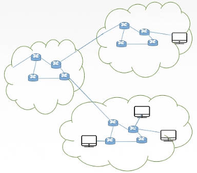

> [!note|style:flat]
> 数据链路层的作用：实现链路两端结点的数据报安全、可靠的传输（发送内容与接收内容一致）。

- **结点：** 构成网络的主机、路由器
- **链路：** 两个「结点」之间的**物理通路**，即「传输媒介」
- **数据链路：** 两个「结点」之间的**逻辑通路**。
- **帧：** 链路层传输的数据单元，是对网络层数据报的封装。
- **功能：**
    1. 为网络层提供服务
        - 无确认无连接：只管发送，不管对方收没收到
        - 有确认无连接：发送之后，要等待对方的确实信号
        - 面向连接：最安全的收发方式
    2. 链路管理：连接的建立、释放、维持
    3. 组帧
    4. 流量控制
    5. 差错控制 

# 2. 组帧

## 2.1. 概念

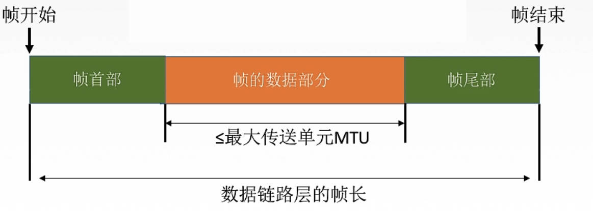

- **封装成帧：** 在一段数据的前后添加「首部」与「尾部」标记，构成一个帧。
- **帧定界：** 真正用于划分帧界限的标志符号。**帧的首部与尾部还存放的有其他控制信息。**
- **帧同步：** 接收方能从二进制流中识别出「帧定界」，进而取出「帧」
- **透明传输：** 不管什么样的比特流，都能在链路上传输，**即对传输功能进行了封装，所有输入的内容都能传输。**

## 2.2. 组帧方法

### 2.2.1. 字符计数法

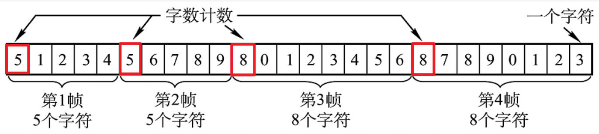

- **思路：** 每个「帧」的第一个「字段」用来计数当前帧的「字符数」
- **缺点：** 「计数字段」出错，会导致「帧同步」失败

### 2.2.2. 字符填充法

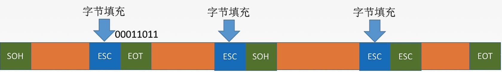

- **思路：** 用一段特定的比特组合来表示「帧定界」；对于帧内部的出现的「帧定界」则使用「转义字符」来标记。
- **缺点：** 实现太复杂

### 2.2.3. 零比特填充法

- **思路：** 使用`01111110`来表示「帧定界」；帧内部则遇到`5`个连续的`1`就插入一个`0`，例如 `0011111101` 转换为 `00111110101`

### 2.2.4. 违规编码法

- **思路：** 对于「曼彻斯特」编码方式，是利用「高-低」与「低-高」来表示二进制的，这样就能采用「高-高」与「低-低」来表示「帧定界」

# 3. 差错控制

## 3.1. 差错概念

- **产生原因：**
  - **全局性：** 由线路本身热噪声产生，固定且随机。解决方法：提高信噪比
  - **局部性：** 外界短暂的冲击噪声产生。解决方法：通过编码技术解决

- **差错的种类：**
  - **位错：** 比特位出错，例如 `1` 变 `0`，`0` 变 `1`
  - **帧错：** 帧顺序 [#1] - [#2] - [#3] 
        1. 丢失：[#1] - [#3] 
        2. 重复：[#1] - [#2] - [#2] - [#3] 
        3. 失序：[#3] - [#1] - [#2] 

- **冗余编码：** 在原始传输数据上，再添加一定的规则的冗余比特位（传输中的附加信息）。

> [!note|style:flat]
> - **物理层编码：** 针对一个比特，如何用高低电平表示比特
> - **链路层编码：** 针对一组比特，通过冗余码技术组织一组二进制比特串，以实现差错检测

## 3.2. 差错控制方法

### 3.2.1. 奇偶校验编码

- **奇校验码：** `x-------`，在原始比特串中添加一个`x`位，使得`1`位个数为奇数
- **偶校验码：** `x-------`，在原始比特串中添加一个`x`位，使得`1`位个数为偶数

> [!note|style:flat]
> 奇（偶）校验码的检错，只能查出 `50%` 的错误，即 奇（偶）数位错误。

### 3.2.2. CRC冗余码

**冗余编码流程：**

1. 要发送的数据 `1101 0110 11`，多项式 `10011`
2. 计算冗余个数：$多项式长度 - 1$ ，即多项式最高位转十进制时，`2`的幂次。例如 `10011`的阶数为 `4`
3. 加冗余`0`：`1101 0110 11 0000`
4. 模`2`除法：最后的冗余码为 `1110`
    
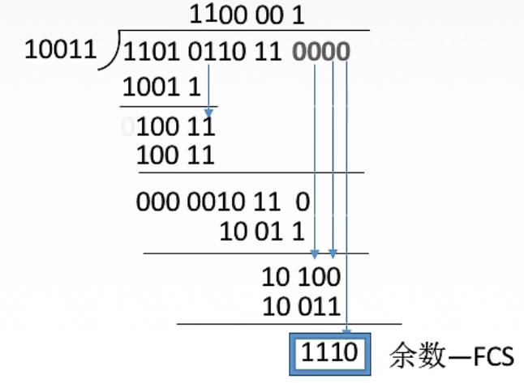

5. 替换掉之前的`0`，冗余编码：`1101 0110 11 1110`

> [!note|style:flat]
> CRC只能保证「接收端」接收的「帧」是没有「位错」的，不能确保所有「帧」都被接收到，所以并不能实现「可靠传输」。

### 3.2.3. 海明码

>[!note|style:flat]
> 发现「双比特」错误，纠正「单比特」错误。

**发送数据为：** `101101`

1. 确定校验码位数

海明不等式：

$$
2^r \ge k + r + 1
$$

式子中 $r$ 为冗余码个数；$k$ 为要发送数据的位数。关于`101101`，$k = 6,r = 4$

2. 确定校验码与数据的位置

- 数据位： 对比特串从`1`开始编号，到 $r + k$ 终止
- $P_i$ 校验码：数据位的二进制的形式为`1`、`10`、`100`、`1000`等形式
- $D_i$ 数据：除校验码剩余的数据位，数据按照顺序填入

3. 计算校验码
 

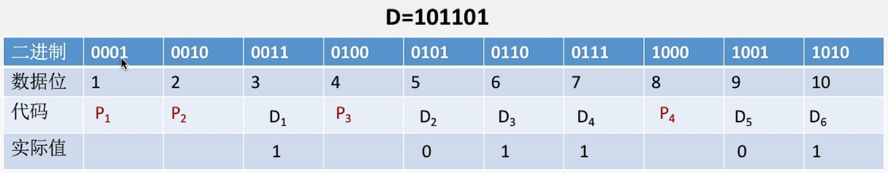

将所有 $D_i$ 数据位 与 $P_i$ 的数据位进行与运算，满足 $index(D_i) \ \& \ index(P_i) == index(P_i)$ 的「实际值」同 $P_i$ 进行「异或」运算结果为`0`。

**$P_i$计算流程：**

1. 满足 $P_1$ 数据位`0001`的数据有：`0011`、`0101`、`0111`、`1001`对应的 $D_1$、$D_2$、$D_4$、$D_5$

2. 解方程：

$$
P_1 \oplus D_1 \oplus D_2 \oplus D_4 \oplus D_5 = 0
$$

3. 得解：$P_1 = 0$

计算所有的 $P_i$ 就为

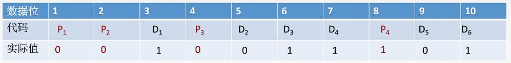

4. 纠错

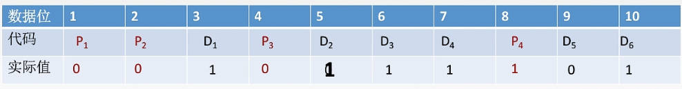

假设 $D_2$ 传输错误：

$$
\begin{aligned}
    P_1 \oplus D_1 \oplus D_2 \oplus D_4 \oplus D_5 &= 1 \\
    P_2 \oplus D_1 \oplus D_3 \oplus D_4 \oplus D_6 &= 0 \\
    P_3 \oplus D_2 \oplus D_3 \oplus D_4  &= 1 \\ 
    P_4 \oplus D_5 \oplus D_6 &= 0
\end{aligned}
$$

将结果反向排序：`0101`，就是 $D_2$ 的「数据位」。

# 4. 流量控制

## 4.1. 基本概念

- **流量控制：** 控制「发送方」的发送速度，发太快了，接收方跟不上，容易出错。

- **可靠传输：** 发送端发送啥，接收端就接收到啥，即内容完全一样。

- **滑动窗口：** 蓝色窗口内的「帧」才能参与收发操作；当收发成功时，蓝色窗口会向右移动。**滑动窗口能解决「流量控制」与「可靠传输」两个问题**

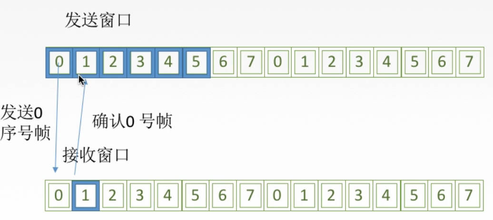

- **信道利用率：** 一个发送周期内，发送数据所用时间占发送周期的比率。

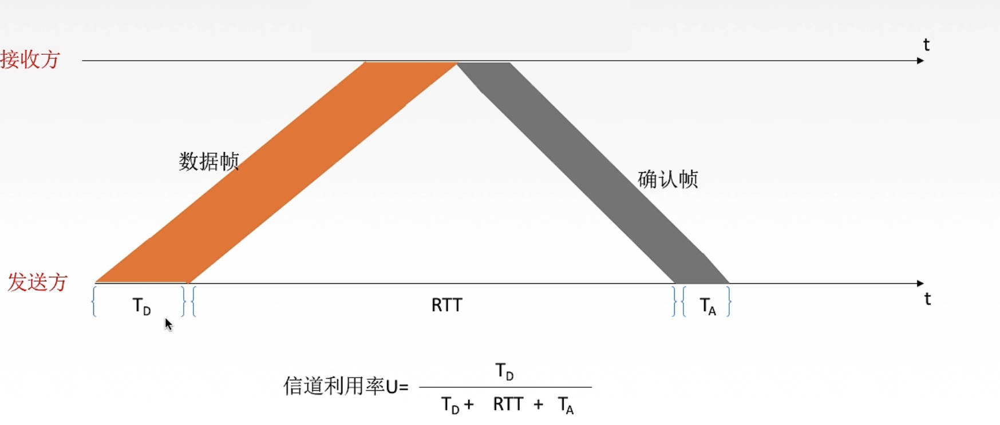

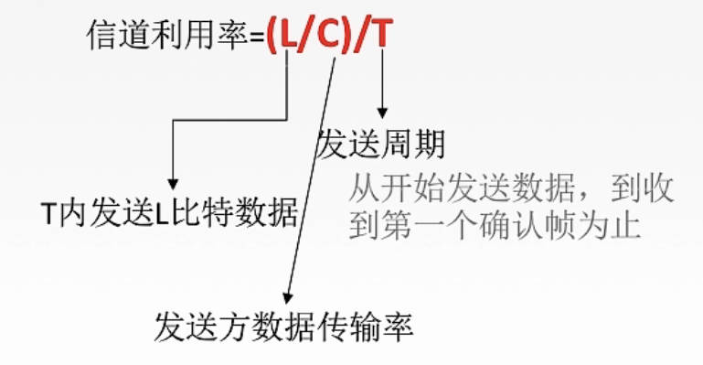

> [!tip|style:flat]
> - **链路层流量控制：** 点对点；接收不了不回复确认。
> - **传输层流量控制：** 端对端；接收不了返回「窗口公告」

## 4.2. 滑动窗口算法

| 算法      | 发送窗口 | 接收窗口 |
| --------- | -------- | -------- |
| 停止-等待 | 1个      | 1个      |
| 后退N帧   | >1个     | 1 个     |
| 选择重传  | >1个     | >1个     |

### 4.2.1. 停止-等待协议

1. 无差错

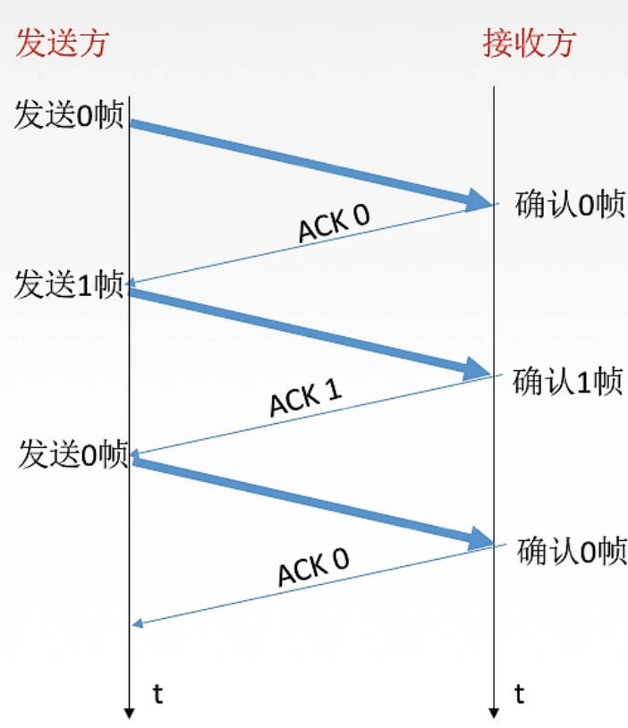

- **发送方：** 发送一「帧」，然后一直等待「接收方」的确认信号
- **接收方：** 接收到的「帧」没问题，就返回一个确认信号`ACK 帧号`

2. 帧丢失

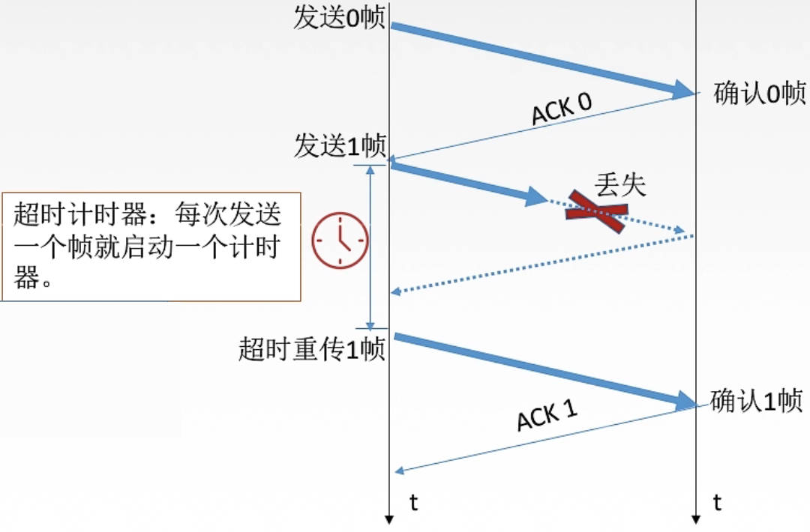

- **发送方：** 对发送的「帧」超时重传。
  - **计时：** 对每一个发送的「帧」计时，判断发送时间是否超过了一个`RTT`。
  - **备份：** 对每一个发送的「帧」都会备份，当「超时」发生，就将「备份帧」重新发送。
- **接收方：** 啥也不干 
- **帧编号：** 用来同步两端「帧」的顺序。可以用来判断「帧丢失」与「帧重传」
  - **帧丢失：** 「接收端」接收的「帧编号」不是一个预测值。比如接收了`0`，下一帧的编号应该是`1`
  - **帧重复：** 「发送端」连续收到多次同样的`ACK num`；「接收端」连续收到同样的「帧编号」

3. ACK丢失

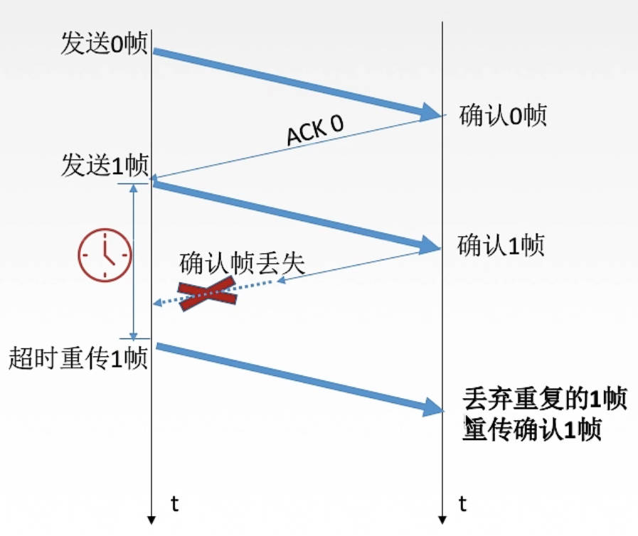

- **发送方：** 等不到`ACK`就「超时重传」
- **接收方：** 发送方超时重传后，导致「帧重复」，丢到原来的帧，重新发送`ACK`

4. ACK迟到

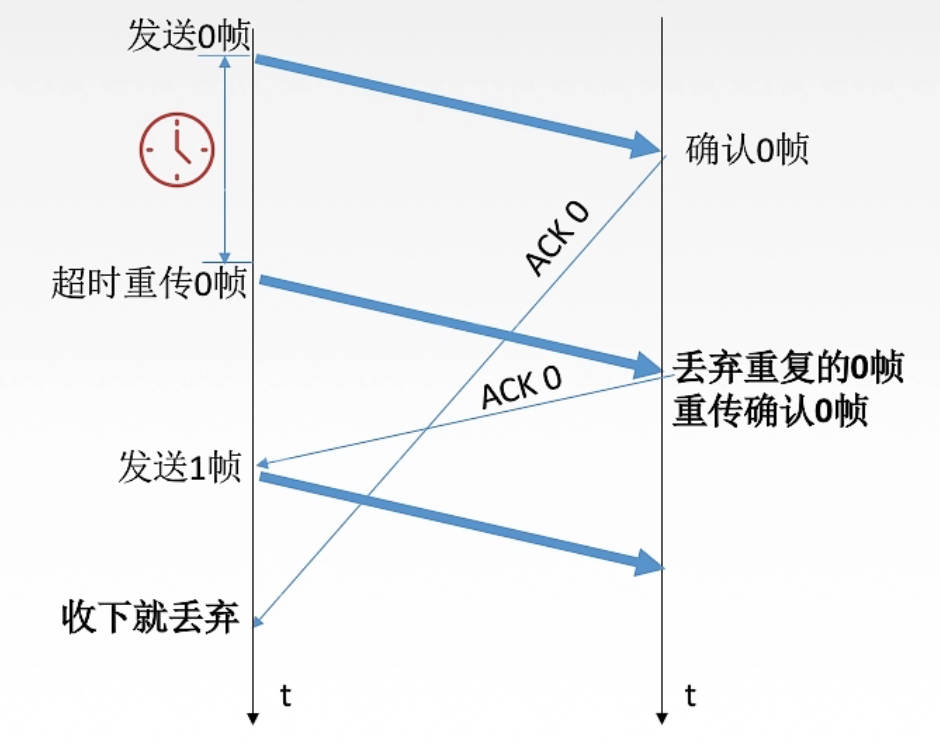

- **发送方：** 等不到`ACK`就超时重传；等待到了延迟的`ACK`，与当前的帧编号对比，不一样就丢弃。
- **发送方：** 「帧重复」，丢到原来的帧，重新发送`ACK`

### 4.2.2. 后退N帧

1. 无差错

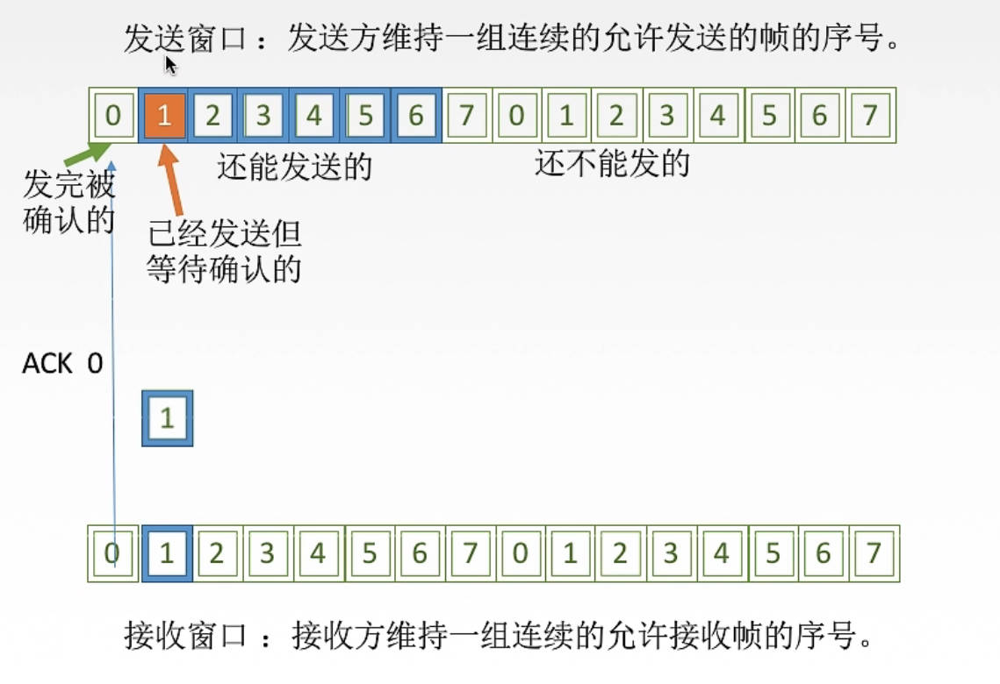

1. 滑动窗口内的「帧」可以发送
2. 发送出去的「帧」会被备份，例如黄色框
3. 发送方发送完一个「帧」后，可以接着发送「滑动窗口」中下一个「帧」
4. 接收方，接收成功一个「帧」后，滑动窗口右移，并返回确认信号`ACK`
5. 发送方的「滑动窗口」最左侧「帧」接收到了对应的`ACK`，「滑动窗口」向右移动

> [!note|style:flat]
> - 「网络层」让「链路层」发送数据报时，会检查「滑动窗口」是否装满，若装满则等待或者将数据报放入对应的等待缓冲区
> - **累计确认：** `ACK num` 确认的是 `num` 之前的所有「帧」接收方都正常接收了，例如 `ACK 2`，表示 `0,1,2` 帧都已经正常接收了

2. 出错

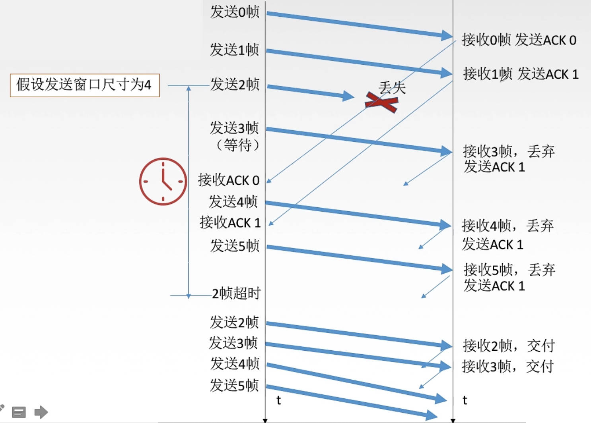

- **超时重传：** 当发生超时事件时，发送方会重新发送所有已发送但是却未被确认的帧
- **expectedseqnum：** 「接收方」标记当前「滑动窗口」要接收的「帧」的编号。 当前接收的「帧」编号与`expectedseqnum` 不一样时，将该「帧」丢弃，并发送`ACK expectedseqnum - 1`

- 重复`ACK`：是已经发送过的「帧」的`ACK`，直接忽略

3. 滑动窗口长度

若用`n`位来表示「帧」的编号，发送方滑动窗口的大小 $w_s$ 就为： 

$$
1 \le w_s \le 2^n - 1 
$$

### 4.2.3. 选择重传

1. 无差错

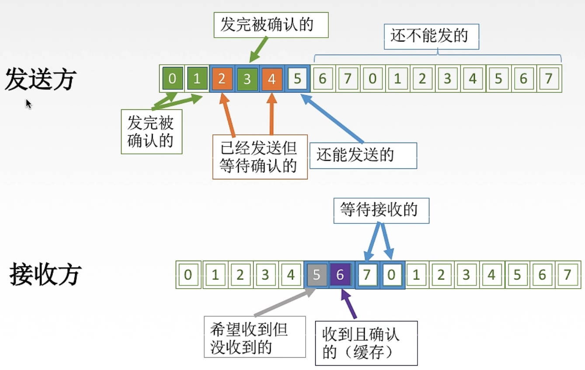

- **接收方：** 接收端的「滑动窗口」个数增加，当最左边「帧」接收成功后，才向右方滑动
- **`ACK`确认：** 确认信号只确认对应「帧」接收成功，不在是累计确认

 2. 出错

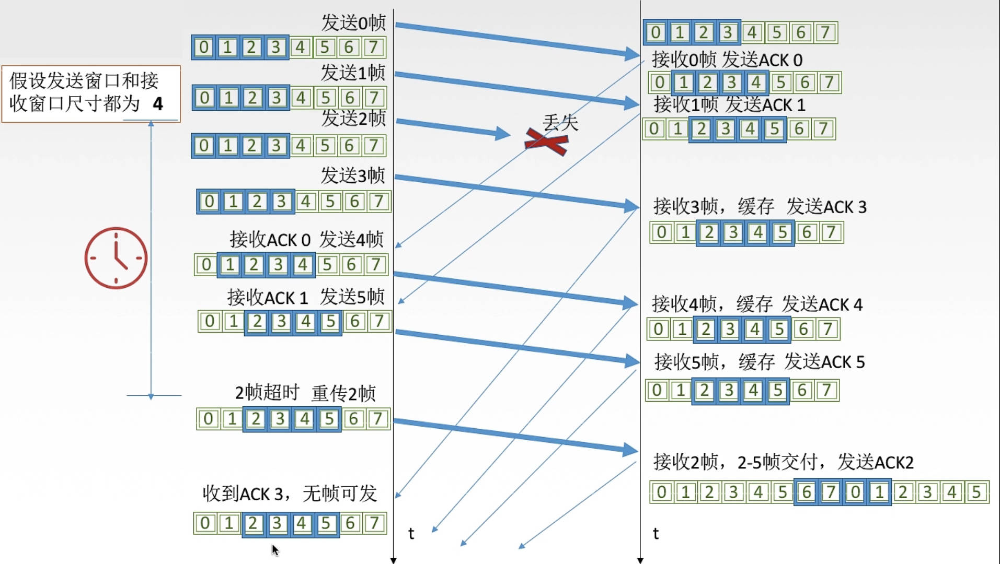

- **接收方：** 接收到已经接收到的「帧」时，返回该帧的`ACK`，其他情况则丢弃帧

- **超时重传：** 每一个「帧」超时后，只重传当前「帧」

3. 滑动窗口长度

若用`n`位来表示「帧」的编号，发送方滑动窗口的大小 $w_s$ 和 接收方滑动窗口大小 $w_a$ 就为： 

$$
w_s = w_a = \frac{2^n}{2}
$$

