# 网络层

# 基本概念

- **网络层目的：** 把「分组」从源端传送到目的端，为主机提供通信服务，传输单位为「数据报」。
- **数据报与分组：** 「数据报」是要传输的数据，但是当数据报太长时，就需要将数据报拆分成小块的「分组」进行传输。
- **功能：**
    1. 路由选择与分组转发：确定路由的路线
    2. 异构网络互联：实现不同类型的终端通信
    3. 拥堵控制：网络拥挤，链路上的分组没地方储存，然后被大量丢弃

# 数据交换方式

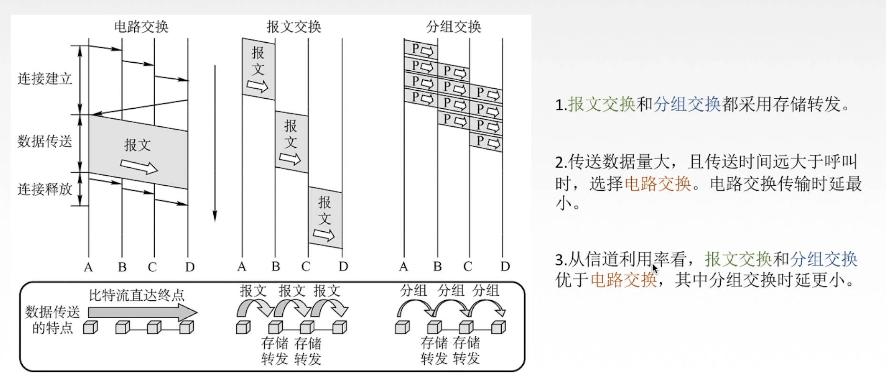

## 电路交换

- **概念：** 通信双方需要建立一个「连接」；连接成功后才能开始通信；通信过程中，这个连接将会独占被分配的资源（例如信道等）；当通信结束后，需要释放连接的占用的资源。

- **特点：** 有连接、独占资源

## 报文交换

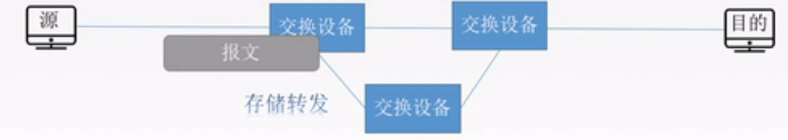

- **概念：** 交换设备能存储转发，当有报文传入时，交换设备会进行缓存；当有链路空闲时，交换设备就将报文转发出去。

- **特点：** 无连接、数据报完整存储转发

## 分组交换

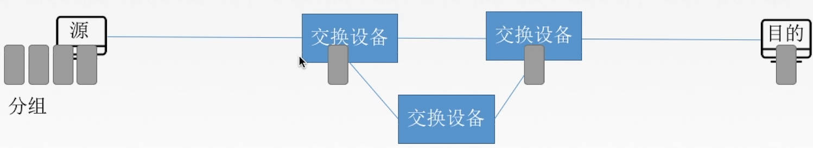

- **概念：** 数据报过长时，拆分为小块的「分组」，然后再存储转发。

- **特点：** 利用率高于报文交换，且缓存小

- **方式：**
    1. **数据报**：无连接服务，不事先确定传输路径，各个分组的传输可以不同
    2. **虚电路**：有连接服务，会事先建立一条「连接」，之后的分组均按照该连接进行通信

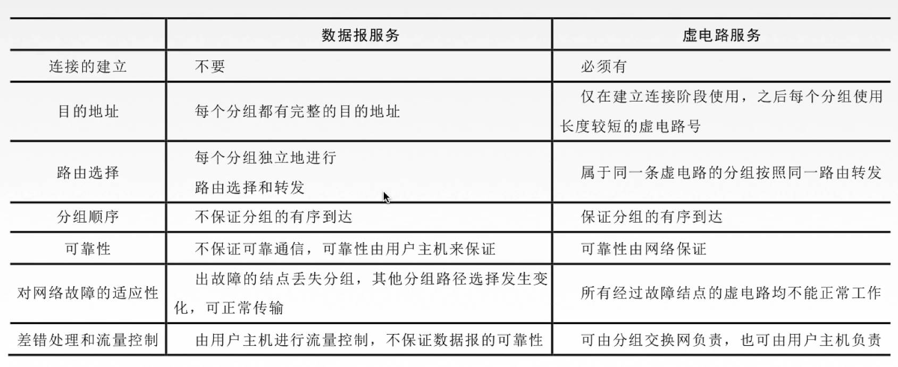

# IP协议

## IP数据报

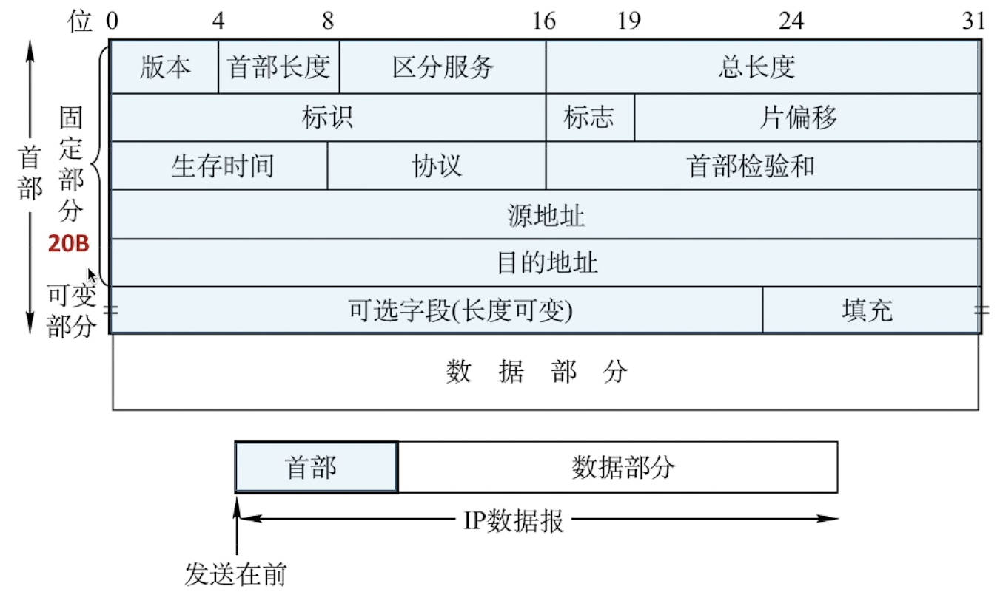

**概念：** IP数据报由「首部」与「报文段」所构成。报文段由传输层提供。首部记录了IP协议的控制信息，由固定部分与可变部分组成。
- 版本：标记是`IPv4`还是`IPv6`
- 首部长度：首部的字节长度，单位为`4B`，最小值为`5 = 20B / 4B`
- 区分服务：希望获得那种服务
- 总长度：IP数据报的长度，单位为`1B`
- 生存时间：IP数据报能在路由器上被转发的次数，每经过一个路由器`-1`
- 协议：报文段使用的协议
  

- 首部检验和：用于「首部」的校验
- 源地址/目的地址：信源与信宿的IP地址
- 可选字段：附加功能字段
- 填充：将首部的长度补全为`4B`的整数倍

## IP数据报分组

- **分组首部的配置：**
  - 标识：同一数据报下的分组具有同一标识
  - 标志：`- DF MF`，只有两位有意义。`DF`，不分片；`MF`，后面还有分片，即可用来标记最后一个分片。
  - 片偏移：分组数据的头部相对于报文段头部的偏移量，单位为`8B`，即分组数据部分的长度为`8B`的整数倍

- **分片：** 数据部分的长度根据链路层的`MTU`确定，尽量往大值分
    
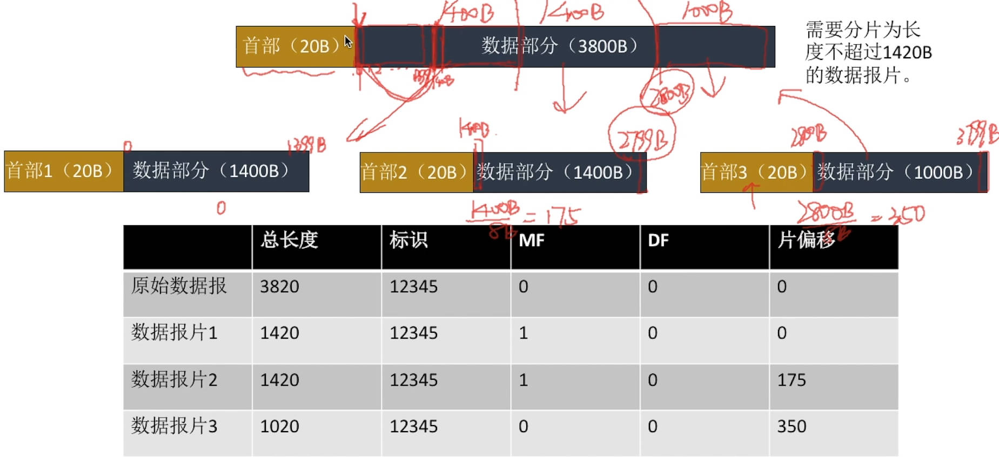

## IP地址

### 基本概念

- **IP地址：** 主机与路由器接口在因特网中的唯一标识符号，由「网络号」与「主机号」构成。
  - **网络号：** 区分广播域
  - **主机号：** 区分广播域中的主机

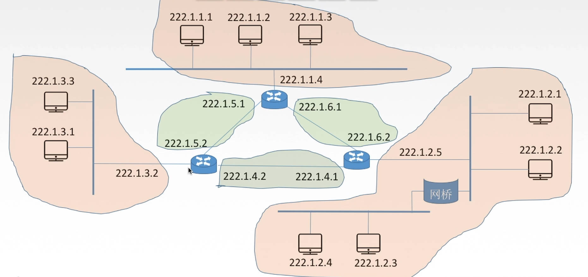

- **分类：** 
  - A类网络不能用于互联网的网络号标记的情况：全`0`与`127`。
    
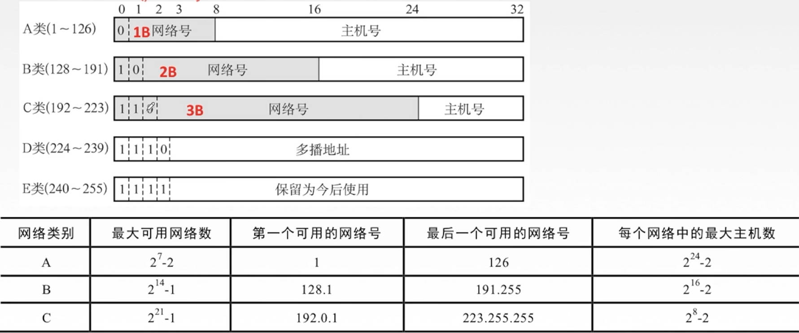

> [!tip]
> - **IP地址：** 主机在因特网中的住址
> - **MAC地址：** 主机入网的身份证号

### 特殊IP地址

- **特殊IP地址：**
    - 网络号全`0`：例如B类就是 `10000000 00000000`
    - 网络号全`1`：例如B类就是 `10111111 11111111`

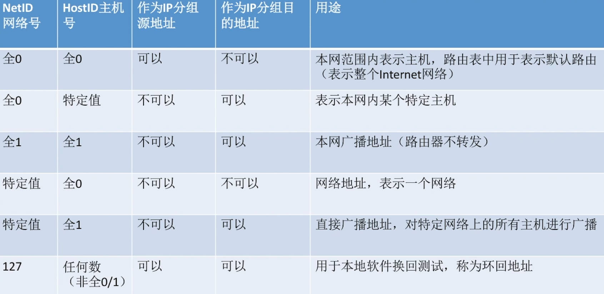

- **私有IP地址：**  私有IP地址作为目的地址时，路由器对数据报不会进行转发，即私有IP地址只能在局域网内使用。 

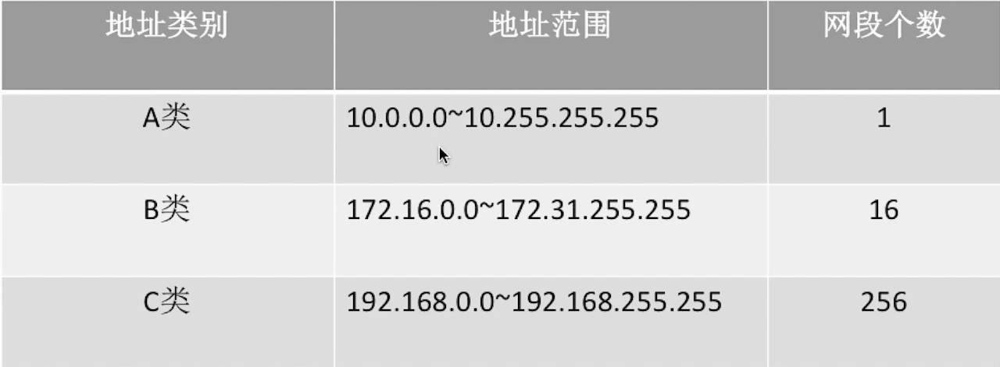

## 网络地址转换NAT

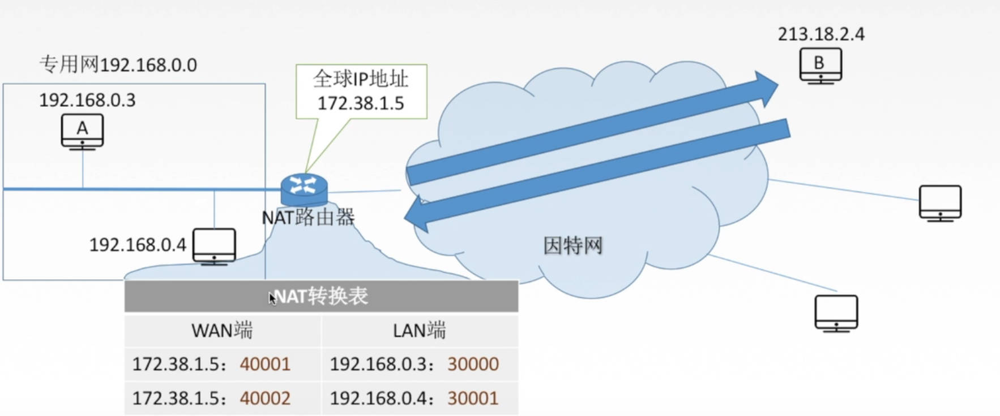

**NAT技术：** 在路由器中安装NAT（Network Address Translation）软件，实现「专用网（私有IP地址）」与「英特网」之间的IP转换。利用路由器的一个进程服务专用专用网络中的一个主机。

# 扩展IP地址

## 分类IP地址的问题

1. **IP地址利用率低**：给一个网络分配了`B`类网络号，但是该网络的主机少，就会存在大量的主机号浪费。
2. **扩建新网络困难**：想要扩充一个新的网络，只能重新向网络运营商申请一个网络号，不能自行添加

## 子网划分

### 基本概念

- **思路：** 将原来的两级IP中的「主机号」拆分为「子网号」与「主机号」，该三级IP中的子网号就是原广播域中的一个子网络。在子网络中的主机对因特网而言是两级IP，对子网而言则是三级IP。
  - **主机号全`0`：** 网络号
  - **主机号全`1`：** 在该子网中广播

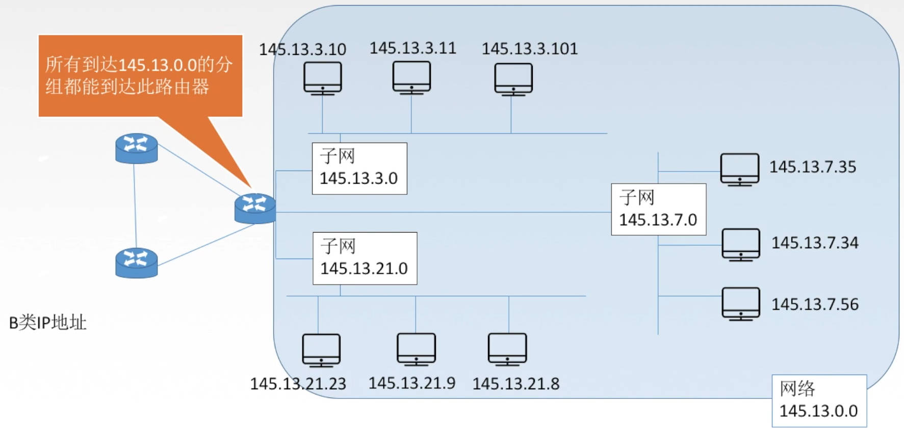

### 子网掩码

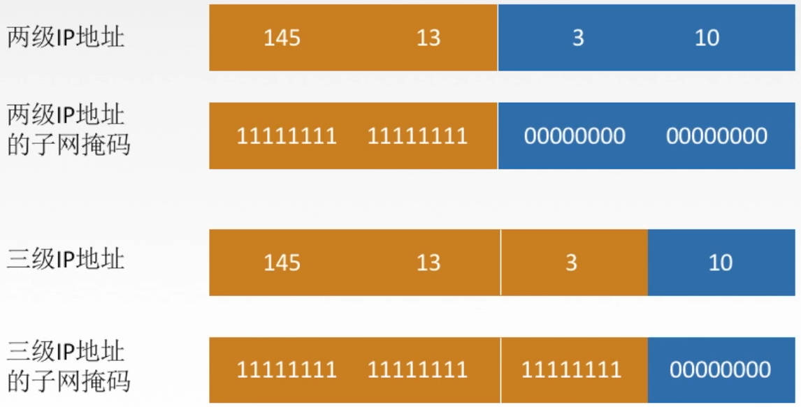

**掩码：** 从IP地址中提取出「网络号」，网络号对应的位全为`1`，主机号对应的位全为`0`。

### 子网分组转发

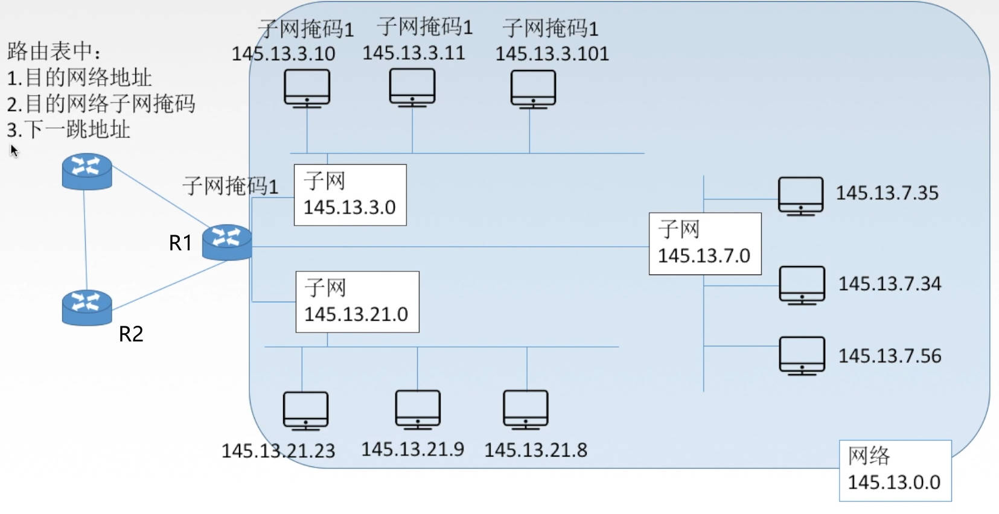

从路由`R1`发送分组：
1. 提取分组的目的`IP`地址
2. 与路由器连接的子网络号进行对比，若有对应网络地址，就直接发送给该网络
3. 与路由器中存储的特定`IP`地址进行对比，若有对应地址，直接发送给该主机
4. 与路由表中的网络号进行对比，若有对应网络地址，就进行「下一跳」，发送给对应的路由器
5. 通过上述步骤，都没找到对应网络，就将分组发送给默认路由（IP地址为`0.0.0.0`）的路由器。

## 无分类编制CIDR

### 基本概念

- **原理：** 直接取消网络`IPv4`关于A、B、C类地址的划分，用自定义长度的「网络前缀」来代替网络号。
- **CIDR地址标记：** `128.14.32.1/20`，`20`表示IP地址的前20位是网络前缀。
- **CIDR地址块：** `128.14.32.0/20`，就是网络号

### 超网

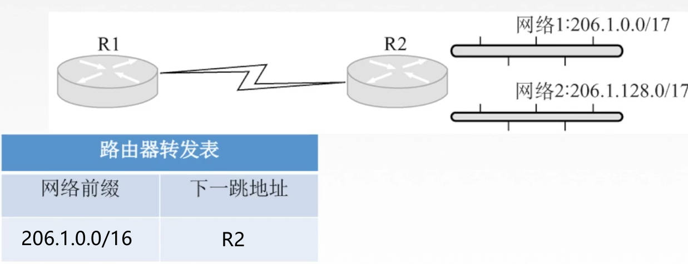

**概念：** 将同一路由器上直接连接的网络，用同一个「CIDR地址块」进行表示，这些就能减少路由表遍历次数，以及节省空间。实现思路就是将路由器连接的网络的网络前缀相同的部分提取出来，构成一个新的网络前缀，即超网。  应当选用匹配长度最长的网络前缀作为路由路径。 

## IPv6地址

### IPv6数据报

**结构：** 由固定首部、三个扩展首部（可选）、数据组成

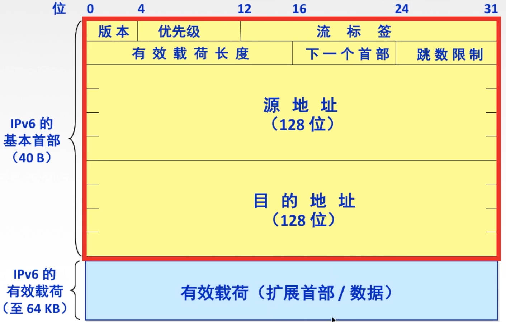

- 版本：IPv6的版本
- 优先级：数据报的优先程度
- 流标签：流，从源点到特点终点的一系列数据报。属于同一流的数据报，流标签一样
- 有效载荷长度：有效载荷的长度
- 下一个首部：指向下一个扩展首部的位置或者数据位置
- 跳数限制：IPv4的生存时间

### IPv6基本地址类型

### IPv4 与 IPv6

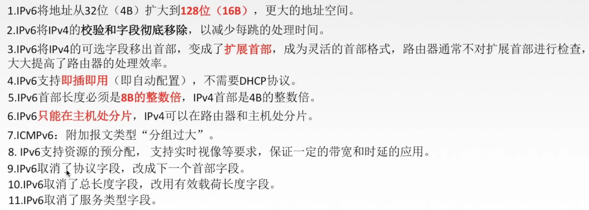

### IPv4 与 IPv6转换

- **双站协议：** 路由器和主机同时兼容IPv4与IPv6

- **隧道技术：** 在网络传播过程中，将IPv6的数据报添加IPv4的首部，伪装成IPv4数据报进行传送。

# 报文发送

## ARP协议

- **ARP协议作用：** 查询MAC帧中的目的地址。
- **ARP高速缓存：** 存储了IP地址与MAC地址的对应关系，主机与路由器均有。 只存储本网络的 

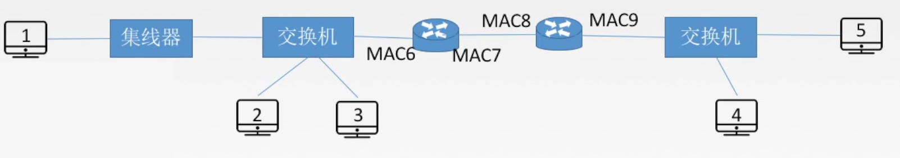

- **同网络流程：** 1主机给3主机发数据
  1. 将要发送的报文封装成MAC帧，但是缺少3主机的MAC地址
    
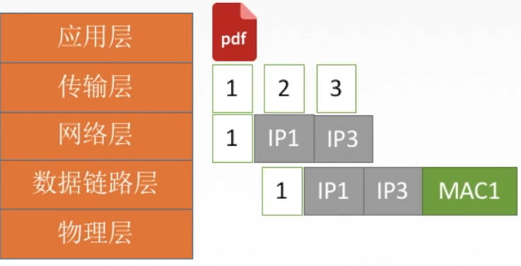

  
  2. 查询目的IP地址是否在本网内
  3. 查询1主机的「ARP高速缓存」，能查询到就填入MAC帧，查询不到继续以下步骤

  4. 广播ARP请求分组：目的MAC地址为`48`位的`1`，即`FF-FF-FF-FF-FF-FF`
    

  5. 3号主机收到ARP请求分组后，返回单播的ARP响应分组，1主机接收到响应后，会在ARP高速缓存中备份对应MAC地址
    

  6. 封装数据帧，正式发送分组
    
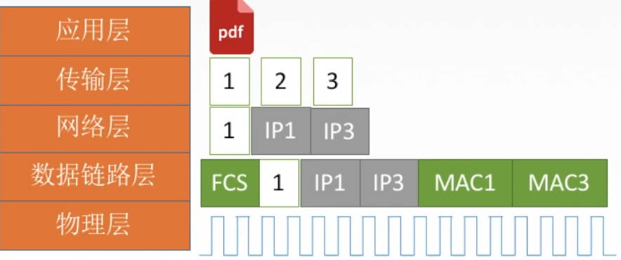

- **跨网络流程：** 1主机给5主机发送数据
  1. 将要发送的报文封装成MAC帧，但是缺少5主机的MAC地址
  2. 查询目的IP地址是否在本网内，不在本网络内，就将分组发送给「默认网关」，即路由器的 MAC6 。
     - 网关：跳出当前「局域网」的出口
  3. 查找默认网关：主机发送ARP请求分组；路由器给出ARP响应分组
  4. 主机和路由器在ARP高速缓存中备份对应的MAC地址
  5. 之后重复上述步骤，传递到的5主机

## DHCP协议

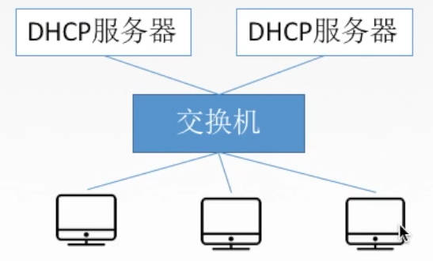

- **作用：** 动态给主机配置IP地址、子网掩码、默认网关、DNS服务器
- **思路：** 配置DHCP服务器，利用「客户/服务器」的方式，通过「广播」和「UDP」的形式进行IP动态分配，该协议属于「应用层」协议。允许地址重用，支持主机随机加入，支持地址续租
  1. 主机广播DHCP发现报文：试图找到网络中的DHCP服务器
  2. DHCP服务器广播DHCP提供报文：所有服务器拟分配给主机一个IP地址及相关配置，先到先得。**还没有正式给主机，就是给主机看看，待主机选择**
  3. 主机广播DHCP请求报文：选择好对应IP地址，并高速所有服务器，选用情况。没选中的服务器回收预先分配的IP地址。
  4. DHCP服务器广播DHCP确认报文：服务器确认主机的选择，正式分配IP地址；

## ICMP协议

- **作用：** 分组发送过程中出问题，发送ICMP报文告知源主机；路由询问。
- **ICMP报文结构：** 
  
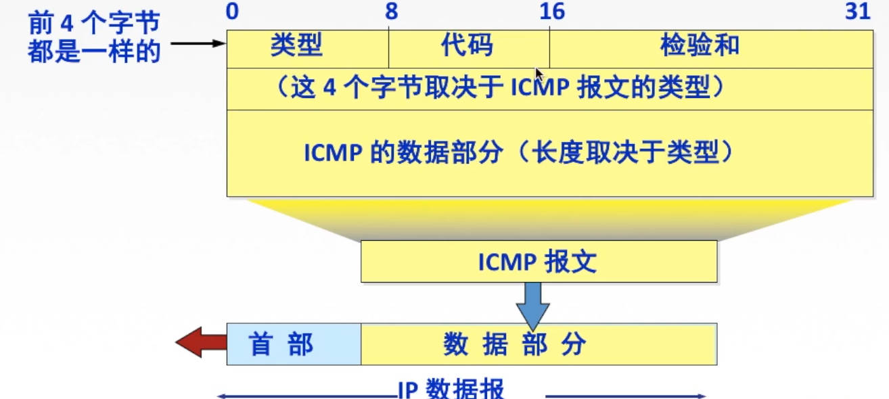

- **ICMP差错报告报文：**
  1. **终点不可达**：无法交付报文
  2. **时间超过**：分组的生存时间为`0`；终点在规定时间内无法完整接收全部分组时
  3. **参数问题**：首部字段出问题
  4. **路由重定向**：有更好的路由路径

- **不发送ICMP差错报告报文：**
  1. ICMP差错报告报文出现差错
  2. 只对第一个分片的数据报发送ICMP报文，后续分片不发送
  3. 组播地址
  4. 特殊地址：默认路由地址`0.0.0.0`、环回地址`127`

- **ICMP询问报文：**
  - 回送请求与回答报文：测试目的站是否可达
  - 时间戳请求与回答报文：询问时间，时钟同步

- **ICMP应用：**
  - 回送请求与回答报文：ping，检测主机之间的连通性
  - 时间超过差错报告报文：Traceroute，试探分组应该设定的「生存时间」

# 路由

## 基本概念

- **路由：** 路由器会维护一张「路由表」会记录IP网络与跳转到下一个路由的接口，通过路由算法实现最佳的跳转路径。

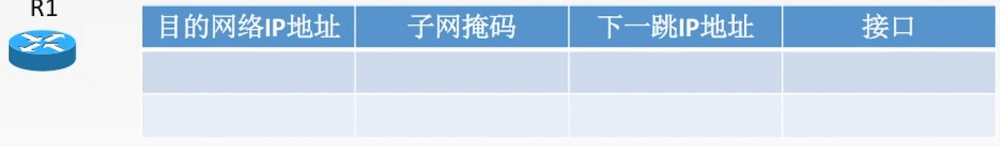

- **路由算法：** 维护更新路由表的算法
  - 静态路由算法：手动配置路由表，之后固定不变
  - 动态路由算法：算法自动更新路由表

- **动态路由算法：**
  - 全局性路由算法：链路状态路由算法，路由器知道完整的网络路由拓扑，例如 OSPF算法
  - 分散性路由算法：距离向量路由算法，路由器只知道相邻的网络结构，例如 RIP算法

- **自治系统AS：** 某些机构想要根据自己的需求搭建一个内部的路由网络，并且结构对外界保密。这样的网络结构就是「自治系统」。
  - 内部网关协议：自治系统内部采用的路由协议，例如 RIP、OSPF
  - 外部网关协议：自治系统外部的公共互联网的路由协议，例如 BGP

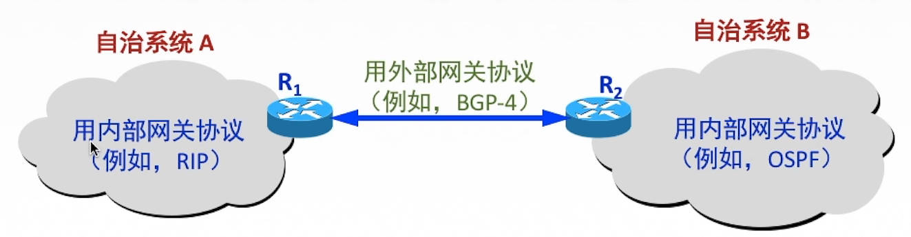

## RIP协议

- **RIP协议思路：** 基于距离向量的路由选择协议，路由表记录的是从他自己到相邻路由器的最佳路径。
  - 交换对象：和直接连接的路由器进行交换
  - 交换内容：各自路由表
  - 交换时间：`30s`交换一次，若`180s`都没收到邻居的路由表，就认为邻居没了
- **距离：** 分组从路由器R1到路由器R2要被中转几次。 RIP协议规定分组最多能跳`15`次 

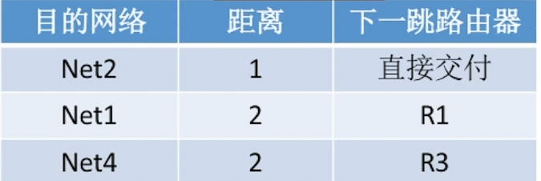

- **路由表更新过程：**  距离向量算法 
  1. 接收相邻路由器R1发送的路由表
  2. R1路由表的「距离」均加一，并把表中的「下一跳」修改为 R1
  3. 将路由表与自身路由表进行对比，然后更新路由表
       - 路由表中没有对应网络，添加该项
       - 路由表中有对应网络，且「下一跳」也是 R1，则替换掉：始终让路由表保持最新状态
       - 路由表中有对应网络，但「下一跳」不是 R1，则对比「距离」，选择距离最小的
  4. 若超过`180s`都没有收到R1的路由表，就将所有「下一跳」为 R1 的「距离」设置为`16`：表示不可达

- **RIP数据报：**  RIP协议为应用层协议，基于`UDP`实现。 
  

- **特点：** 好消息传送快，坏消息传送慢。当路由器出问题，不可达时，其余路由器的路由表更新慢。当 R1 直接连接的网络1出现故障，R1 就会将网络1的距离修改为 `16`，但是 R2 并不知道这种情况，认为网络1是可达的，其距离为`2`。这样进行一次更新后，R1 达到网络1的距离 `16` 就被修改为了 `3`，R2 达到网络1的距离 `2` 就被修改为 `4`，且当 R1 再次发现网络1故障后，又会将距离修改为`16`。如此循环多次后，路由器 R1 与 R2 达到网络1的距离均为`16`。
  
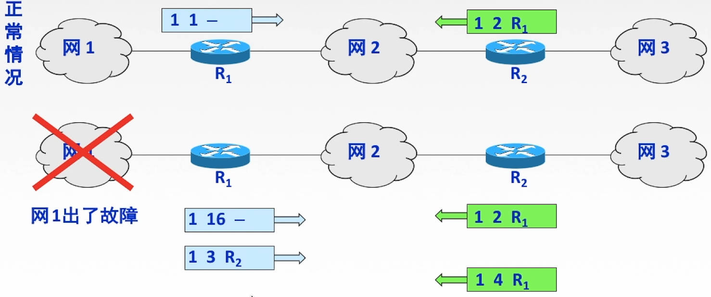

## OSPF 协议

- **OSPF 协议思路：** 路由器知道整个网络的结点图，然后根据 Dijkstra 算法查询出路由的最短路径。
  - 交换对象：通过「洪泛法」与「自治系统」内的所有路由器交换信息
  - 交换内容：与本路由器直接连接的所有路由器的链路状态，即用于 Dijkstra 算法路径查询的代价，例如传送延迟、传送距离、传输费用等
  - 交换时间：路由状态发生变化时；`30min`刷新一次

- **洪泛法：** 分组由路由器结点一传十、十传百的传播出去

- **网络拓扑的建立：**  链路状态路由算法 
  1. 利用「Hello 问候分组」发现邻居结点
  2. 记录邻居结点的网络地址，以及到达邻居结点的代价
  3. 根据本路由的链路状态数据库，构建一个简要的「DD数据库描述分组」
  4. 邻站接收到DD数据库描述分组后，与自己的链路状态数据库进行对比，若自己都有，则不处理；若一些项，自己没有，则发送「LSR链路状态请求分组」，获取详细的链路状态
  5. 本路由器收到LSR请求分组后，返回「LSU链路状态更新分组」给邻站
  6. 邻站更新数据库后，返回「LSAck链路状态确认分组」进行更新确认
  7. 当路由器的链路状态发生变化时，就会向其他路由器洪泛发送「LSU链路状态更新分组」
  8. 其他路由器更新后，会返回一个「LSAck链路状态确认分组」进行更新确认
  9. 每个路由器根据自己的链路状态图，利用 Dijkstra 算法查找最短路径

- **OSPF区域：** 当自治系统的路由器很多时，就会造成链路状态图很大并且查找时间也增加，因此进一步将自治区域划分为较小的「OSPF区域」。
  - **主干路由器：** 主干区域内的路由器
  - **边界路由器：** 连接不同区域的路由器
  
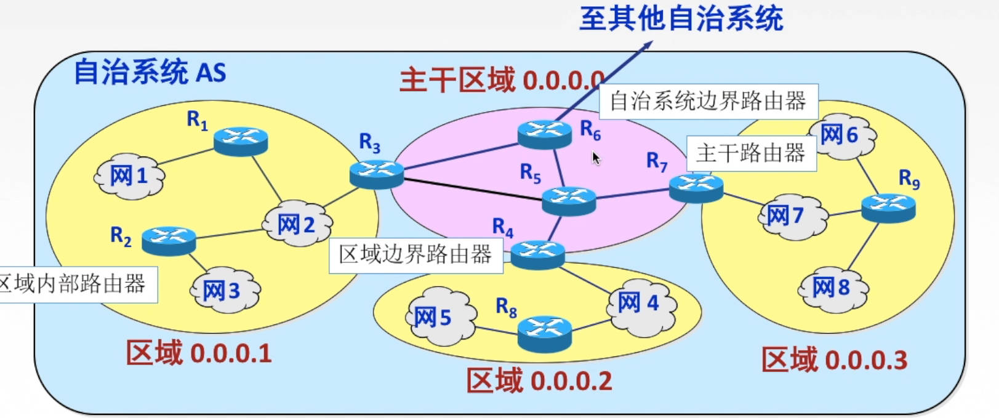

- **OSPF数据报：**  属于网络层协议 
  
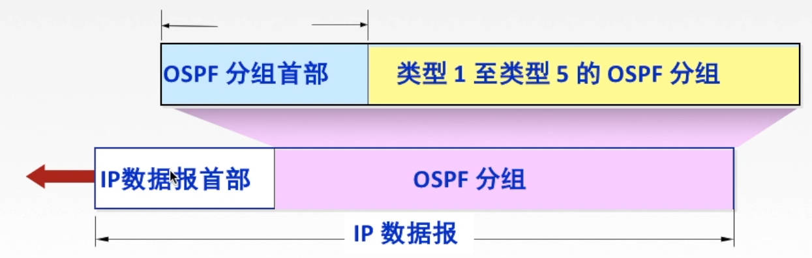

## BGP协议

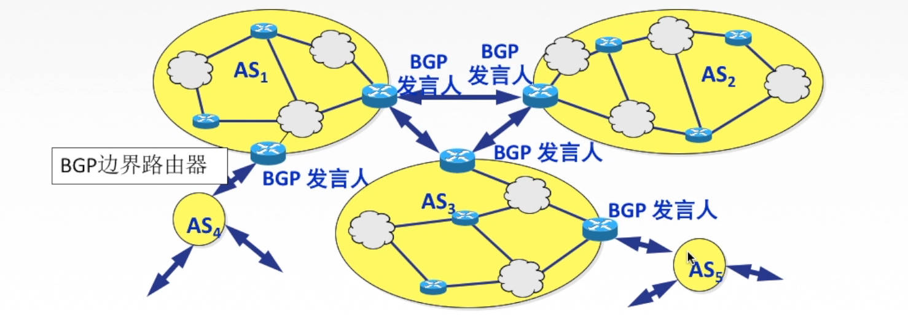

- **OSPF 协议思路：** 将一些列的自治系统连接起来
  - 交换对象：与邻站的「BGP发言人」交换信息
  - 交换内容：网络可达信息，即达到某个网络，需要经过哪些自治系统
  - 交换时间：发生变化时更新

- **BGP发言人：** 进入自治系统的入口路由器。

- **网络可达信息：** 将BGP发言人作为接口，自治系统作为结点，构造出来的自治系统拓扑图

  
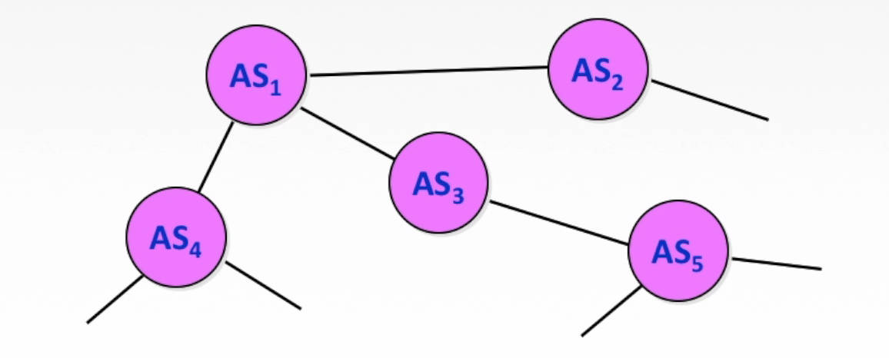

- **BGP报文：** 基于 `TCP` 实现，属于应用层协议
  
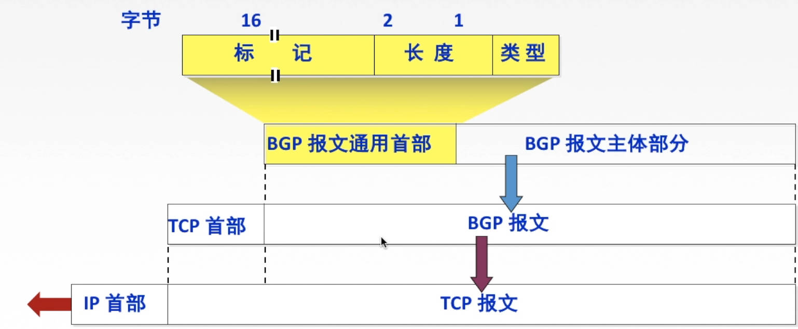

  1. **OPEN（打开）报文**：用来与相邻的另一个BGP发言人建立连接，并认证发送方。
  2. **UPDATE（更新）报文**：通告新路径或撤销原路径。
  3. **KEEPALIVE（保活）报文**：在无UPDATE时，周期性证实邻站的连通性；也作为OPEN的确认。
  4. **NOTIFICATION（通知）报文**：报告先前报文的差错；也被用于关闭连接。

## 协议对比

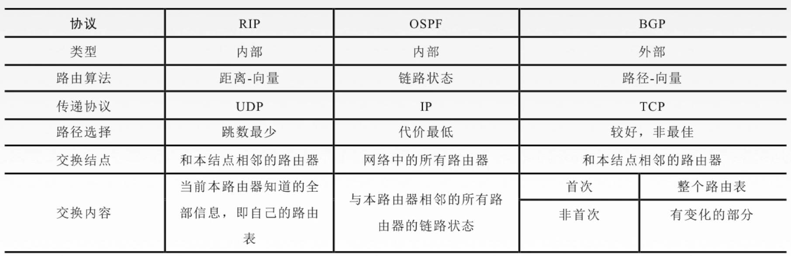

# IP组播

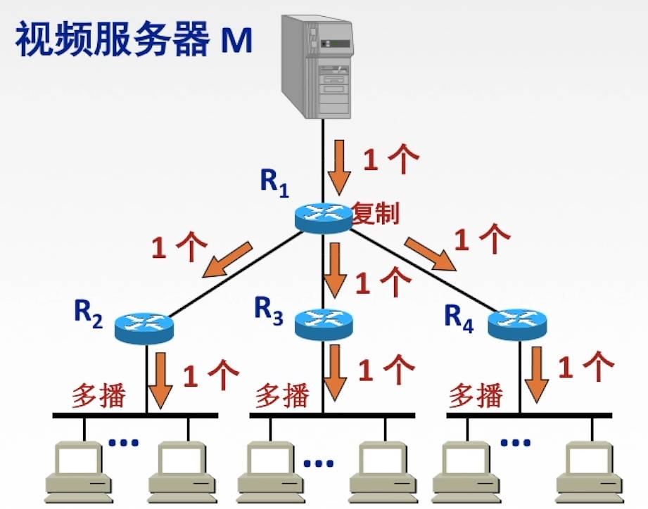

- **广播：** 将分组发送给一个网络号内的所有主机。
- **组播：** 将分组发送给特定一组的主机
- **组播地址：** 属于同一组播组的主机，会被分配同一「组播IP地址」，即D类地址

# 移动IP

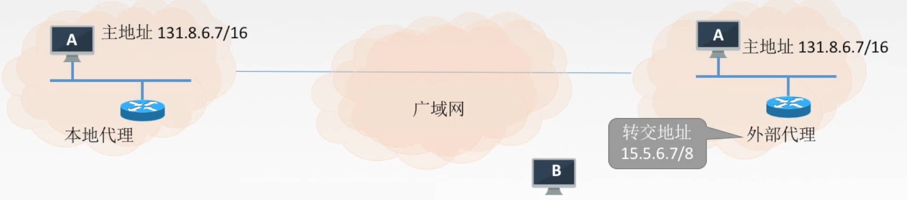

- **移动IP技术：** 是移动结点(计算机/服务器等)以固定的网络IP地址，实现跨越不同网段的漫游，并保证了基于网络IP的网络权限在漫游过程中不发生任何改变。
  - **移动结点：** 需要设定固定IP地址的主机
  - **主IP地址：** 在不同的网络内，IP地址不变
  - **归属\本地代理：** 在主IP网络内的代理结点
  - **外部\外地代理：** 在外部网络中，帮忙连接本地代理的结点
  - **转交地址：** 在外部网络中，使用的临时地址

- **主机在外部网络：**
  1. 外部代理分配临时的转交地址
  2. 外地代理在本地代理上登记转交地址
  3. B主机发送数据给A主机：本地代理截获分组；本地代理通过隧道技术将分组转交给外地代理；外地代理又将分组转交给主机A
  4. A主机发送数据给B主机：A主机用自己IP作为源地址，B主机的IP作为目的地址，直接发送出去

# 网络层设备

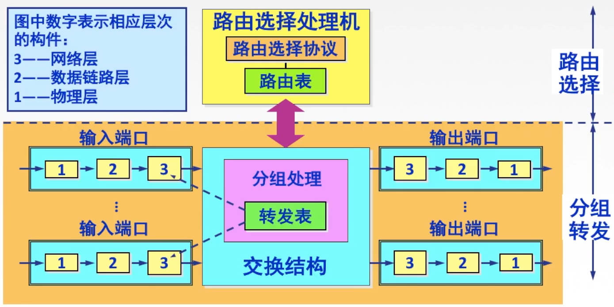

- **路由器：** 一种具有多个输入端口和多个输出端口的专用计算机，其任务是转发分组。
- **功能：**
  - **路由选择：** 构建、维护路由表
  - **分组转发：** 根据有路由表得到的转发表，转发分组，发生在路由器内部

- **分组丢失：** 输入队列或者输出队列产生溢出，缓存存满了，没地方放分组

