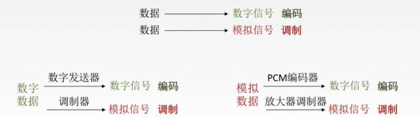

# 物理层

# 1. 物理层介绍

- **作用：** 解决如何在连接各个计算机的传输媒体（例如网线）上传输数据比特流，而不是具体的传输媒体。
- **特性**
    1. **机械特性：** 规定物理连接规则，例如接口形状，引线数目等
    2. **电器特性：** 规定二进制位的电压范围（特定电压范围表示何种状态）、传输速率、距离限制等
    3. **功能特性：** 规定某一电平表示何种意义
    4. **规程特性：** 规定物理线路的工作规程与时许关系

# 2. 数据通信概念

## 2.1. 通信模型

- **数据：** 传送的信息实体
- **信号：** 数据在传输过程中的表现
  - **数字信号：** 信号参数取值是离散的，例如01方波
  - **模拟信号：** 信号参数取值是连续的
- **信源：** 产生和发送数据的源头
- **信宿：** 接收数据的终点
- **信道：** 信号的传输媒介
  - **信号：**
    - **数字信道：** 传送数字信号
    - **模拟信道：** 传送模拟信号
  - **介质：**
    - **无线信道：** wifi
    - **有线信道：** 网线

## 2.2. 通信传输方式

1. 通信方式

- **单工通信：** 只能单向通信
- **半双工通信：** 接收和发送不能同时进行
- **全双工通信：** 接收和发送可以同时进行

2. 传输方式

- **串行：** 速度慢，适合远距离
- **并行：** 速度快，适合近距离

## 2.3. 码元

- **码元：** 一个固定时长的信号波形，例如二进制码元，波峰和波谷就是一个码元
- **N进制码元：** 一个码元表示N进制的数，例如二进制码元，一个码元代表一个二进制数，1或者0
- **码元传输速率：** 单位时间内能传输多少个码元，单位 **波特** `Baud`

## 2.4. 传输速率

- **定义：** 单位时间内传输的数据量，可以用「码元传输速率」与「信息传输速率」表示
- **转换关系：** 对于N进制码元，其码元传输速率为M baud，信号传输速率为 A bit/s

$$
A = \log_2 N * M
$$

- **带宽：** 理论上能达到的最高传输速率
- **信道带宽：** 信道能通过的最高频率与最低频率之差

# 3. 传输速率限制

## 3.1. 失真

**产生原因：**
1. 码元传输速率
2. 信号传输距离
3. 噪声干扰
4. 传输媒体质量

> [!note]
> **码间串扰**：信号频率太高，导致接收端无法辨别出波形的差异

## 3.2. 奈奎斯特定理

**奈氏定理：** 在理想低通情况下（不考虑干扰），为避免码间串扰，极限码元传输速率为 `2w Baud`，其中`w`为「信道带宽」，单位 `Hz`

> [!note|style:flat]
> 奈氏定理只限制了「码元传输速率」，并未限制「信号传输速率」

## 3.3. 香农定理

- **信噪比：** 评价信号平均功率`S`相对噪声平均功率`N`的强度，单位为`dB`

$$
信噪比 = 10 \log_{10} \frac{S}{N} \ dB
$$

- **香农定理：** **在带宽受限且有噪声的信道中**，为了不产生误差，信息的传输速率会受到限制

$$
w \log_2 (1 + \frac{S}{N}) \ b/s
$$

> [!note|style:flat]
> 香农定理直接限制「信号传输速率」

# 4. 编码与调制

## 4.1. 基本概念

### 4.1.1. 基带信号与宽带信号

- **基带信号：** 将「数字信号」（1或者0）用电压表示，然后利用「数字信道」进行传输。近距离传输
- **宽带信号：** 将「基带信号」调制后的「模拟信号」，然后利用「模拟信道」进行传输。远距离传输

### 4.1.2. 编码与调制

- **编码：** 将「数据」转换为「数字信号」
- **调制：** 将「数据」转换为「模拟信号」

## 4.2. 编码方式

1. 非归零编码

- **方式：** 高平为1，低平为0
- **特点：** 判断码元的起始与结束困难，难以保证双方收发的数据同步

2. 归零编码

- **方式：** 信号电平要在一个码元内恢复到零 
- **特点：** 判断码元的起始与结束困难 

3. 反向不归零编码

- **方式：** 遇到 `0` 时，电平信号反转；遇到 `1` 时，电平信号不变。
- **特点：** 判断码元的起始与结束困难 

4. 曼彻斯特编码

- **方式：** 将一个码元拆分为两部分：前高后低为`1`；前低后高为`0`
- **特点：** 中间电平的跳变可以作为「时钟信号」，实现信号同步

> [!note|style:flat]
> 由于一个「码元」由两个「电平」组成，在实际数字信号上，其实是「两个真实码元」表示「一个逻辑码元」，所以，其「信息传输速率」减少了一半。

5. 差分曼彻斯特编码

- **方式：** 将一个码元拆分为两部分：`0`码元不变；`1`码元反转
- **特点：** 中间电平的跳变可以作为「时钟信号」，实现信号同步。**抗干扰能力强于曼彻斯特编码**

6. 4B/5B编码

- **方式：** `4b`的信号利用`5b`进行表示：`5b`的`16`种状态对应`4b`的`16`种状态，`5b`剩余的`16`状态当作控制码使用
- **特点：** 利用率只有 80%

## 4.3. 调制方式

- **调幅：** 用幅值的变化表示信号状态
- **调频：** 用频率的变化表示信号状态
- **调相：** 用相位的变化表示信号状态
- **调幅调相：** 利用相位与幅值的变化来表示信号状态

## 4.4. 模拟信号编码数字信号

1. **抽样：** 把连续的时间信号转变位离散的信号。防止采样数据失真，需要遵循：
  $$
  f_{采样频率} \ge 2 f_{信号最高频率}
  $$
2. **量化：** 把采样到的电平信号，用数值进行表示。
3. **编码：** 将「量化」的数值进行二进制编码

# 5. 传输媒介

## 5.1. 基本概念

- **定义：** 连接发送设备与接收设备的物理通路。 并不属于物理层 

- **分类：**
  - **导向性传输介质：** 固体媒介，例如网线
  - **非导向性传输介质：** 自由传播空间，例如空气、真空

## 5.2. 导向性传播介质

1. 双绞线

- **定义：** 由两根采用一定规则并排绞合的、相互绝缘的铜导线组成。**绞合可以减少对相邻导线的电磁干扰，电磁相互抵消**

2. 同轴电缆

3. 光纤

- **多模光纤：** 在同一根光纤导线中，有多个光信号
- **单模光纤：** 在同一根光纤导线中，只有一个光信号

## 5.3. 非导向性传输介质

# 6. 物理层设备

## 6.1. 中继器

- **原因：** 传输存在损耗，使得信号衰减，进而导致信号失真
- **中继器：** 对信号进行「再生」与「还原」：对失真的「数字信号」进行「还原」，然后「再生」为新的信号。
- **范围：** 连接完全相同的两类网络
- **543准则：** 最多只能有`5`个网段；最多只能有`4`个中继器；只有`3`个位置能接入设备

## 6.2. 集线器

- **集线器：** 多接口的「中继器」，但信号发送为「广播方式」，**集线器会将信号通过所有的端口广播出去，且一次只能广播一组信号**。

