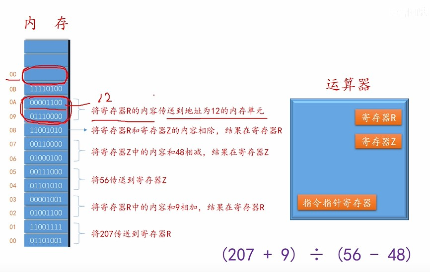

# 内存管理

# 内存

## 作用

**由于硬盘读写速度相对于`CPU`而言，太慢。所以采用更快速的内存作为`CPU`运算时数据，指令的储存工具。**
- 内存的每个「储存单元」均有对应的「地址编号」
- 内存中存储数据，代码二进制指令

## 逻辑地址与绝对地址

**由于程序代码在编译后，是无法知道自己的二进制指令会放在内存的哪个位置的。这样也就导致了「指针地址」操作无法正确实现。逻辑地址与绝对地址就是解决这个问题。**

- **逻辑地址（相对地址）：** 该地址是编译器编译后的暂时给定的指令地址，地址值都是相对于程序「首地址」进行排序的，只要知道了程序在内存中的首地址，就能准确确定指令的地址。
- **绝对地址：** 代码加载到内存后，在内存中真实的代码指令、数据地址。

## 逻辑地址转绝对地址

- **绝对装入：** 事先已经知道程序会被加载内存中的哪个地址位置，然后在编译时，直接将「逻辑地址」设置为真实的「绝对地址」
- **静态重定位：** 程序编译，链接时根据「逻辑地址」来实现。在程序被装入内存后，系统会对程序中的「逻辑地址」进行 **重定位** （把程序首地址修改正确就行）。
- **动态重定位：** 程序编译，链接时根据「逻辑地址」来实现。系统会利用「重定位寄存器」来对程序的「逻辑地址」进行 **动态重定位**。