# 内存管理

# 1. 内存基础概念

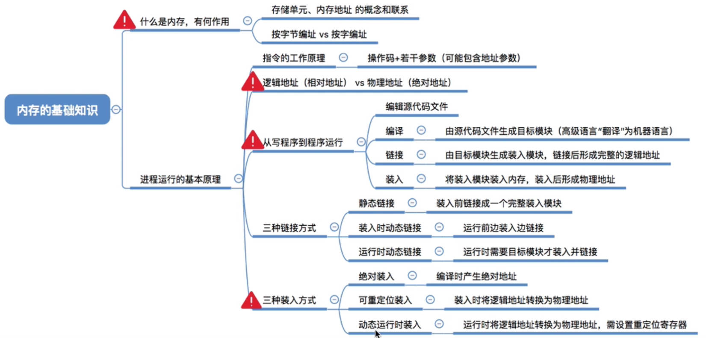

## 1.1. 作用

**由于硬盘读写速度相对于`CPU`而言，太慢。所以采用更快速的内存作为`CPU`运算时数据，指令的储存工具。**
- 内存的每个「储存单元」均有对应的「地址编号」
- 内存中存储数据，代码二进制指令

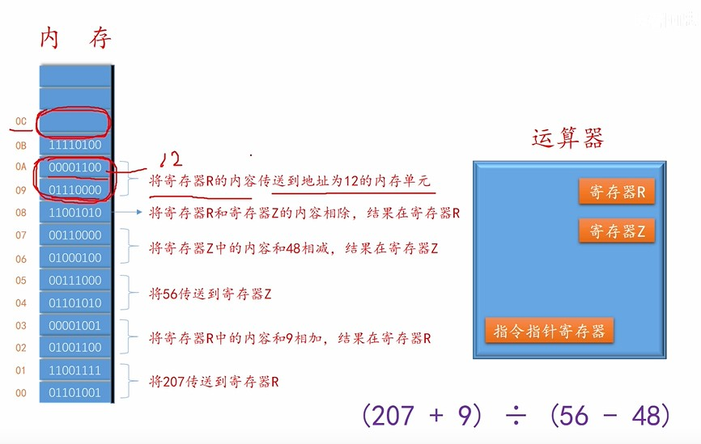

## 1.2. 逻辑地址与绝对地址

**由于程序代码在编译后，是无法知道自己的二进制指令会放在内存的哪个位置的。这样也就导致了「指针地址」操作无法正确实现。逻辑地址与绝对地址就是解决这个问题。**

- **逻辑地址（相对地址）：** 该地址是编译器编译后的暂时给定的指令地址，地址值都是相对于程序「首地址」进行排序的，只要知道了程序在内存中的首地址，就能准确确定指令的地址。
- **绝对地址：** 代码加载到内存后，在内存中真实的代码指令、数据地址。

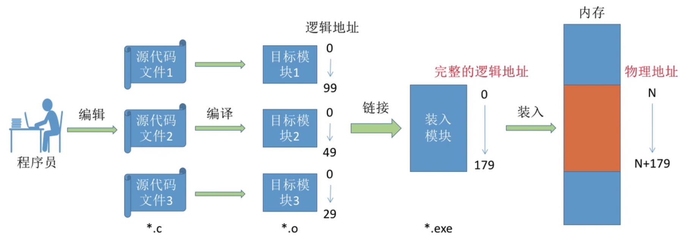

## 1.3. 逻辑地址转绝对地址

- **绝对装入：** 事先已经知道程序会被加载内存中的哪个地址位置，然后在编译时，直接将「逻辑地址」设置为真实的「绝对地址」
- **静态重定位：** 程序编译，链接时根据「逻辑地址」来实现。在程序被装入内存后，系统会对程序中的「逻辑地址」进行 **重定位** （把程序首地址修改正确就行）。
- **动态重定位：** 程序编译，链接时根据「逻辑地址」来实现。系统会利用「重定位寄存器」来对程序的「逻辑地址」进行 **动态重定位**。

## 1.4. 内存管理的内容

# 2. 内存空间的扩充

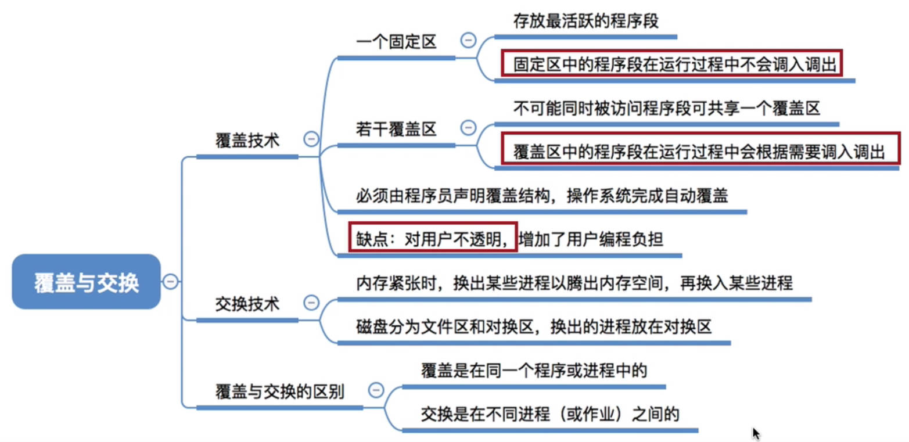

## 2.1. 覆盖技术

- **目的：** 解决程序的实际大小超过了内存的大小，对程序的大小进行优化。 针对「同一程序」内存占用的优化。 
- **规则：** 将程序划分为多个模块，常用的模块常驻内存，不常用的等需要时再调入。
    1. 将内存划分为「固定区」与「覆盖区」；并对程序根据调用关系进行模块化处理
    2. 程序的常用模块放到「固定区」，不常用的模块放大「覆盖区」
    3. 不相互依赖且程序调用层级相同的模块，可以公用一个「覆盖区」

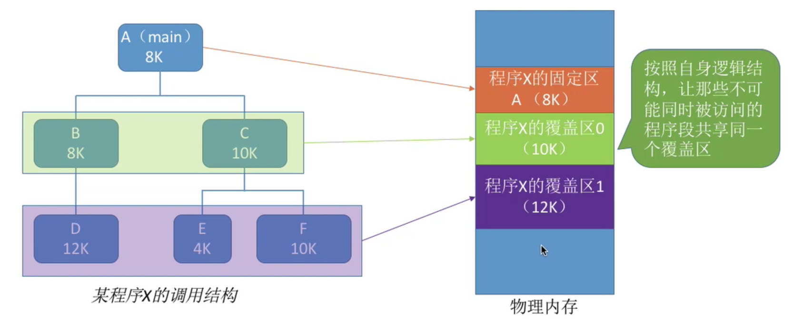

- **缺点：** 程序的层级关系，需要有程序员提供，增加编程负担；属于已经淘汰的机制。

## 2.2. 交换技术

- **目的：** 在外存（机械硬盘，固态硬盘等）中开辟一片交换区，当内存紧张时，就可以将内存中某些进程剔除内存，放入到外存的交换区中，等内存充足时，在重新调度回内存中，即 **「中级调度」** 的实现。 针对「不同进程」内存占用的优化 

**规则：**
1. **外存：** 将外存划分为「对换区」与「文件区」；
    - 对换区：内存使用采用 **「连续分配」** ，利于快速读取。
    - 文件区：内存使用采用 **「离散分配」** ，利于空间利用。

     

     

     

2. **交换：** 内存吃紧时，才会交换。优先将「阻塞态」的进程交换出去。

> [!note|style:flat]
> **`PCB`不会换出内存，常驻在内存的「系统区」中，除非撤销了进程。**

## 2.3. 虚拟存储技术

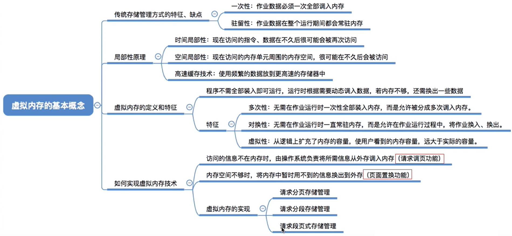

### 2.3.1. 传统内存分配算法

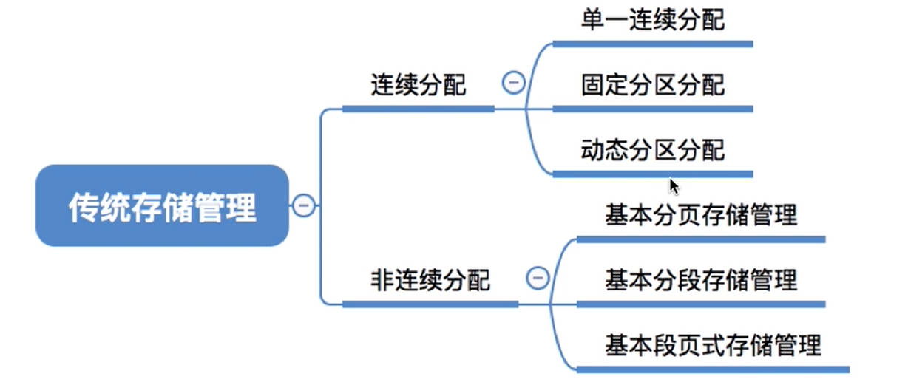

**特征：**
- **一次性：** 作业均为一次性全部装入内存后，然后才开始被`CPU`运行。这就导致
    - **作业太大时，内存不够用，无法运行**
    - **同一作业占用的内存较多，内存容纳的作业较少，并发度低**
- **驻留性：** 一旦作业被加载入内存，就会一直驻留在内存中，直到作业运行结束。然而，对于同一作业而言，需要运行的程序只是一小部分，这就导致在内存中放入了大量用不到的数据。

### 2.3.2. 局部性原理

- **时间局部性：** 如果执行了程序中的某条指令，那么不久后这条指令很有可能再次执行；如果某个数据被访问过，不久之后该数据很可能再次被访问。（因为程序中存在大量的循环）
- **空间局部性：** 一旦程序访问了某个存储单元，在不久之后，其附近的存储单元也很有可能被访问。（因为很多数据在内存中都是连续存放的，并且程序的指令也是顺序地在内存中存放的）

> [!tip|style:flat]
> 由于「局部性原理」的存在，就可以把需要频**繁访问的内容**丢到**读写速度更快的缓存**中，进而提出了 **「高速缓冲技术」**。

### 2.3.3. 虚拟内存的概念

**思想：** 每个进程都运行在自己的「虚拟内存空间」中，但是实际上，每个进程只有部分代码和数据放入了内存，让`CPU`并发运行。将程序中很快会用到的部分装入内存，暂时用不到的部分留在外存（**硬盘的`swap`区/对换区**），就可以让程序开始执行。

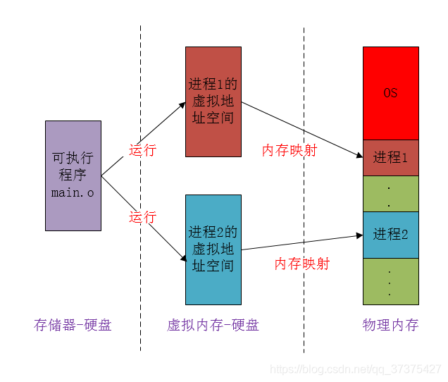

**规则：**
1. 基于局部性原理，在程序装入时，**可以将程序中很快会用到的部分装入内存，暂时用不到的部分留在外存**，就可以让程序开始执行。
2. 在程序执行过程中，**当所访问的信息不在内存时，由操作系统负责将所需信息从外存调入内存**，然后继续执行程序。
3. **若内存空间不够，由操作系统负责将内存中口暂时用不到的信息换出到外存**。

> [!note|style:flat]
> - **虚拟内存最大容量：** `CPU`的寻址范围，地址总线的长度。
> - **虚拟内存的实际容量：** min(内存+外存,`CPU`寻址范围)

### 2.3.4. 虚拟内存的特性

- **多次性：** 作业并非是一次性调入内存的，允许多次调入
- **对换性：** 作业的部分无需一直常驻内存，允许作业在内存与外存的交换

### 2.3.5. 虚拟内存的实现

1. 基于内存的「离散分配存储管理算法」
2. **请求调页/段功能**：当所访问的信息不在内存时，由操作系统负责将所需信息从外存调入内存。
3. **页面/段置换功能**：若内存空间不够，由操作系统负责将内存中口暂时用不到的信息换出到外存

# 3. 内存分配与回收

> [!tip|style:flat]
> - **连续分配：** 系统为进程分配的内存是一块「连续的内存空间」。**进程的数据块与代码块都是完整地放在一块。**
> - **非连续分配：** 系统为进程分配的内存是一块「非连续的内存空间」。
> 
> **注意**： 在没有引入「虚拟内存技术」之前，所有的内存分配算法都是将进程完整地放入内存中，才进行运行。 

## 3.1. 内部碎片与外部碎片

- **内部碎片：** 分配给进程的内存中，进程没有利用上的内存，例如字节对齐产生的空字节。
- **外部碎片：** 在内存中，某些内存块由于太小，无法给进程用使用的内存。

## 3.2. 连续分配管理

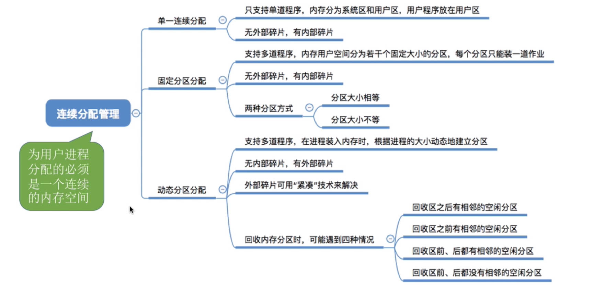

### 3.2.1. 单一连续分配

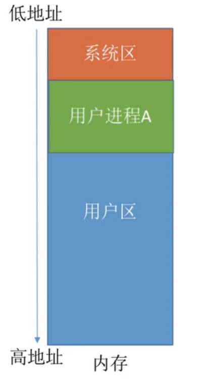

- **规则：** 内存被分为「系统区」和「用户区」
  - 系统区: 通常位于内存的低地址部分，用于存放操作系统相关数据；
  - 用户区: 用于存放用户进程相关数据。 内存中只能有一道用户程序，用户程序独占整个用户区空间  。
- **优缺点：** 无外部碎片，有内部碎片。

### 3.2.2. 固定分区分配

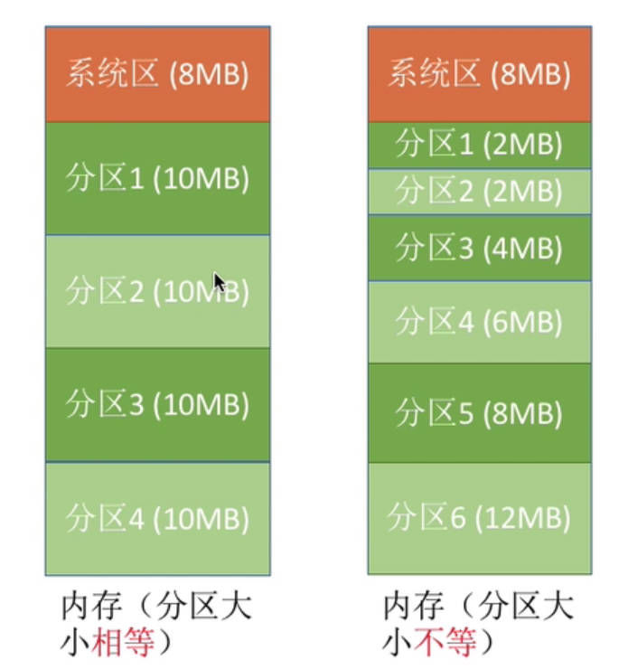

- **规则：** 
  - 将「用户区」非为若干内存大小相等的区域，一个分区运行一道程序。
  - 建立「分区说明表」用于管理每个分区。
  
  

  
  
  
  

- **优缺点：** 无外部碎片，有内部碎片。当程序太大时，只能采用「覆盖技术」来缩减内存占用。

### 3.2.3. 动态分区分配

- **思路：**  「固定分区分配」是由操作系统来划分每个分区的大小。相对地，可以直接通过「进程」加载内存中的大小来划分每个分区的大小。

- **规则：**
    1. **空闲分区表/链**：区别于「分区说明表」，**这里只记录内存中的「空闲区域」**。

    

    
    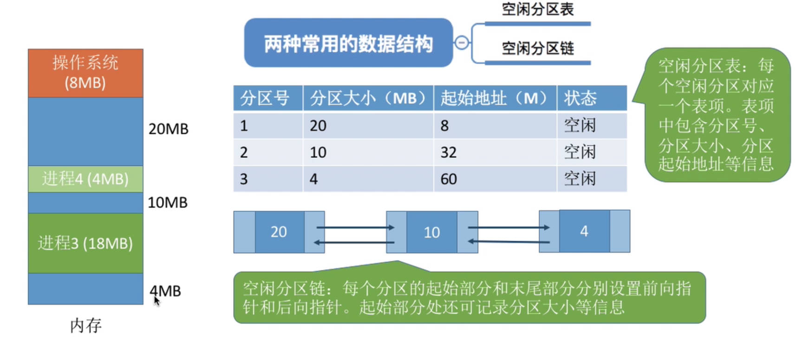
    
    

    表的更新方式为：**相邻的空闲分区合并；未用来的分区更新大小，起始地址；刚好用完的分区，从空闲表中删除。**

    2. 进程内存的「动态分配算法」，下一节详细描述

- **优缺点：** 有外部碎片，无内部碎片。

## 3.3. 动态分区分配算法

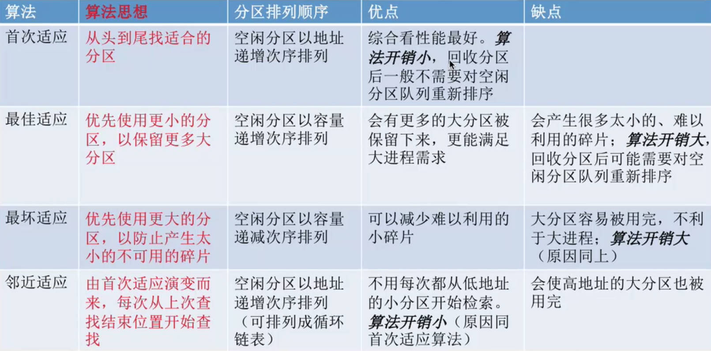

### 3.3.1. 首次适应算法

- **思想：** 从低地址开始查找，找到第一个能满足进程大小的空闲区间。
- **规则：** 
    1. 空闲表以「地址递增」的次序排序
    2. 每次分配内存，**从空闲表表头开始查找**，找到满足进程大小的第一个空闲分区
-  效果最好的 

### 3.3.2. 邻近适应算法

- **思想：** 「首次适应算法」每次分配都是从低地址开始查找，就会导致低地址处产生许多小的空闲分区，且每次查找都要遍历这些分区，就导致开销增大。所以**修改为每次都从上一次结束的位置开始查找**。
- **规则：** 
    1. 空闲表以「地址递增」的次序排序
    2. 每次分配内存，**上一次结束的位置开始查找**，找到满足进程大小的第一个空闲分区
- **缺陷：** 高低地址的空闲分区都被同等概率的利用，这就导致大进程无法进入。

### 3.3.3. 最佳适应算法

- **思想：** 由于动态分区分配算法中的每一个区块就是一个完整的连续内存空间，为了保证能放入大进程，所以应尽量保留大内存的空间区间，优先使用小空闲区间。
- **规则：** 
    1. 空闲表以「空闲区容量递增」的次序排序
    2. 每次分配内存，从空闲表表头开始查找，找到满足进程大小的第一个空闲分区
- **缺陷：** 由于每次都是利用小空闲区间，就会导致外部碎片增加。

### 3.3.4. 最坏适应算法

- **思想：** 与「最佳适应算法」相反，优先使用最大空闲区间。
- **规则：** 
    1. 空闲表以「空闲区容量递减」的次序排序
    2. 每次分配内存，从空闲表表头开始查找，找到满足进程大小的第一个空闲分区
- **缺陷：** 由于每次都是利用最大空闲区间，就会导致大进程无法进入。

## 3.4. 非连续分配管理-基本分页存储

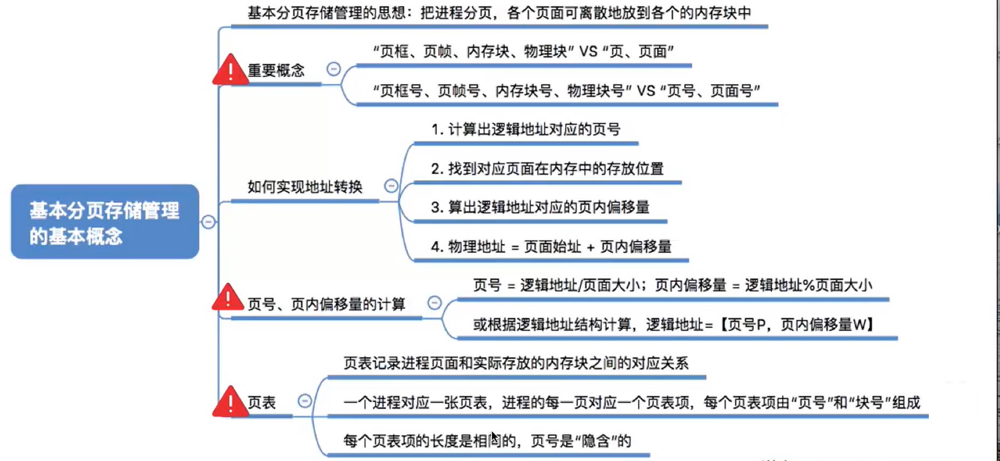

### 3.4.1. 基本思想

**思路：** 内存按照「固定分区分配」思路，将内存划分为一定大小等值的内存块。再将进程也划分为同样大小的块，这样就能将进程一块一块的放入内存中。**当分块大小越小时，对内存的利用率也就越高，内部碎片越小。**

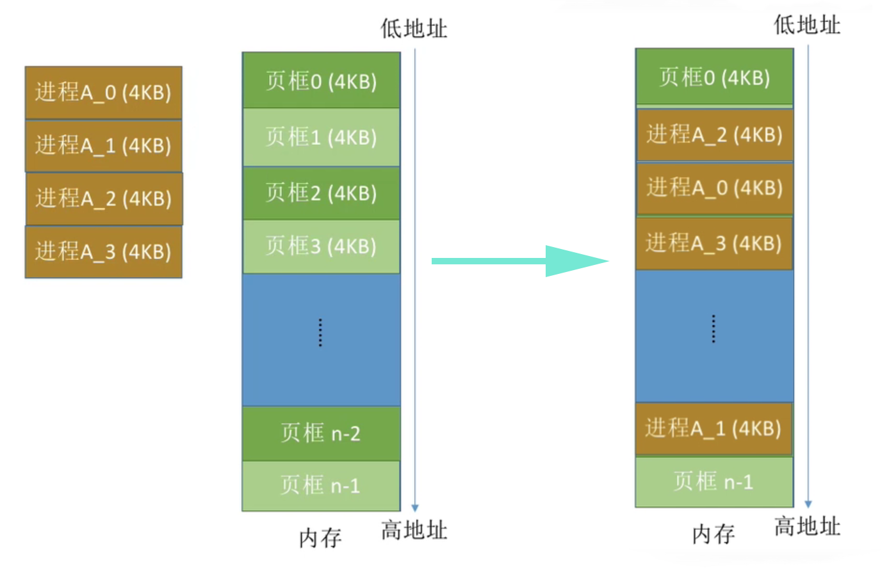

**概念：**
- **页框：** 内存的分块，也叫页帧、内存块、物理块
- **页面：** 进程的分块，也叫页
- **页号：** 每一个「页」编号，从`0`开始
- **页面号：** 每一个「页框」编号，从`0`开始

> [!tip|style:flat]
> - 操作系统是以「页框」为基本单位来为进程分配内存
> - 在内存中，「页」与「页框」是一一对应关系
> - 「页」在内存中分布，不用按照先后顺序存放。

### 3.4.2. 地址转换逻辑

> [!note|style:flat] 
> **根据逻辑地址转绝对地址的三种方案，可以看出「动态重定位」方案是最适合的。**

1. 地址转换方案

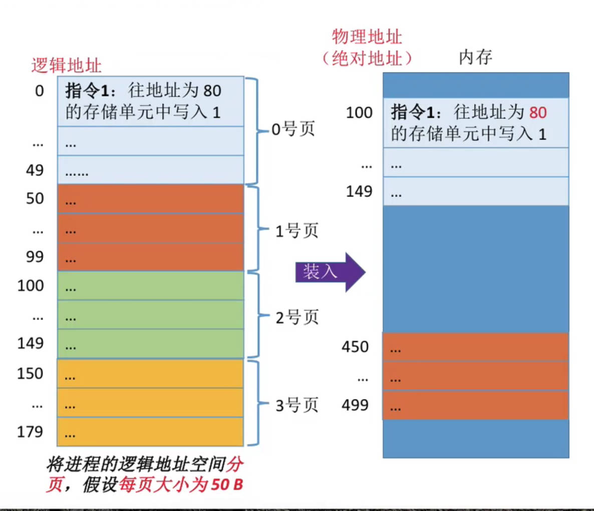

**问题：** 计算「指令1」中逻辑地址`80`在「物理地址」中的值。

1. 计算出逻辑地址`80`的「页号」
    $$
    页号 = \lfloor 80 / 50 \rfloor = 1 
    $$
2. 根据「页号」查询「页表」，得到「页面号」`N`
3. 计算逻辑地址`80`在1号「页面」中的相对「偏移量」
    $$
    偏移量 = 80 \% 50 = 30
    $$
4. 根据「页面号」与「偏移量」计算绝对地址
    $$
    物理地址 = N * 50 + 30
    $$

2. 页号与偏移量的计算

- **十进制：** 
    $$
    \begin{aligned}
        页号 &= \lfloor \frac{逻辑地址}{页大小} \rfloor \\
        偏移量 &= 逻辑地址 \% 页大小 
    \end{aligned}
    $$
- **二进制：** 为了`CPU`处理方便， 一般取「页大小」的值为`2`的整数幂  。取页大小为`4096 bit`，一个`32 bit`的逻辑地址`4097`的「页号」与「偏移量」的二进制表达形式如下图所示。红色部分就是「页号」，黑色部分就是「偏移量」
    

    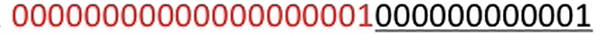

    

3. 页表

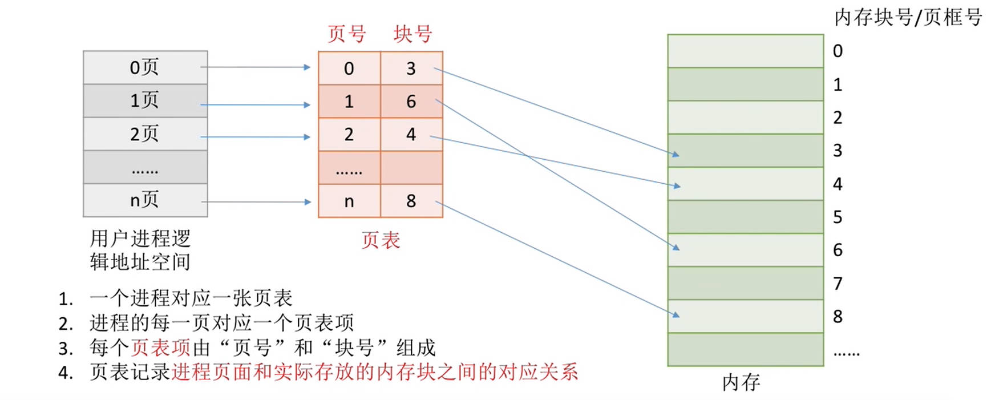

> [!note|style:flat]
> **在「页表」中，「页号」是从`0`开始，顺序排序的，且「页号」的储存长度是一样的。这样就能将「页表」当作一个数组，对于「块号」的查询，就能把「页号」当作「索引号」来使用。**
> $$
> 块号地址 = 页号 * 块号项字节长度 + 页表首地址
> $$

### 3.4.3. 基本地址变换机构

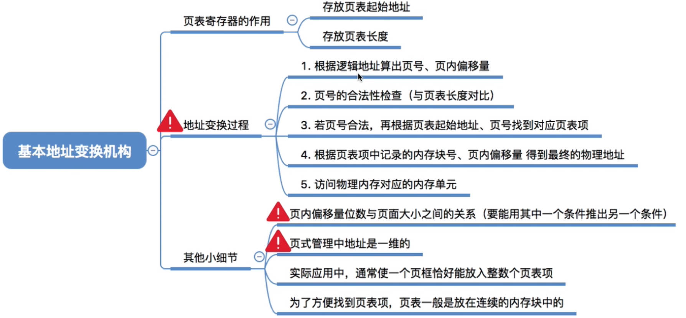

1. 基本地址变换机构的实现

**作用：** 基本地址变换机构可以根据进程的「页表」将逻辑地址转换为物理地址。利用「页表寄存器」来储存「页表」在内存中的位置。
- **页表寄存器(PTR)**：存储「页表」在内存中的「页表始址」与「页表长度」
- **页表始址**：「页表」在内存存放的起始地址
- **页表长度**：「页表」中存放了几项数据
- 「起始地址F」与「页表长度M」的初始值存放在`PCB`中，当进程转为「运行态」时，才会修改对应「页表寄存器」的值

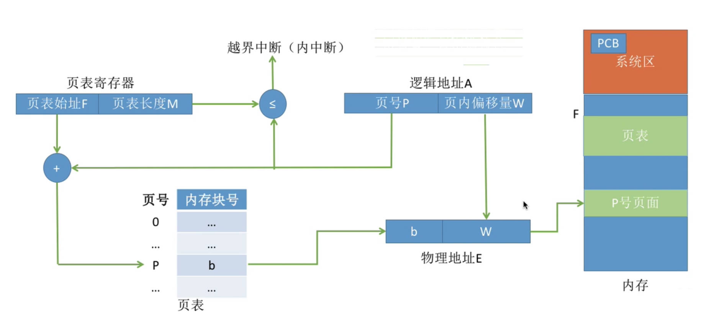

**工作原理：**
1. 计算「逻辑地址」的「页号」与「页内偏移量」
2. 根据「页表长度」检测「页号」是否越界
3. 根据「页号」从「页表」中取出「内存块号」
4. 根据「内存块号」与「页内偏移量」计算「物理地址」

> [!note|style:flat]
> 对于`32 bit`的系统，内存为`4G`，取「页面」大小为`4KB`，这样「块号」的取值范围就为`0 ~ 2^20`，在内存中就需要用`20 bit`来存储「块号」，为了读取方便，就可以利用`3 Byte`来存储。 利用`3B`来存储块号，就会导致一个`4KB`的「页框」只能存储了`1365`个「块号」，还剩余`4096 - 1365*3 = 1`个字节，这就导致对于占用多个「页框」的「页表」，并不能在内存中连续存储，所以为了编程方便，可以将「页块」所占长度设置为`4B` 

2. 快表的实现

**原因：** 根据程序运行的「局部性原理」，转换「逻辑地址」将是一个很频繁的操作，为了加快这种运算，可以在计算速度更快的缓存中，建立一个「快表」，加快对「页号」对应「块号」的转换。

**快表：** 联想寄存器（TLB），**一种访问速度比内存快得多的高速缓冲寄存器**，可用于存放「页表」查询最近的若干「页表项」，加速地址转变过程。

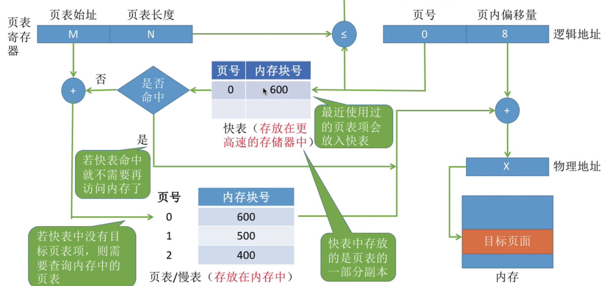

**工作原理：**
1. 计算「逻辑地址」的「页号」与「页内偏移量」
2. 根据「页表长度」检测「页号」是否越界
3. 根据「页号」在「快表」中查询「块号」，若快表中有，就直接与「页内偏移量」计算「物理地址」；若无，则查询「慢表」
4. 根据「页号」从「页表」中取出「内存块号」，并添加到「快表」中
5. 根据「内存块号」与「页内偏移量」计算「物理地址」

> [!note|style:flat]
> 根据「逻辑地址」访问内存中的值：「快表」只进行**一次内存访问**，「慢表」则需要**两次内存访问**。

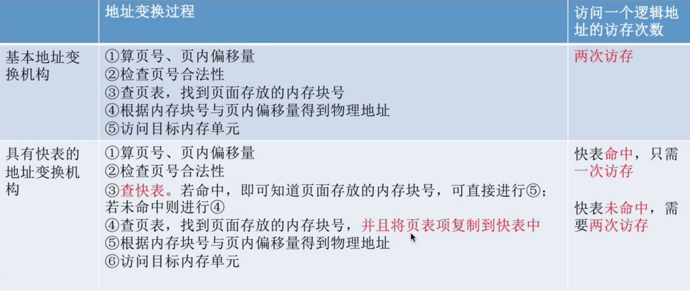

### 3.4.4. 两级页表

> [!tip|style:flat]
> **单级页表存在问题：**
> 1. 从上述「页表」查询可以看出，「页表」在内存中的存放，必须是 **完整的连续内存**，这将会占用大量且连续的「页框」，这样就与「基于分页分配算法」的设计思路相违背。
> 1. 根据「局部性原理」，没有必要让整个「页表」都常驻内存，只用保存几个特定的「页」就行
>
> **解决方案：** 第一个问题可以通过「两级页表」解决；第二个问题可以通过「虚拟内存算法」解决

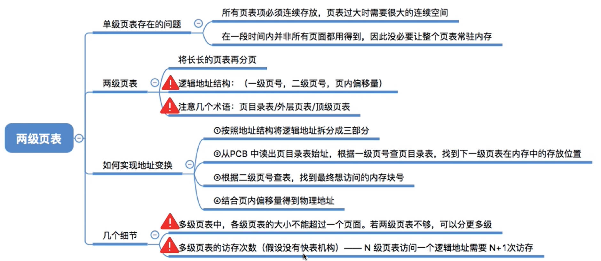

**思路：** 模仿「基本分页存储算法」，将「页表」也拆分为多个「页」，然后再为分散的「页表」创建一个「目录页」，也叫「外层页表」、「顶层页表」。

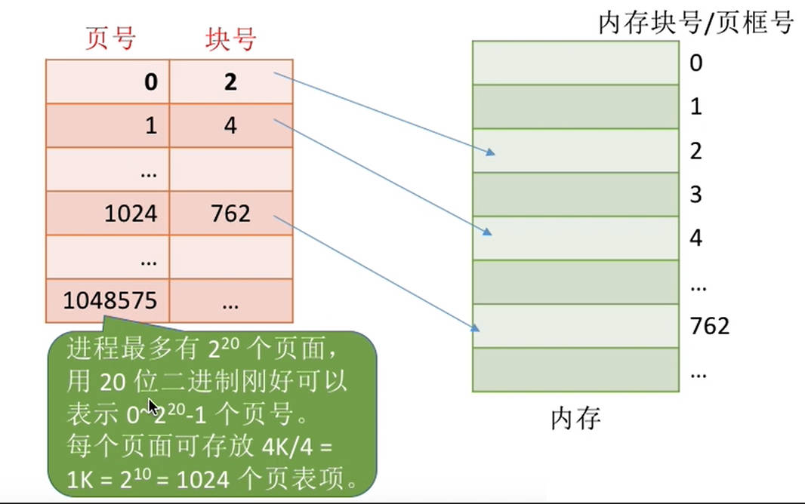

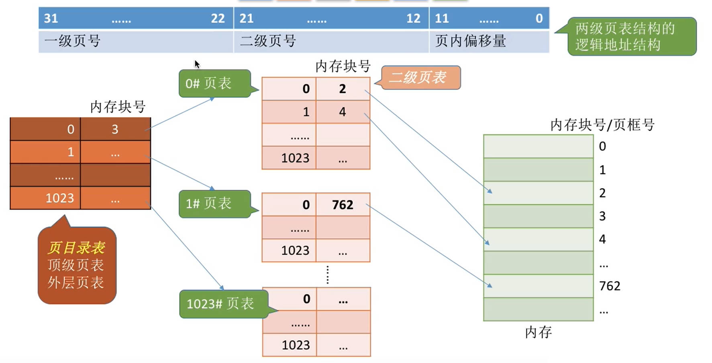

1. 如上图所示，对于`32 bit`系统，取「页面」大小为`4KB`，最多可以拆分为`2^20`个「页」，「页表」的最大长度就为`2^20`。该「页表」在内存中的结构就可以看作是一个 **四字节的数组，数组长度为`2^20`**。
2. 「基本分页存储算法」将内存划分成了一个个大小为`4KB`的「页框」，为了离散存放「页表」，就可以将该「页表」拆分成一个个大小为`4KB`的「小页表」
3. 一个「页」能储存`4KB / 4B = 1024`个「页表项」，长度为`2^20`的「页表」可以拆分为`2^20 / 1024 = 1024`个「小页表」
4. 再将「小页表」在内存中存放的「块号」存放到一个「目录列表」中。「目录列表」则有`1024`个「列表项」，刚好就是一「页」**。这样得到的二级列表就类似于一个一维的数组转换成了一个二维的数组。「一级页号」与「二级页号」就是二维数组的索引号。**
5. 可以通过「一级页号」在「目录列表」中查询出「小页表」，然后通过「二级页号」在「小页表」中查询出内存的「块号」。

> [!note|style:flat]
> - **各级页表的大小不能超过一个页的大小**
> - **根据需要可以设计多级页表**
> - **二级列表会进行三次内存访问**

## 3.5. 非连续分配管理-基本分段存储

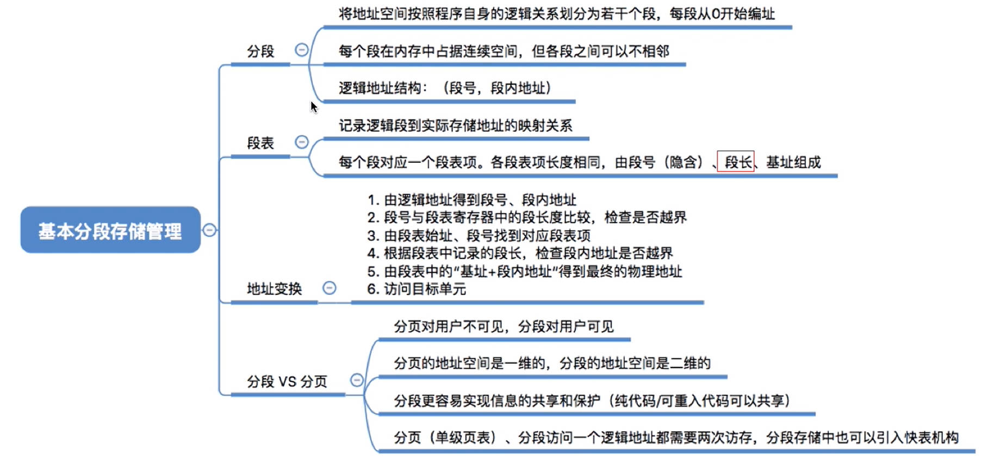

### 3.5.1. 算法思路

**原因：** 对于「基本分页存储」而言，内存和进程是被拆分成了一个个大小相等的「页」与「页框」，且该拆分过程是对用户隐藏的，不利于程序代码的控制。对此可以借鉴「动态分配算法」的思路，对于内存的划分是可变的，对于进程「页」划分是程序员可控的。

**实现：**
1. 按照程序逻辑关系，将程序划分为若干个「段」
2. 在内存中，每个「段」都分配**连续的内存空间**，且各个「段」可以随便分配，
    

    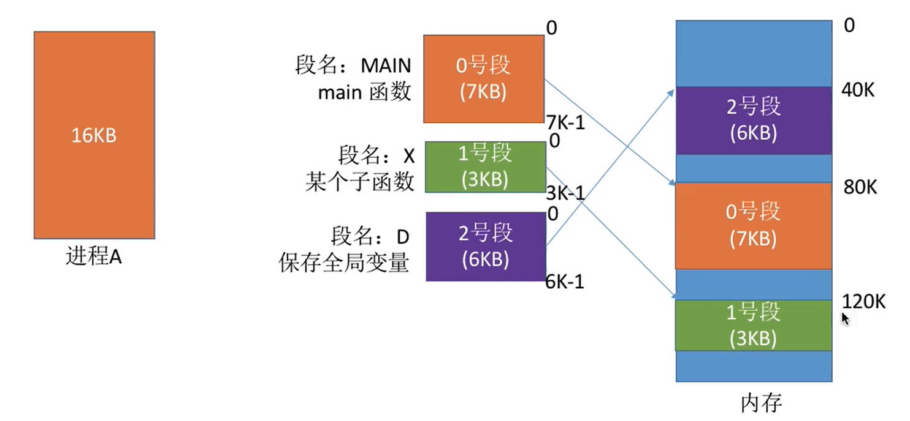

    

3. 「逻辑地址」由「段号」与「段内地址」组成。在`16 bit`的`CPU`中提出了「段」的概念，当时的「段寄存器」就是`16 bit`的，并沿用到了`32 bit`的`CPU`中。
    

    
    
    
    

4. 「段表」的「段表项」包含了「段长」以及该段在内存中存储的起始地址「基址」。由于「段内地址」分配的是`16 bit`，所以「段长」的长度为`2B`。「基址」存储的是内存地址，对于`32bit`的`CPU`而言，其长度就为`4B`。**综上，一个「段表项」的长度就为`2 + 4 = 6B`，又由于「基本分段存储」的「段」长度是可变的，所以不用字节对齐「段表项」**。
    

    
    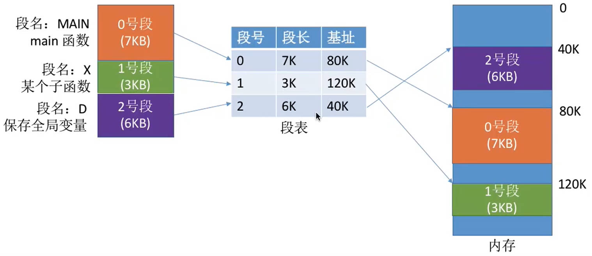
    
    

5. 地址转换
    

    
    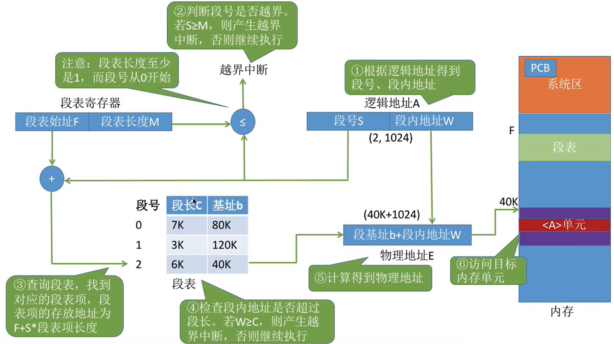
    
    

### 3.5.2. 基本分段存储与基本分页储存对比

- **页：** 信息的物理单位，固定大小
- **段：** 信息的逻辑单位，可变大小
- **分页：** 由「操作系统」完成；地址变换只要「相对地址」，一维
- **分段：** 由「程序员」指定；地址变换需要「段地址」与「段内地址」，二维
- **分段比分页更容易实现信息的共享与保护**。 不会修改内容的代码段才能共享。「页面」并非根据逻辑来划分的，提出可以共享的代码段困难。 

## 3.6. 非连续分配管理-段页式管理

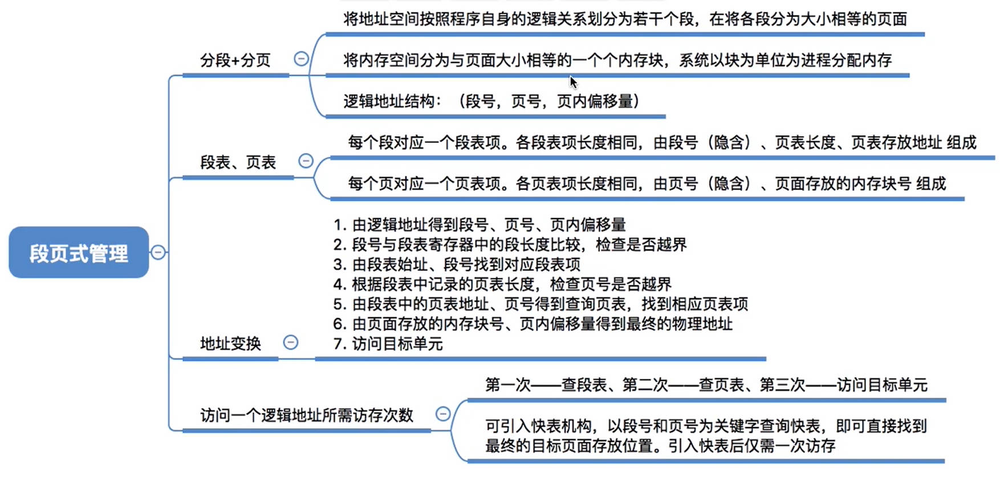

**思路：** 整合了「基本分段存储」与「基本分页存储」的优缺点后，提出了「段页式管理」。对代码程序进行「分段」处理；在内存中又将各个「段」进行「分页」处理。

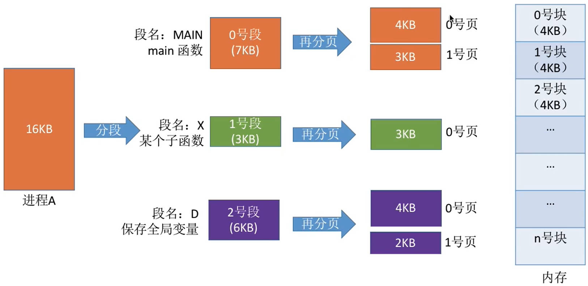

1. 「逻辑地址」组成
    

    
    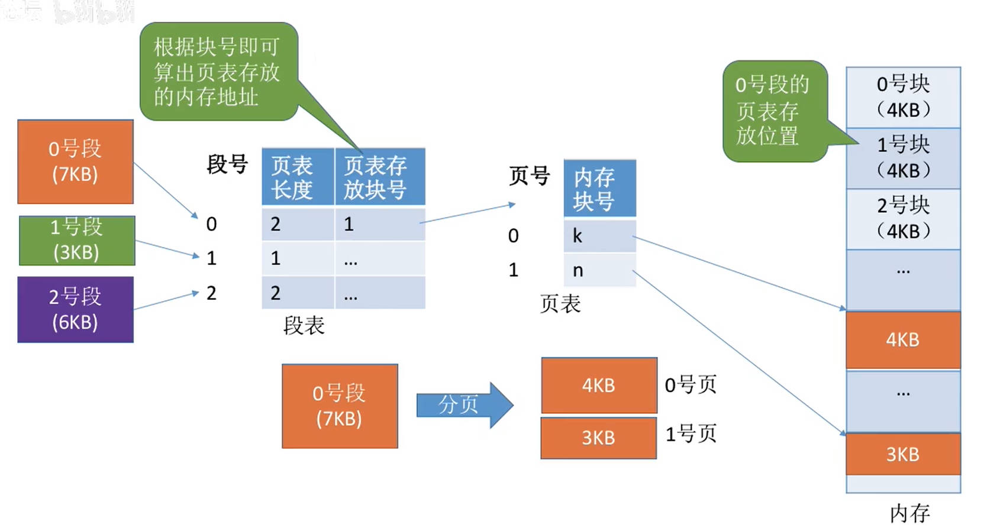    
    

2. 地址转换
    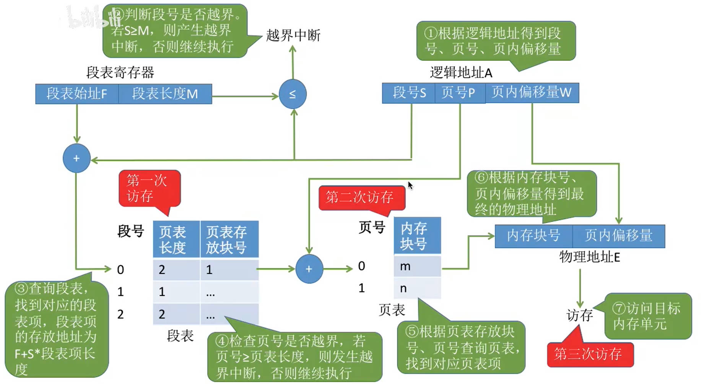
