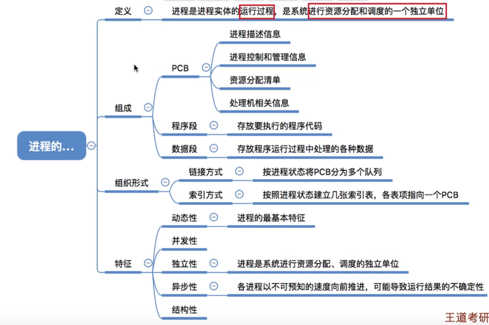
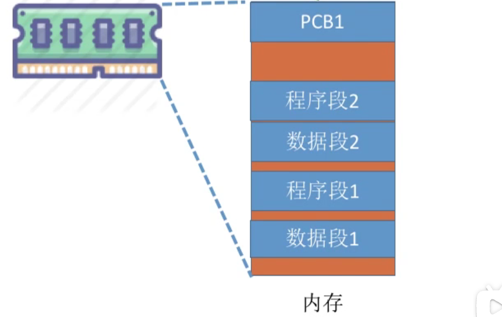
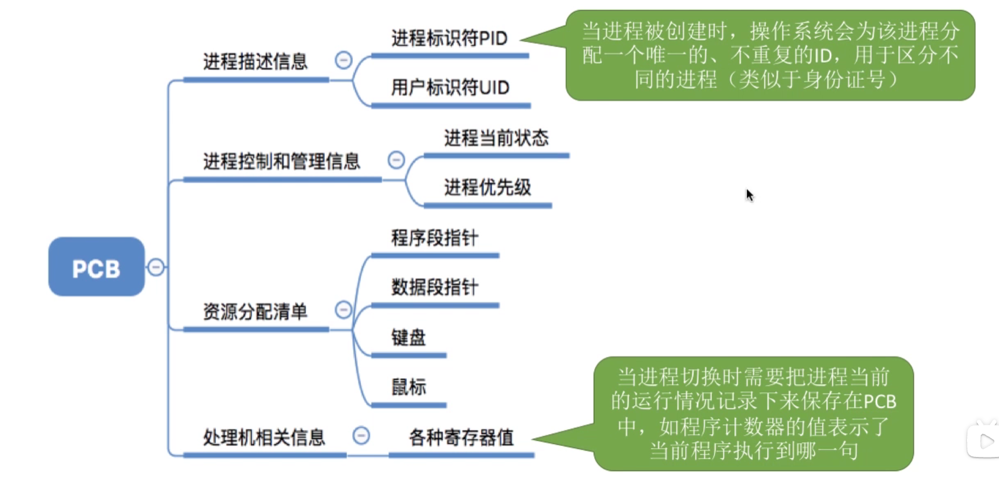
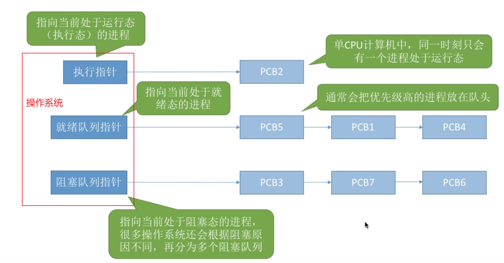
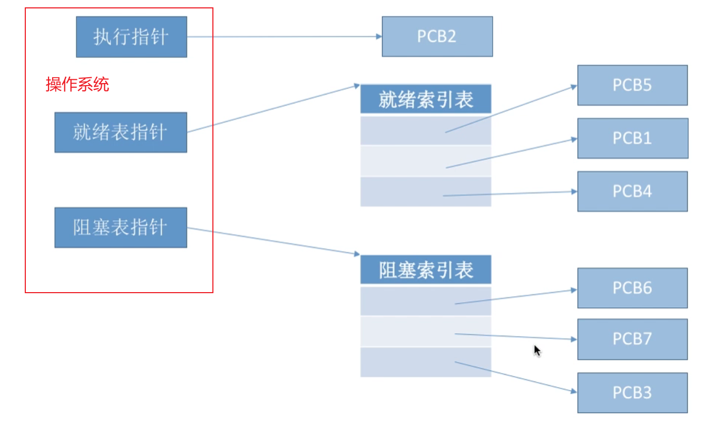
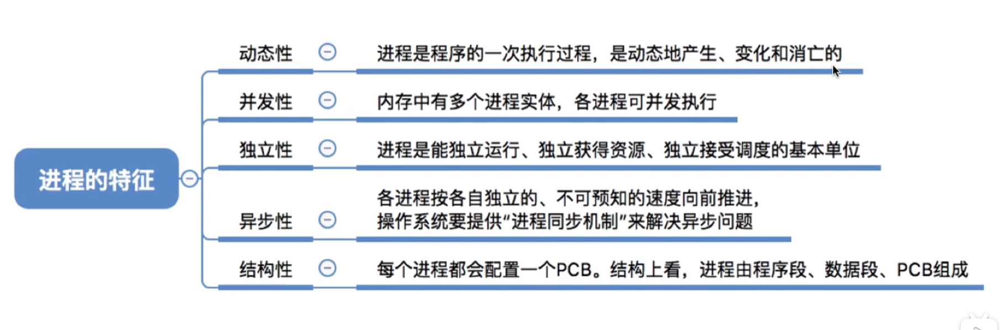

# 进程

# 1. 进程的描述

<p style="text-align:center;"></p>

## 1.1. 定义

**作用**：对于「多道批处理系统」，在内存中加载了多道程序的数据段与代码段，为了方便操作系统对这些内存中的运行程序进行管理，引入的「进程」、「进程实体」的概念。


<p style="text-align:center;"></p>


**进程实体**；进程在物理上，实实在在的体现。
- `PCB`：进程控制模块，用来记录，描述进程的各种信息的一个结构体。
- 程序段：程序代码指令
- 数据段：程序运行中要使用的数据，例如字符串，静态变量，全局变量等。

**注意：** 
- 一般「进程实体」与「进程」会混用
- **进程创建，指的是创建`PCB`；进程回收，指的是回收`PCB`。**
- **`PCB`是进程存在的唯一标志。**

> [!note|style:flat]
> **定义： 进程是动态的，进程实体的运行过程（程序的一次执行过程），是系统进行资源分配、独立运行、接受调度的基本单位。**

## 1.2. `PCB`

`Linux`中关于`PCB`结构体的定义。
```cpp
struct task_struct {
    // 进程状态
    long              state;
    // 虚拟内存结构体
    struct mm_struct  *mm;
    // 进程号
    pid_t              pid;
    // 指向父进程的指针
    struct task_struct __rcu  *parent;
    // 子进程列表
    struct list_head        children;
    // 存放文件系统信息的指针
    struct fs_struct        *fs;
    // 一个数组，包含该进程打开的文件指针
    struct files_struct        *files;
};
```

<p style="text-align:center;"></p>


## 1.3. 进程的组织

<span style="font-size:24px;font-weight:bold" class="section2">1. 链接方式</span>

<p style="text-align:center;"></p>

<span style="font-size:24px;font-weight:bold" class="section2">2. 索引方式</span>

<p style="text-align:center;"></p>

## 1.4. 进程特性

<p style="text-align:center;"></p>