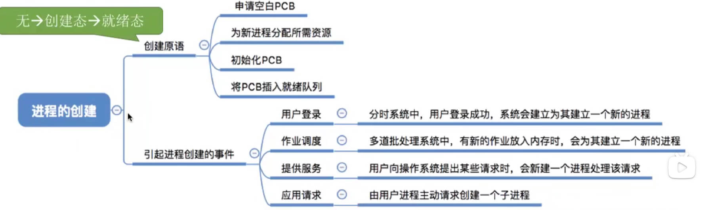

# 进程

# 1. 进程的描述


## 1.1. 定义

**作用**：对于「多道批处理系统」，在内存中加载了多道程序的数据段与代码段，为了方便操作系统对这些内存中的运行程序进行管理，引入的「进程」、「进程实体」的概念。


**进程实体**；进程在物理上，实实在在的体现。
- `PCB`：进程控制模块，用来记录，描述进程的各种信息的一个结构体。
- 程序段：程序代码指令
- 数据段：程序运行中要使用的数据，例如字符串，静态变量，全局变量等。

**注意：** 
- 一般「进程实体」与「进程」会混用
- **进程创建，指的是创建`PCB`；进程回收，指的是回收`PCB`。**
- **`PCB`是进程存在的唯一标志。**

> [!note|style:flat]
> **定义： 进程是动态的，进程实体的运行过程（程序的一次执行过程），是系统进行资源分配、独立运行、接受调度的基本单位。**

## 1.2. `PCB`

`Linux`中关于`PCB`结构体的定义。

```cpp
struct task_struct {
    // 进程状态
    long              state;
    // 虚拟内存结构体
    struct mm_struct  *mm;
    // 进程号
    pid_t              pid;
    // 指向父进程的指针
    struct task_struct __rcu  *parent;
    // 子进程列表
    struct list_head        children;
    // 存放文件系统信息的指针
    struct fs_struct        *fs;
    // 一个数组，包含该进程打开的文件指针
    struct files_struct        *files;
};
```


## 1.3. 进程的组织

<span style="font-size:24px;font-weight:bold" class="section2">1. 链接方式</span>


<span style="font-size:24px;font-weight:bold" class="section2">2. 索引方式</span>


## 1.4. 进程特性


# 2. 进程状态


## 2.1. 状态分类

<center>


</center>

- **创建态（new）**：进程正被创建，操作系统为进程分配资源，初始化`PCB`。
- **就绪态（ready）**：进程运行所需要的资源，已经得到满足，只差`CPU`运行了。**让进程提前做好准备，`CPU`一有空，就能直接运行。**
- **运行态（running）**：占用`CPU`，在`CPU`上进行执行。
- **阻塞态（waiting）**：进程因为某一事件暂停（所需要的资源得不到满足等），导致进程不能继续运行
- **终止态（terminated）**：进程从系统中销毁，操作系统回收分配的资源，销毁`PCB`

# 3. 进程控制

## 3.1. 进程转换

<center>


</center>


- **`new -> ready`**：进程`PCB`生成了，运行所需的所有资源都准备好了，就等着`CPU`运行了。
- **`ready -> running`**：该进程被`CPU`调度，开始运行；被中断暂停的进程，恢复运行。恢复运行环境。
- **`running -> ready`**：分时系统，执行时间到了，切换进程；被紧急事件中断，进程被暂停。保存运行环境。
- **`running -> waiting`**：当前运行进程所需要的「资源」得不到满足，进程「主动」请求操作系统，把自己挂起，等待资源条件满足。
- **`waiting -> ready`**：等待的进程所需要的「资源」得到了满足，然后被操作系统调整到就绪态，等待运行。
- **`running -> terminated`**：进程运行完毕；进程运行异常被强制停止；外部将进程强制停止（`ctrl c`）


## 3.2. 进程原语


<center>


</center>

<span style="font-size:24px;font-weight:bold" class="section2">1. 作用</span>

> [!note]
> 1. 更新`PCB`中的信息
>     - 修改进程的状态
>     - 剥夺进程对`CPU`的使用权后，保存运行环境
>     - 运行进程前，恢复进程的环境东风四扽分等等刚发到了；
> 2. 将`PCB`放入相应队列
> 3. 分配/回收资源

<span style="font-size:24px;font-weight:bold" class="section2">2. 类型</span>





# 4. 进程通信

<center>


</center>

> [!note]
> **为了安全，进程只能访问自己的地址空间，这就导致两个进程无法直接进行通讯。就需要有相应的方法实现进程间通信**
>   - 共享存储
>   - 消息传递
>   - 管道通信


## 4.1. 共享存储

<center>


</center>

**原理：** 由操作系统在内存中分配一块公共的内存空间，两个进程都能够合法访问。但是进程对公共内存空间的访问应该是 <font color="red"> 互斥 </font>的。

- **数据结构共享**：共享的内存空间为一个规定好的数据结构。
- **存储区共享**：共享了一片内存，无格式要求。

## 4.2. 管道共享

<center>


</center>


**原理**：在内存中创建一个大小固定的“文件”——管道，然后进程就读写这个文件。
  1. <font color="red"> 半双工通信 </font>：在一个时间内，只能单向传输数据。
  2. 进程对管道的访问也是 <font color="red"> 互斥 </font>的。
  3. 以 <span style="color:red;font-weight:bold"> 字符流 </span>的形式读写数据
  4. 当文件 <span style="color:red;font-weight:bold"> 写满 </span> 时，才能读取；当文件 <span style="color:red;font-weight:bold"> 读空 </span> 时，才能写入。
  5. 文件数据一经 <span style="color:red;font-weight:bold"> 读空 </span>，就会被清理掉。

## 4.3. 消息传递

<center>


</center>

**原理**：以「消息」为数据传送单位，并以操作系统提供的发送消息/接收消息原语进行数据传输。
 - **直接通讯**：消息会直接挂载到进程的「消息缓冲队列」
  - **间接通讯**：消息会被放到一个 <span style="color:red;font-weight:bold"> 信箱 </span> 中进行统一管理。

# 5. 线程


## 5.1. 基本概念

**原因：** 由于进程是一次程序的执行，实现的是多道程序之间的并发。但是当一个进程中，需要同时并发执行多种功能时，只能靠线程实现。

**原理：** 线程是`CPU`执行的基本单位，也是程序执行流水线最小的单位。


<center>


</center>

## 5.2. 实现方式

### 5.2.1. 用户级线程

<center>


</center>


用户级线程是通过「应用程序线程库」实现和管理，处于「用户态空间」，操作系统不会介入。只是在用户的视角看见了多线程的存在，对于操作系统而言只有一个线程执行。

### 5.2.2. 内核级线程

<center>


</center>

内核级线程是通过「操作系统内核」实现和管理，处于「内核态空间」。因此，线程的切换只能在内核态实现。

### 5.2.3. 多线程模型

> [!note]
> **操作系统中，线程调度只以「内核级线程」为准。**

<center>

**多对一**


**一对一**


**多对多**

</center>


# 6. 处理机调度


## 6.1. 基本概念

当有一堆任务要处理，但由于资源有限，这些事情没法同时浬。<span style="color:red;font-weight:bold"> 决定处理这些任务的「顺序」 </span> ，这就是「调度」研究的问题。


## 6.2. 分类

<center>


</center>

- **高级调度：** 从一个后备任务队列中，根据规则选择作业添加到内存中，创建`PCB`，形成进程。
- **中级调度：** 由于「虚拟内存」的出现，可以将需要长时间闲置的进程放到外存磁盘中，此时的进程变为了「挂起态」。中级调度则根据对应规则将挂起的进程调回内存中等待执行。
- **低级调度：** 从「就绪队列」中根据规则，选择一个进程进行执行。

<center>


</center>

# 7. 进程调度


## 7.1. 进程调度与进程切换

- **狭义进程调度：** 从就绪队列中选择一个进程运行。（<span style="color:red;font-weight:bold"> 选出的进程可能就是刚刚的暂停的 </span>）
- **进程切换：** 从一个进程切换到另外一个进程运行。（<span style="color:red;font-weight:bold"> 进程不一样 </span>）
- **广义进程调度：**
    1. 从就绪队列中选择一个进程
    2. 进程切换

## 7.2. 进程调度的时机

- **可以进程调度**：当前的常规进程放弃`CPU`使用，需要从就绪队列中再选出一个进程继续执行。
- **不能进行调度**：会造成操作系统安全问题的操作
  1. 处理中断的过程
  2. 进程在操作系统内核临界区中
  3. 原语执行过程中

> [!tip]
> - **临界资源**：一段时间内，只能允许一个进程使用的资源。
> - **临界区**：使用临界资源的那一段代。
> - **内核临界区**：使用内核临界资源的代码

## 7.3. 进程调度的方式

- **非剥夺调度方式（非抢占式）**：只有当进程进入阻塞态，终止态时，才会主动放弃`CPU`的使用。
- **剥夺调度方式（抢占式）**：当存在一个优先级较高的进程时，会将当前正运行的进程暂停，优先执行优先级较高的进程。

# 8. 调度的评价指标


- `CPU`利用率：`CPU`忙碌时间占总时间的比例。

    $$
    利用率 = \frac{忙碌时间}{总时间}
    $$
- 系统吞吐量：单位时间内完成了多少作业。
    $$
    吞吐量 = \frac{总共完成作业量}{总共花费的时间}
    $$
- 周转时间：从作业提交给系统开始（作业被加载到后备队列开始），到作业完成的时间。
    $$
    周转时间 = 作业完成时间 - 作业被提交时间
    $$
- 带权周转时间：周转时间不能很好反应用户等待的过程
    $$
    带权周转时间 = \frac{周转时间}{作业实际运行时间}
    $$
- 等待时间：作业等待被服务的时间。`I/O`操作也是被服务的过程，所以不算等待。<span style="color:red;font-weight:bold"> 调度算法的重点优化对象。 </span>
- 响应时间：从用户提交请求，到系统首次响应的时间。<span style="color:red;font-weight:bold"> 交互式操作系统才考量。 </span>

# 9. 调度算法
## 9.1. 非交互调度算法


<span style="font-size:24px;font-weight:bold" class="section2">1. 先来先服务 (FCFS,first come first serve)</span>

- **算法思想：** 从公平的原则出发，先到先得。
- **算法规则：** **一次作业主动退出`CPU`时**，发生调度，按照到底的先后顺序进行服务。
- **抢占：** 非抢占
- **优缺点**：公平。对长运行时间作业有利，对短运行时间不利。
- **饥饿：** 不会

<span style="font-size:24px;font-weight:bold" class="section2">2. 短作业优先 (SJF,shortest job first)</span>

- **算法思想：** 追求最少的平均等待时间，最少的平均周转时间，最少的带权周转时间。
- **算法规则：** **一次作业主动退出`CPU`时**，发生调度，从当前已经提交的作业中，选择最短运行时间的作业优先服务。
- **抢占：** 非抢占
- **优缺点**：对短运行时间作业有利，对长运行时间不利。
- **饥饿：** 不会

<span style="font-size:24px;font-weight:bold" class="section2">2.5 最短剩余时间优先 (SRTN)</span>

- **算法思想：** `SJF`的抢占式版本
- **算法规则：** **一次作业提交以及一次作业主动退出`CPU`时**，发生调度，计算所有作业的剩余运行时间，选择最短运行时间的作业优先服务。
- **抢占：** 抢占
- **优缺点**：对短运行时间作业有利，对长运行时间不利。
- **饥饿：** 会

<span style="font-size:24px;font-weight:bold" class="section2">3. 最高响应比优先(HRRN,Highest Response Ratio Next)</span>

- **算法思想：** 结合`FCFS`与`SJF`算法的优点，进行折中。
- **算法规则：** **一次作业主动退出`CPU`时**，发生调度，选择「响应比」最高的作业进行服务。
    $$
    响应比 = \frac{等待时间 + 要求服务时间}{要求服务时间}
    $$
- **抢占：** 非抢占
- **优缺点**：综合了考量了等待时间与作业运行时间
- **饥饿：** 会


## 9.2. 可交互调度算法

> [!note]
> **用于面向交互的调度算法，只针对「响应时间」进行优化，不关注等待时间、周转时间、带权周转时间等。**

<span style="font-size:24px;font-weight:bold" class="section2">1.时间片轮转(RR,Round-robin)</span>

- **算法思想：** 公平轮流的运行每一个进程，让每一个进程在一定时间内得到响应。
- **算法规则：** **一次进程运算结束以及时间片计时结束，** 发生调度，将正在运行的进程暂停，并对就绪队列的队首进程进行服务。
- **抢占：** 抢占，由时钟发出中断信号进行控制。
- **优缺点：** 切换时间片太大，就退化为了`FCFS`算法；时间片太小，又会导致切换进程的开销增大。不能区分任务的紧急程度。
- **饥饿：** 不会
- **适用范围：** 进程

<span style="font-size:24px;font-weight:bold" class="section2">2.优先级调度算法</span>

- **算法思想：** 需要对任务的紧急程序进行优先级划分。
- **算法规则：** 
  - **非抢占式：** **一次进程主动退出`CPU`以及有新的进程进入就绪队列时，** 发生调度，对就绪队列中优先级最高的进程进行服务。
  - **抢占式：** **一次进程主动退出`CPU`时，** 发生调度，对就绪队列中优先级最高的进程进行服务。
- **抢占：** 抢占式与非抢占式都有
- **优缺点：** 可以区分进程的优先程度，但是可能会导致进程饿死。
- **饥饿：** 会
- **适用范围：** 进程、作业


**补充：**

- **静态优先级：** 进程创建好之后，优先级就不会发生改变。
- **动态优先级：** 进程优先级会有一个初始值，运行过程中会视情况不同而发生变化。
- **优先级的划分：**
  1. 系统进程高于用户进程；
  2. 前台进程高于后台进程；
  3. `I/O`型进程（`I/O`繁忙进程）高于`CPU`型进程（`CPU`繁忙进程） 


<span style="font-size:24px;font-weight:bold" class="section2">3.多级反馈队列调度算法</span>

- **算法思想：** 对其他算法进行整合，折中优化。
- **算法规则：** 
    1. 设置多级就绪队列，各级队列优先级从高到低，时间片从小到大
    2. 新进程到达时先进入第1级队列，按`FCFS`原则排队等待被分配时间片，若用完时间片进程还未结束，则进程进入下一级队列队尾。如果此时已经是在最下级的队列，则重新放回该队列队尾
    3. 只有第k级队列为空时，才会为k+1级队头的进程分配时间片
- **抢占：** 抢占
- **优缺点：** 各个方面表现优先，`UNIX`就采用这种模式。
- **饥饿：** 会
- **适用范围：** 进程、作业

# 10. 进程互斥


## 10.1. 基本概念

- **临界资源**：一段时间内，只能允许一个进程使用的资源。
- **临界区**：使用临界资源的那一段代。
- **同步**： 当多个线程访问临界资源式，就要求进程能按照一定顺序访问这些资源。
- **互斥**：当一个线程在访问临界资源时，其他进程必须等待。

## 10.2. 进程互斥

对于临界资源的互斥访问问题，逻辑上分为四个部分：
1. **进入区**：检查其他进程是否可以进入，对应「上锁」
2. **临界区**：访问临界资源的代码
3. **退出区**：解除对临界资源的占有，对于「解锁」
4. **剩余区**：其他操作

实现进程互斥遵循的原则：
1. **空闲让进**。临界区空闲时，可以允许一个请求进入临界区的进程立即进入临界区；
1. **忙则等待**。当已有进程进入临界区时，其他试图进入临界区的进程必须等待；
1. **有限等待**。对请求访问的进程，应保证能在有限时间内进入临界区（保证不会饥饿）；
1. **让权等待**。当进程不能进入临界区时，应立即释放处理机，防止进程忙等待。


## 10.3. 进程互斥软件实现


<span style="font-size:24px;font-weight:bold" class="section2">1. 单标算法</span>

- **规则：** 通过一个单一标志来控制对临界区的访问权限。
- **缺陷：** 违背「空闲让进」。当`P0`不想进入时，`P1`就没机会

```cpp
// 标志
int turn = 0;

// ===================进程 P0====================
while (turn != 0) ; // 进入区
// 临界区
turn = 1; // 退出区
// 剩余区

// ===================进程 P1====================
while (turn != 1) ; // 进入区
// 临界区
turn = 0; // 退出区
// 剩余区
```

<span style="font-size:24px;font-weight:bold" class="section2">2. 双标志先检验算法</span>

- **规则：** 通过一个数组来记录每个进程是否想要进入临界区。
- **缺陷：** 主要会导致「忙则等待」。进入区并非原子操作，两个进程会同时进入临界区。

```cpp
// 标记想要进入临界区的意愿
bool flags[2] = {0};
// 进程编号
int P0 = 0;
int P1 = 1;

// ===================进程 P0====================
 // 进入区
while (flag[P1] == true); //P1想进入，就等他用。
flag[P0] = true; // P0 要进入了
// 临界区
flag[P0] = false; // 退出区
// 剩余区

// ===================进程 P1====================
// 进入区
while (flag[P0] == true) ; 
flag[P1] = true; // P1 要进入了
// 临界区
flag[P1] = false; // 退出区
// 剩余区
```


<span style="font-size:24px;font-weight:bold" class="section2">3. 双标志后检验算法</span>

- **规则：** 通过一个数组来记录每个进程是否想要进入临界区。
- **缺陷：** 解决了「忙则等待」。进入区并非原子操作，又导致「空闲让进」与「有限等待」

```cpp
// 标记想要进入临界区的意愿
bool flags[2] = {0};
// 进程编号
int P0 = 0;
int P1 = 1;

// ===================进程 P0====================
 // 进入区
flag[P0] = true; // P0 要进入了
while (flag[P1] == true); //P1想进入，就等他用。
// 临界区
flag[P0] = false; // 退出区
// 剩余区

// ===================进程 P1====================
// 进入区
flag[P1] = true; // P1 要进入了
while (flag[P0] == true) ; 
// 临界区
flag[P1] = false; // 退出区
// 剩余区
```

<span style="font-size:24px;font-weight:bold" class="section2">4. Peterson算法</span>

- **规则：** 通过一个数组来记录每个进程是否想要进入临界区。
- **缺陷：** 违背「让权等待」

```cpp
// 标记想要进入临界区的意愿
bool flags[2] = {0};
int turn = 0;
// 进程编号
int P0 = 0;
int P1 = 1;

// ===================进程 P0====================
 // 进入区
flag[P0] = true; // P0 要进入了
turn = 1; // 谦让一下P1
while (flag[P1] == true && turn == 1); //P1想进入，就等他用。
// 临界区
flag[P0] = false; // 退出区
// 剩余区

// ===================进程 P1====================
// 进入区
flag[P1] = true; // P1 要进入了
turn = 0; // 谦让一下P0
while (flag[P0] == true && turn == 0) ; 
// 临界区
flag[P1] = false; // 退出区
// 剩余区
```


## 10.4. 进程互斥硬件实现


<span style="font-size:24px;font-weight:bold" class="section2">1. 中断屏蔽</span>


- **规则：** 利用「开/关中断」来实现原子性操作。
- **缺陷：** 不适用于多核处理器。且该组指令为特权指令，只能在「内核态」使用。

```cpp
// 屏蔽中断，IF = 0
CLI

// 临界区

// 启动中断，IF = 1
STI
```

<span style="font-size:24px;font-weight:bold" class="section2">2. TestAndSet(TSL/TS指令)</span>

- **规则：** 由于双标志后检验算法，双标志先检验算法出问题都是因为「进入区」的「原子性」通过程序很难保证，所以从硬件来解决。
- **缺陷：** 不能满足「让权等待」

```cpp

// 硬件实现：保证了原子性；lock == true 表示以及加锁了
bool TestAndSet(bool *lock ){
    bool old;
    old = *lock;
    *lock = true;
    return old;
}

//==========进程=============
 // 进入区
while (TestAndSet(&lock)); // 没有加锁，就进入临界区
// 临界区
lock = false; // 退出区，解锁
// 剩余区

```

<span style="font-size:24px;font-weight:bold" class="section2">3. swap指令</span>

- **规则：** 由于双标志后检验算法，双标志先检验算法出问题都是因为「进入区」的「原子性」通过程序很难保证，所以从硬件来解决。<span style="color:red;font-weight:bold"> 实现机制与`TSL`道理一样 </span>
- **缺陷：** 不能满足「让权等待」

```cpp

// 硬件实现：保证了原子性
void Swaps(bool * a , bool * b){
    bool temp  = *a;
    *a = *b;
    *b = temp;
}


//==========进程=============
 // 进入区
bool old = true; // true 表示已经加锁了
do{
    Swap(&lock,&old);
}
while (old == true) // 没有加锁，就进入临界区
// 临界区
lock = false; // 退出区，解锁
// 剩余区

```


