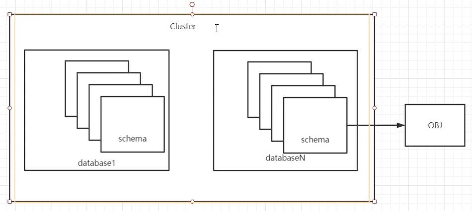

# 基本操作

# Postgres 部署

## 安装

`Postgres 12`安装：

```term
triangle@LEARN:~$ sudo apt install postgresql-12 postgresql-contrib 
triangle@LEARN:~$ psql --version
psql (PostgreSQL) 12.9 (Ubuntu 12.9-0ubuntu0.20.04.1)
```

`Postgres`安装完毕后，需要配置一下环境变量：

```term
triangle@LEARN:~$ sudo vim /etc/profile
# postgresql 的安装位置
export PGHOME=/usr/lib/postgresql/12
# postgresql 辅助程序所在路径，例如 initdb pg_ctl 等
export PATH=$PGHOME/bin:$PATH
# man 手册路径，添加了就能使用 man initdb 查看指令说明 
export MANPATH=/usr/share/postgresql/12/man:$MANPATH
# 数据库所在的路径
export PGDATA=/home/triangle/psql/data
triangle@LEARN:~$ source /etc/profile
```
> [!note|style:flat]
> - 只有添加了`PATH=$PGHOME/bin`环境变量，才能在终端中直接使用数据库管理指令`initdb`、`pg_ctl`。
> - 查询`PATH`路径：`locate initdb`

## 初始化数据库

```term
triangle@LEARN:~$  initdb -A md5 -D pgsql/data/ -E utf8 --locale=C -W
```
- `-D`：指定数据所在位置，即`PGDATA`
- `-W`：需要指定密码

> [!tip|style:flat]
> 若设定了环境变量`PGDATA`，可用省略`-D`参数，指令会默认使用`PGDATA`，所有的`-D`参数同理。

# pSQL服务管理

<span style="font-size:24px;font-weight:bold" class="section2">1. 启动</span>

```term
triangle@LEARN:~$ pg_ctl -D pgsql/data/ start // 启动pgsql
triangle@LEARN:~$ pg_ctl -D pgsql/data/ start -l logfile // 不输出启动流程，下面重启、关闭同理
```

**注意**：

当启动失败时，需要手动创建文件夹
```term
triangle@LEARN:~$ sudo mkdir /var/run/postgresql
triangle@LEARN:~$ sudo chown triangle /var/run/postgresql // 开放文件夹的读写权限给非root用户
```

<span style="font-size:24px;font-weight:bold" class="section2">2. 重启</span>

```term
triangle@LEARN:~$ pg_ctl -D pgsql/data/ restart
```

<span style="font-size:24px;font-weight:bold" class="section2">3. 关闭</span>

```term
triangle@LEARN:~$ pg_ctl -D pgsql/data/ stop -mf
triangle@LEARN:~$ pg_ctl --help

Options for stop or restart:
  -m, --mode=MODE        MODE can be "smart", "fast", or "immediate"

Shutdown modes are:
  smart       quit after all clients have disconnected
  fast        quit directly, with proper shutdown (default)
  immediate   quit without complete shutdown; will lead to recovery on restart
```
- `-mf`：fast关闭模式，会杀死一些空闲客户进程后，关闭pgsql，默认方法
- `-ms`：smart关闭模式，等待所有的客户进程都退出，才关闭pgsql
- `-mi`：immediate关闭模式，马上关闭pgsql，不管客户进程的状态。

# 用户连接

## 首次登陆

首次登陆时，pgsql 只有三个默认的数据库，所以首次登录需要登录默认数据库`-d postgres`：
```term
triangle@LEARN:~$ psql -d postgres
Password for user triangle:
psql (12.9 (Ubuntu 12.9-0ubuntu0.20.04.1))
Type "help" for help.

postgres=#
```

## 本地登录

```term
triangle@LEARN:~$  pg_ctl -D pgsql/data/ start
waiting for server to start....2022-04-08 10:48:06.285 CST [118] LOG:  starting PostgreSQL 12.9 (Ubuntu 12.9-0ubuntu0.20.04.1) on x86_64-pc-linux-gnu, compiled by gcc (Ubuntu 9.3.0-17ubuntu1~20.04) 9.3.0, 64-bit
2022-04-08 10:48:06.286 CST [118] LOG:  listening on IPv4 address "127.0.0.1", port 5432
2022-04-08 10:48:06.298 CST [118] LOG:  listening on Unix socket "/var/run/postgresql/.s.PGSQL.5432"
```
本地登录数据库，pgsql 采用的了本地[socket文件](https://blog.csdn.net/wjy741223284/article/details/98513237)的连接方式：`var/run/postgresql/.s.PGSQL.5432`

## 远程登录

远程登录数据库，pgsql 采用的是 [TCP协议](../../../Internet/chapter/transport_withNum.md)。**但是该方式不能直接使用，需要进行配置。**

<span style="font-size:24px;font-weight:bold" class="section2">1. 配置`$PGDATA/pg_hba.conf`</span>

```term
triangle@LEARN:~$ vim pgsql/data/pg_hba.conf
# PostgreSQL Client Authentication Configuration File
# ===================================================
#
# Refer to the "Client Authentication" section in the PostgreSQL
# documentation for a complete description of this file.  A short
# synopsis follows.
#
# This file controls: which hosts are allowed to connect, how clients
# are authenticated, which PostgreSQL user names they can use, which
# databases they can access.  Records take one of these forms:
#
# local         DATABASE  USER  METHOD  [OPTIONS]
# host          DATABASE  USER  ADDRESS  METHOD  [OPTIONS]
# hostssl       DATABASE  USER  ADDRESS  METHOD  [OPTIONS]

# configuration example
# TYPE  DATABASE        USER            ADDRESS                 METHOD
# "local" is for Unix domain socket connections only
local   all             all                                     md5
# IPv4 connections:
host    all             all             127.0.0.1/32            md5
# IPv6 connections:
host    all             all             ::1/128                 md5

```
该配置文件可用配置，哪些地址`ADDRESS`的用户`USER`可用什么连接方式`TYPE`登录pgsql，并且验证方式`METHOD`是什么。其中`ADDRESS`采用的是 [CIDR地址标记](../../../Internet/chapter/network_withNum.md) 来指定「网段」。**需要在该配置文件中添加远程登录的IP地址**

- `local`：本地socket连接控制
- `host/hostssl`：远程登录控制

> [!note|style:flat]
> 该配置是从上往下读取，当读取到可以适用于当前连接的配置时，则停止，不再管之后的配置。


<span style="font-size:24px;font-weight:bold" class="section2">2. 配置`$PGDATA/postgresql.conf`</span>

```term
triangle@LEARN:~$ vim pgsql/data/postgresql.conf

# - Connection Settings -

# 需要将 # 去掉，启用下列配置
#listen_addresses = 'localhost'         # what IP address(es) to listen on;
                                        # comma-separated list of addresses;
                                        # defaults to 'localhost'; use '*' for all
# 端口号，若没特殊癖好，默认就行
#port = 5432                            # (change requires restart)
```
将监听地址`listen_addresses`设置为「全网络」：'*' 或者 '0.0.0.0'

> [!note|style:flat]
> 配置完毕后，需要重启 pgsql

<span style="font-size:24px;font-weight:bold" class="section2">3. 远程连接</span>


```term
triangle@LEARN:~$ psql --help
Connection options:
  -h, --host=HOSTNAME      database server host or socket directory (default: "local socket")
  -p, --port=PORT          database server port (default: "5432")
  -U, --username=USERNAME  database user name (default: "triangle")
  -w, --no-password        never prompt for password
  -W, --password           force password prompt (should happen automatically)
triangle@LEARN:~$ ifconfig // 查询数据库服务器主机的IP地址
triangle@LEARN:~$ psql -h 数据库主机IP -p 数据库主机端口 -U 数据库中的哪个用户 -d 登录哪个数据库 // 客户端远程登录
```

# psql客户端命令

- `\?`：查询所有能用的命令
- `\help`：查看sql指令帮助
- `\c`：切换数据库，类似`use 数据库;`
- `\l`：列出数据库
- `\d`：列出表
- `\d 表名`：查看表的结构

# 用户管理

## 用户作用

不同的对象按照要求登录数据库，执行规定的操作，方便对数据使用的管理。

## 创建用户

```term
triangle@LEARN:~$ psql -d postgres -h  192.168.1.79 -p 5432 -U triangle
Password for user triangle:
psql (12.9 (Ubuntu 12.9-0ubuntu0.20.04.1))
Type "help" for help.
postgres=# \help create user 

Syntax:
CREATE USER name [ [ WITH ] option [ ... ] ]

where option can be:

      SUPERUSER | NOSUPERUSER
    | CREATEDB | NOCREATEDB
    | CREATEROLE | NOCREATEROLE
    | INHERIT | NOINHERIT
    | LOGIN | NOLOGIN
    | REPLICATION | NOREPLICATION
    | BYPASSRLS | NOBYPASSRLS
    | CONNECTION LIMIT connlimit
    | [ ENCRYPTED ] PASSWORD 'password' | PASSWORD NULL
    | VALID UNTIL 'timestamp'
postgres=# create user triangle; // 创建用户
postgres=# alter user triangle 。。。; // 修改用户
postgres=# drop user triangle; // 删除用户
```

## 权限管理

<p style="text-align:center;"></p>

pgsql的用户权限具有四个层次：
- **cluster**：pgsql的登录访问，通过 `pg_hba.conf` 进行控制
- **database**：控制数据库的权限
- **schema**：对数据库中的「表」进行一次分组管理，属于pgsql特有
- **obj**：即「表」，对表的操作权限管理。

**database权限：**

```sql
GRANT 权限 ON DATABASE 数据库 TO 用户;
```

**schema权限：**

```sql
-- 修改 schema 的拥有者
ALTER SCHEMA 名字 OWNER TO 用户;

-- schema 中 table操作权限
GRANT table操作权限 ON ALL TABLES IN SCHEMA 名字 TO 用户;

```

**object权限：**

```sql
GRANT table操作权限 ON  schema名.表名 TO 用户;
```

