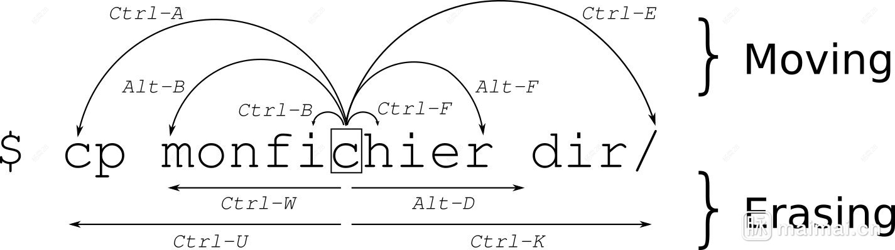

# Bash

# 基本概念

Bash 是一个命令处理器，运行在文本窗口中，可以用来执行用户输入的指令，例如用户在 Linux 终端中输入的指令，就是靠 Bash 翻译文本，然后去执行对应的程序。将多个指令写到一个文本文件中，让 Bash 批量解析运行，这就是 shell 脚本。

```term
triangle@LEARN:~$ sh hello.sh // bash 执行脚本
```

# 展开

Bash 可以通过 `{}` 进行命令展开

```term
triangle@LEARN:~$ echo fuck{1,2,3,4} 
fuck1 fuck2 fuck3 fuck4
triangle@LEARN:~$ echo fuck{1..4} // .. 可以指定范围
fuck1 fuck2 fuck3 fuck4
triangle@LEARN:~$ echo fuck{1..4..2} // {开始..结束..步长}
fuck1 fuck3
```

# alias

Bash 允许给指令设置一个别名

```term
triangle@LEARN:~$ alias // 查看别名
alias l='ls -CF'
alias la='ls -A'
alias ll='ls -alF'
triangle@LEARN:~$ alias rm='rm -i' // 自定义别名
triangle@LEARN:~$ unalias rm // 删除别名
```

# 快捷键



- cltr + L ：清屏，相当于 `clear`
- tab : 查找 `$path` 路径下的程序名，进行补全


