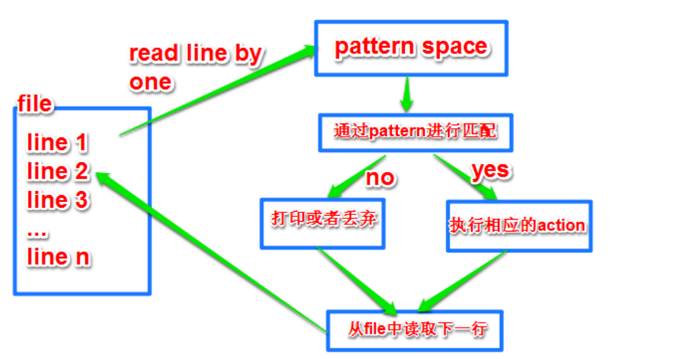

# 三剑客

# 介绍

在 linux 中，普通指令一般只支持通配符 `*`，更复杂的正则表达式只有三剑客才能解析
- grep: 文本过滤工具
- sed: 文本编辑工具
- awk: 文本格式化

正则表达式分为两大类
- 基本正则，`^$.[]*`
- 扩展正则，`(){}?+|`


# grep

```bash

grep [option] [pattern] file

[option]
-i 忽略大小写
-o 只显示匹配到的字符串
-v 反向匹配
-E 启用扩展正则
-n 显示行号
-c 统计行数
```

```term
triangle@LEARN:~$ grep "^$" -v test.txt // 过滤空行
triangle@LEARN:~$ grep "^#" -v test.txt // 过滤注释行
```

# sed



sed 对文件的处理的基本单位是行，读取一行就执行一次 pattern 指令，然后输出结果，接着处理下一行。

```bash

sed [option] [<range><command>] file

[option]
-n 取消 sed 默认输出
-i 覆盖原文件
-e 设置多条指令
-r 扩展正则

[command]
-a 指定行后追加行
-i 指定行前插入行 
-d 删除行
-p 打印匹配行
-s/正则/内容/g 替换行内的内容，g为全局替换

[range]
-空地址：全文处理
-单地址：文件某一行
-/pattern/：正则匹配的每一行
-起点,终点：范围匹配
-起点,+N：从起点开始，数 N 行
-起点~步长：步长匹配
```

```term
triangle@LEARN:~$ sed "a,bp" test.txt -n // 输出 [a,b] 范围内的行
triangle@LEARN:~$ sed "/pattern/p" test.txt -n // 查找含有 pattern 的行
triangle@LEARN:~$ sed "/pattern/d" test.txt  // 删除含有 pattern 的行
triangle@LEARN:~$ sed "2,$p" test.txt -n // 第2行到最后一行
triangle@LEARN:~$ sed "2,5a fuck you" test.txt  // 在 [2,5] 的每一行后面添加 fuck you
triangle@LEARN:~$ sed "a fuck you" test.txt  // 在每一行后面添加 fuck you
```

# awk

awk 默认以空格作为分隔符，且连续多个空格也识别为同一个。
- `$0` 表示整列
- `$n` 表示第 n 列
- `NF` 一共多少行
- `NR` 行数
- `FNR` 多文件的行号，每个文件分开计算行号
- `FS` 输入分割符号，默认为空格
- `OFS` 输出分割符号，默认为空格
- `RS` 一行的标志符号，awk 看见 RS 符号就认为读取了一行
- `ORS` 输出一行的标记
- `FILENAME` 文件名 

```bash

awk [option] [pattern {action}] file

[option]
-F 指定分割符号
-v 修改内部变量值

[pattern]
- NR==1 行查找
- BEGIN 在动作开始前
- END 在动作结束后
- /reg/ 正则表达式匹配

{action}
- print 打印
- printf 格式化输出

```

```term
triangle@LEARN:~$ awk '{print $1,$3}' test.txt // 输出第一列与第三列，且 "," 指明两列间有风格符号
triangle@LEARN:~$ awk '{print $1,"fuck",$3}' test.txt // 输出三列，第二列全部为 fuck
triangle@LEARN:~$ awk 'NR==3,NR==6{print $0}' test.txt // 找到3到6行 
triangle@LEARN:~$ awk '{print NR,$0}' test.txt // 显示行号
triangle@LEARN:~$ awk '{printf "%d,%s\n",NR,$0}' test.txt // 格式化输出
```

在 awk 中分隔符分为输入分隔符与输出分隔符

```term
triangle@LEARN:~$ awk -F "#" '{print $1}' test.txt // 以 # 作为输入分隔符
triangle@LEARN:~$ awk -v FS="#" '{print $1}' test.txt // 同上
triangle@LEARN:~$ awk -v OFS="#" '{print $1,$2}' test.txt // 输出分隔符改为 #
```

引用环境变量

```term
triangle@LEARN:~$ awk -v var=$path 'BEGIN{print var}' // 在 awk 中打印环境变量
```

