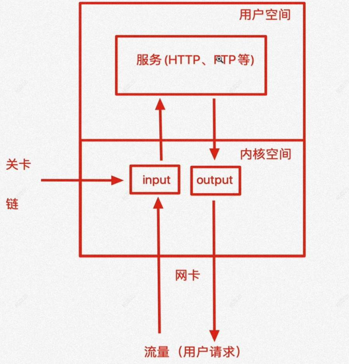

# iptables

# 防火墙

防火墙分为两类：
- 硬件防火墙：在硬件级别实现流量过滤，成本高
- 软件防火墙：系统内核级别实现流量过滤，成本低

Linux 在软件层面实现的防火墙主要靠 `iptables` 与 `netfilter` 实现
- iptables：用户进行防火墙功能配置的客户端
- netfilter：运行在操作系统的内核态，负责执行用户的配置

在 CentOS7 系统下，`firewalld` 与 `nftables` 可代替上面两个工具。

# iptables 规则


```term
triangle@LEARN:~$ iptables -L // 查看防火墙规则
Chain INPUT (policy ACCEPT)

Chain FORWARD (policy ACCEPT)

Chain OUTPUT (policy ACCEPT)

```

iptables 会自上而下的读取规则，匹配到正确的规则就会结束。这些规则可以定义源地址信息、目的地址信息、传输协议类型、服务类型等。当数据包满足对应规则时，就会执行定义的放行、拒绝、丢弃等动作。 



每一个 `chain` 就是数据包会经过各个环节
- prerouting ：路由选择前处理数据包
- input : 数据包流入
- output : 数据包流出
- forward: 数据包转发
- postrouting : 路由选择后处理数据包

对应处理动作有：
- ACCEPT: 允许数据包通过
- DROP: 丢弃数据包
- REJECT: 拒绝数据包通过
- LOG: 将数据包信息记录 syslog 曰志
- DNAT: 目标地址转换
- SNAT: 源地址转换
- MASQUERADE: 地址欺骗
- REDIRECT: 重定向

对应的表有：
- filter 表（过滤规则表）
- nat 表（地址转换规则表）
- mangle（修改数据标记位规则表）
- raw（跟踪数据表规则表）
