# 文件系统

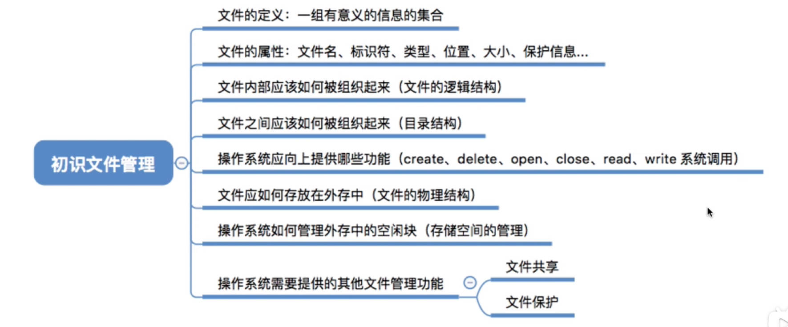

# 文件的逻辑结构


## 基本概念

- **物理结构：** 对于操作系统而言，文件数据是如何存放在外存中的。
- **逻辑结构：** 对于用户而言，文件内部数据应当如何组织起来。
  - **无结构文件：** 文件内部的数据是一系列的二进制流或者字符流组成，又称之为「流式文件」，例如`.txt`。**该类型文件，储存没有规律，讨论「逻辑结构」无意义。**
  - **有结构文件：** 由一组相似的记录组成，又称之为「记录式文件」，例如数据库文件。
- **有结构文件：**
  - **数据项：** 每条记录的基本单元。
  - **记录：** 由多个「数据项」组成的一行数据，类似数组中的一个元素。
  - **定长记录：** 「数据项」的储存空间是恒定的，不会改变。
  - **可变记录：** 「数据项」的储存空间是可变的，例如`varchar`。

## 有结构文件的逻辑结构

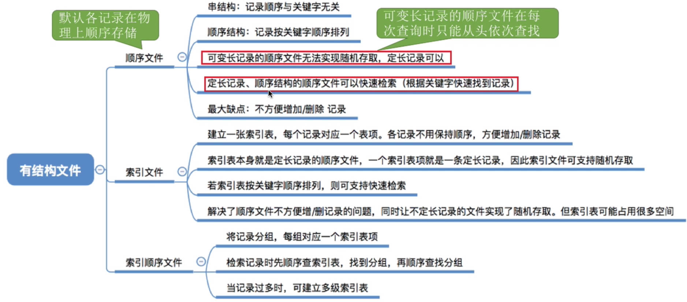

<span style="font-size:24px;font-weight:bold" class="section2">1. 顺序文件</span>

- **概念：** 在逻辑上，文件中的「记录」是一个接着一个的顺序排列，记录的「数据项」可以「定长」和「变长」。**在「物理结构」上，可以通过「数组」或者「链表」实现。**
  - **串结构：** 记录间的顺序与「关键字」无关。
  - **顺序结构：** 记录按照「关键字」顺序排列
- **各类顺序文件的查找特点：**


<span style="font-size:24px;font-weight:bold" class="section2">2. 索引文件</span>

- **概念：** 由于「顺序文件」的结构，对于「可变长记录」无法实现「随机存取」。**针对该问题，可以在「记录」中将「数据项」替换成指向数据项的「指针」，「指针」的内存占用长度是固定的。通过「关键字」（索引号）建立一张「索引表」，「索引表」又指向每个「记录」，每条「记录」又能离散的存放在外存中。** 
    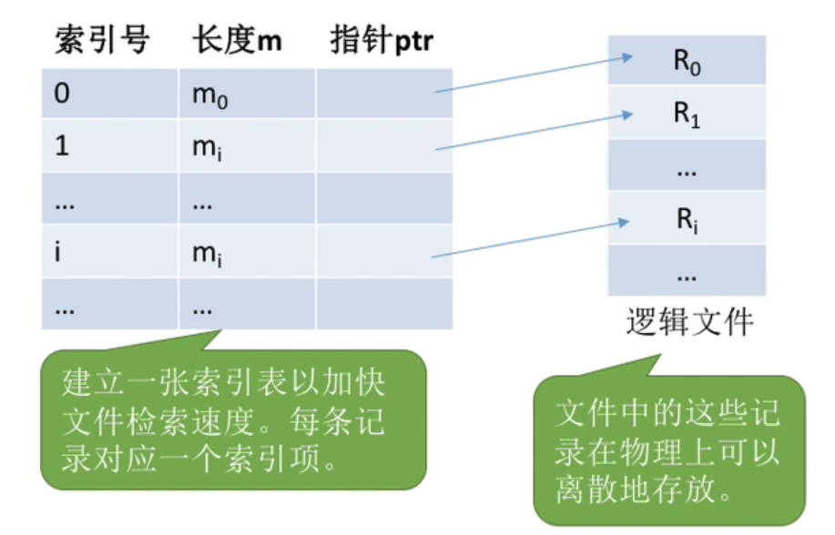

<span style="font-size:24px;font-weight:bold" class="section2">3. 索引顺序文件</span>

- **概念：** 「索引文件」虽然靠「索引表」解决了「可变记录」的问题，但是为每一条「记录」都配置一条「索引表项」，这就导致当「记录」的大小小于「索引表项」时，造成对存储空间的浪费。**针对该问题，将「索引表」的指向由一条「记录」更改为一组「记录」。**
    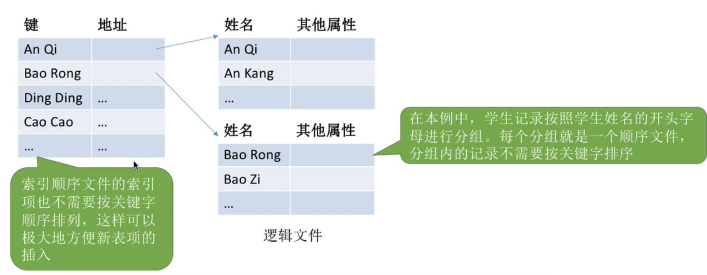

- **多级索引表：** 为了加快检索速度，可以对「索引表」再进行分组
    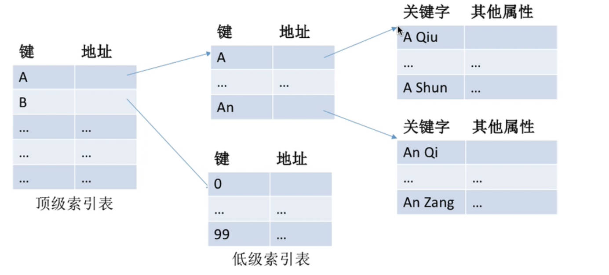

# 文件目录


## 目录的本质

> [!note|style:flat]
> 「目录」即「文件夹」，其本身就是一个文件，存储了其他文件的「文件控制块」，便于对其他文件的查找。

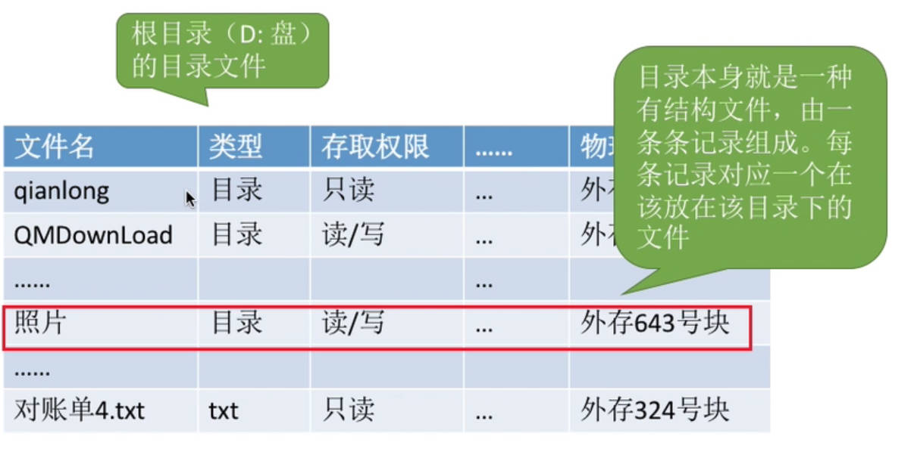

- **文件控制块（FCB）：** `FCB`的有序集合称为「文件目录」，`FCB`就是一个文件目录项。`FCB` 中包含了文件的基本信息（文件名、物理地址、逻辑结构、物理结构等），存取控制信息（是否可读/可写、禁止访问的用户名单等），使用信息（如文件的建立时间、修改时间等）最重要，最基本的还是 文件名、文件存放的物理地址。
- **FCB的作用：** 实现「文件名」与「文件」的关联，便于用户来访问磁盘中的「文件」。
- **对「目录」的操作：**
    - **搜索文件**：当用户要使用一个文件时，系统要根据文件名搜索目录，找到该文件对应的目录项
    - **创建文件**：创建一个新文件时，需要在其所属的目录中增加一个目录项
    - **删除文件**：当删除一个文件时，需要在目录中删除相应的目录项
    - **显示目录**：用户可以请求显示目录的内容，如显示该目录中的所有文件及相应属性
    - **修改目录**：某些文件属性保存在目录中，因此这些属性变化时需要修改相应的目录项（如：文件重命名）

## 目录结构

<span style="font-size:24px;font-weight:bold" class="section2">1. 单级目录结构</span>

- **概念：** 早期操作系统中，整个操作系统中只有一张「目录表」，每一个文件占用一个「目录项」

<center>


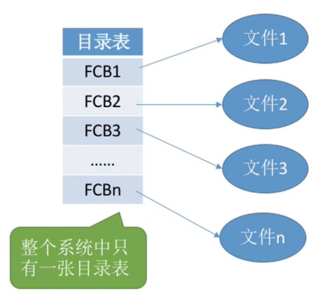

</center>


<span style="font-size:24px;font-weight:bold" class="section2">2. 两级目录结构</span>

- **概念：** 由于「单级目录」并不利于「多用户」管理，所以又根据「用户」对「目录项」进行了分组。

<center>

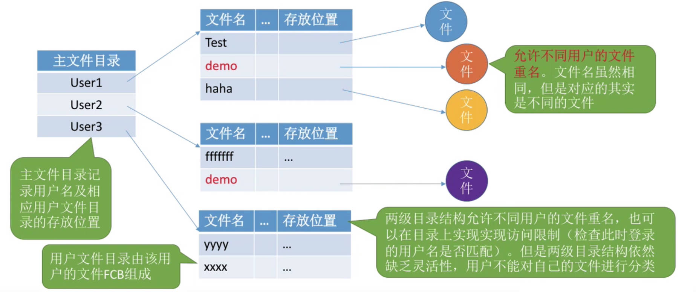

</center>

<span style="font-size:24px;font-weight:bold" class="section2">3. 多级目录结构</span>

- **概念：** 「两级目录」结构，用户不能进行对文件的分类，进一步对「目录层级」加深。

    <center>
    
    
    
    </center>
- **文件查找：**
  - **绝对路径：** 查找`/照片/2015-08/自拍.jpg`，整个过程需要`3`次读磁盘`I/O`操作：
    1. 外存读入根目录的目录表；
    2. 找到`照片`目录的存放位置后，从外存读入对应的目录表；
    3. 再找到`2015-08`目录的存放位置，再从外存读入对应目录表；
    4. 最后才找到文件`自拍.jpg`的存放位置。
  - **相对路径：** 当在`照片`目录下查找`./2015-08/自拍.jpg`，整个过程需要`1`次读磁盘`I/O`操作：
    1. 将`照片`目录设置为「当前路路径」，即`./`
    2. 再找到`2015-08`目录的存放位置，再从外存读入对应目录表；
    3. 最后才找到文件`自拍.jpg`的存放位置。

<span style="font-size:24px;font-weight:bold" class="section2">4. 无环图目录结构</span>

- **概念：** 由于「多目录结构」是「树状结构」，无法实现「文件共享」。因此，便将「树状结构」修改为「无环图」结构。

    <center>
    
    
    
    </center>


## 索引结点

- **思路：** 对传统的「目录文件」的逻辑结构进行改进，由于上面的「目录」中的一个「目录项」就是一个完整的`FCB`，这对于「搜索目录」来说没啥用处，还占用内存，所有可以建立「索引表」来对「目录」进行瘦身。**由于「目录」的大小缩减，这样一次`I/O`操作就能读取更多的「目录项」，大大缩减了`I/O`操作的时间，提高了「搜索」时间。**

<center>


</center>

- **索引结点：** 包含了除「文件名」之外的所有文件信息。
- **磁盘索引结点：** 位于磁盘中的「索引结点」
- **内存索引结点：** 位于内存中的「索引结点」，比「磁盘索引结点」多了一些描述信息。


# 文件的物理结构

> [!note|style:flat]
> 针对的是文件数据在外存中是如何存放的问题。

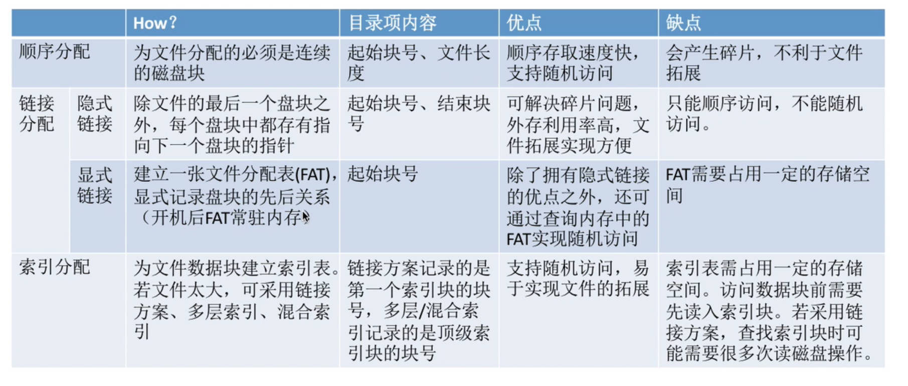


## 外存概念

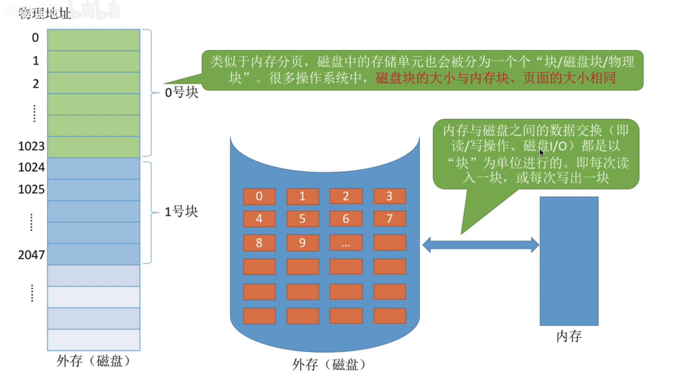

1. 「外存」的存储空间也和「内存」一样，会划分成**大小相等的「磁盘块」**
2. 「文件」与「进程」一样，会根据「逻辑地址」划分为「逻辑块号」与「块内地址」
3. 操作系统为「文件」分配空间都是根据「块」进行的
4. 用户使用「逻辑块号」操作文件；操作系统需要将「逻辑块号」转换为「物理块号」

## 连续分配

- **思路：** 每个「文件」在「外存」中占用**连续的物理空间**。
  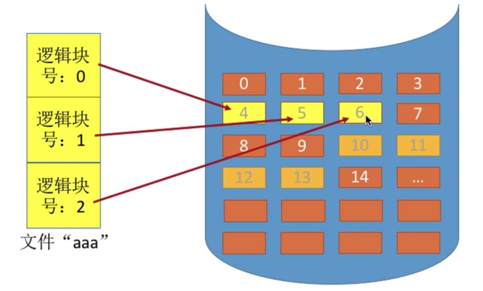
- **地址转换：** 

  在`FCB`中要记录文件的起始「物理块号」与「块的个数」
  $$
  物理块号 = 起始块号 + 逻辑块号
  $$
- **优缺点：** 可以「随机访问」；顺序读写速度最快；拓展文件不方便；利用率低，容易产生「磁盘碎片」（类似「外部碎片」）

## 链接分配

### 隐式链接

- **思路：** 每一个「物理块」要记录下一个「物理块」的位置。
  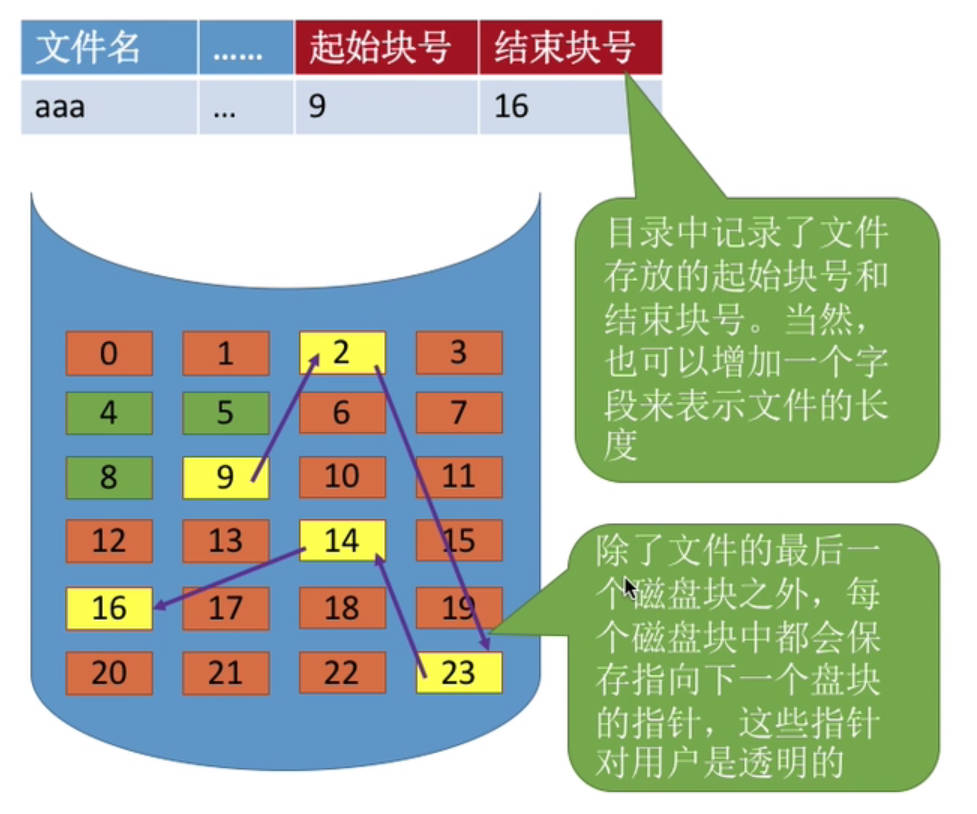
- **地址转换：** 
  1. 在`FCB`中存储文件的起始「物理起始块号」与「物理结束块号」
  2. 查找第`i`号「逻辑块号」时，就从「物理起始块号」开始，一个一个的加载「物理块」加载到第`i+1`次时，就是需要的「物理块」

- **优缺点：** 只能顺序存储，不能随机访问，查找浪费时间；拓展文件方便

### 显示链接

- **思路：** 链接文件「物理块」的指针是显示的放在了一张表中的，即「文件分配表」(FAT,file allocation table)
  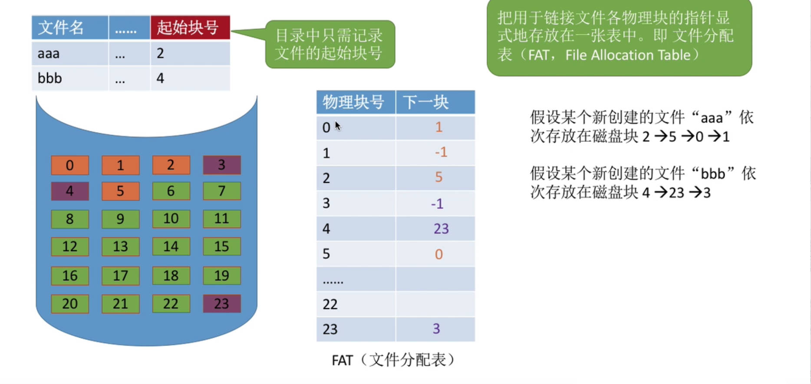
- **地址转换：** 
  1. 对于「外存」文件会生成一张`FAT`表，并且会常驻「内存」
  2. 在`FCB`中存储文件的起始「物理起始块号」
  3. 从`FAT`表中查询下一个「物理块」的块号，直到`-1`文件结束

- **优缺点：** 支持「随机访问」（从`FAT`表中查询到对应的「物理块」之后，才进行`I/O访问`）；`FAT`表会占用一定的储存空间

## 索引分配

### 基本概念

- **思路：** 为每一个文件建立一张「索引表」，记录「逻辑块」对应的「物理块」。类似「基本分页」中的「页表」
  - **索引块：** 存放索引表的「物理块」
  - **数据块：** 存放文件数据的「物理块」
  

- **地址转换：** 
  1. 在`FCB`中存储文件的「索引块」
  2. 根据「索引表」查询「逻辑块号」对应的「物理块号」

### 改进

> [!tip]
> 当一个「索引表」的大小超过了「物理块」的大小时，需要对「索引表」的存储进行改进。

<span style="font-size:24px;font-weight:bold" class="section2">1. 链接方案</span>

- **思路：** 用「链接」的方式将各个「索引块」链接起来

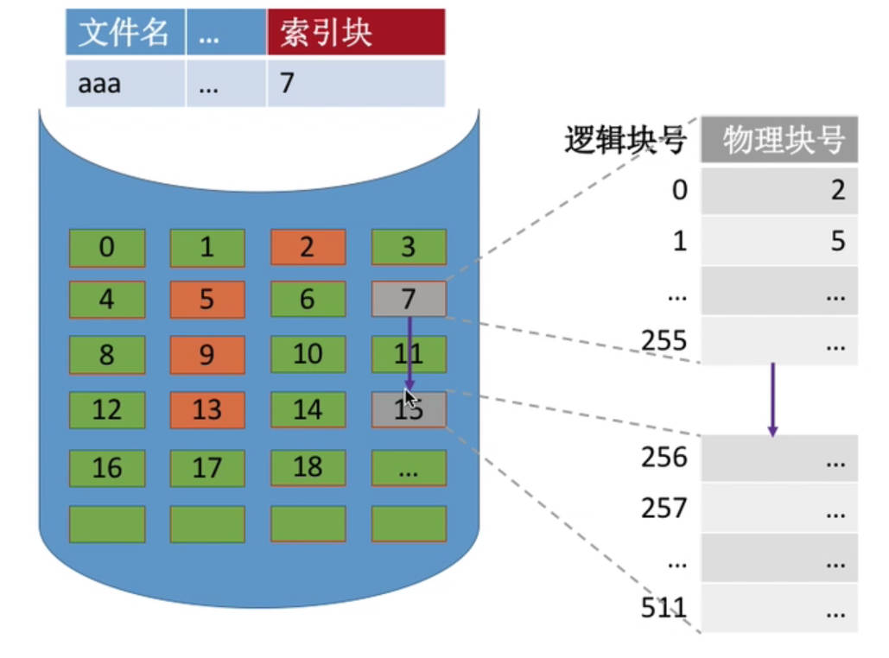

<span style="font-size:24px;font-weight:bold" class="section2">2. 多级索引</span>

- **思路：** 建立多级「索引表」

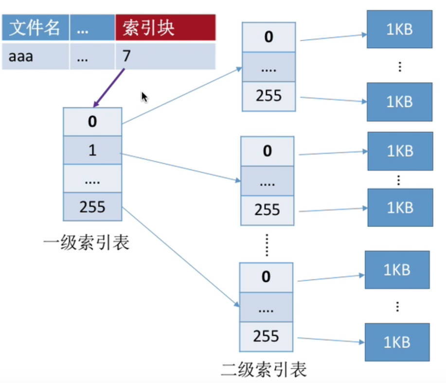

> [!note|style:flat]
> **每个「索引表」的大小不能超过一个「物理块」的大小**

<span style="font-size:24px;font-weight:bold" class="section2">3. 混合索引</span>

- **思路：** 由于「多级索引」对于「小文件」的查询不利，可以根据文件的大小来规划「索引」的方式。

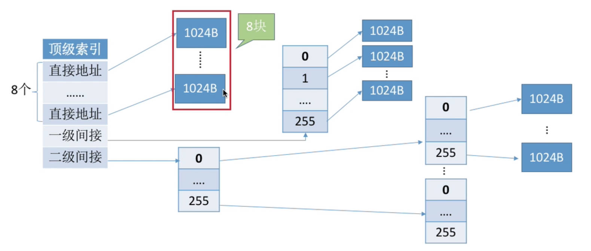

# 文件存储空间的管理

> [!note|style:flat]
> 针对的是外存中空闲空间是如何管理的问题。


## 基本概念

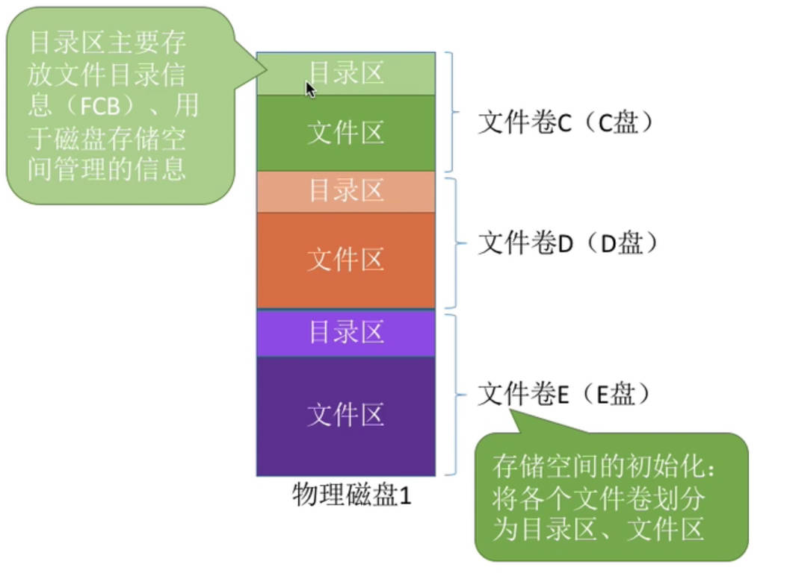

- **文件卷、逻辑盘：** 就是`C、D、E`盘
- **目录区：** 文件的`FCB`，即文件的「索引结点」；磁盘管理用的数据结构
- **文件区：** 存放文件数据

## 空闲表法

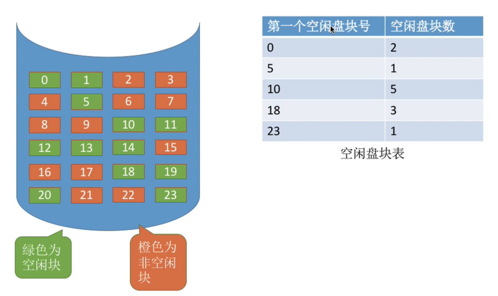

- **适用场景：** 适用于文件「连续存储」的方案，**与内存管理中的「动态分区分配」类似**
- **分配：** 空间管理方法可以采用：首次适应、最佳适应、最坏适应等
- **回收：** 相邻的空闲区合并；未用来的分区更新大小，起始地址；刚好用完的分区，从空闲表中删除。

## 空闲链表法

<span style="font-size:24px;font-weight:bold" class="section2">1. 空闲盘块链</span>

- **思路：** 将 **空闲的单个「物理块」** 通过链表链接
  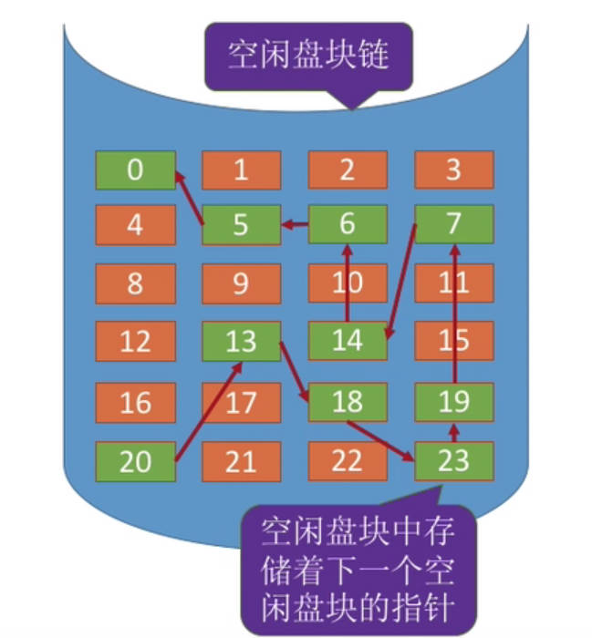
- **分配：** 从「链头」开始划分出对应长度的「物理块」
- **回收：** 放到「链尾」

<span style="font-size:24px;font-weight:bold" class="section2">2. 空闲盘块</span>

- **思路：** 将 **空闲的连续「物理块」** 通过链表链接
  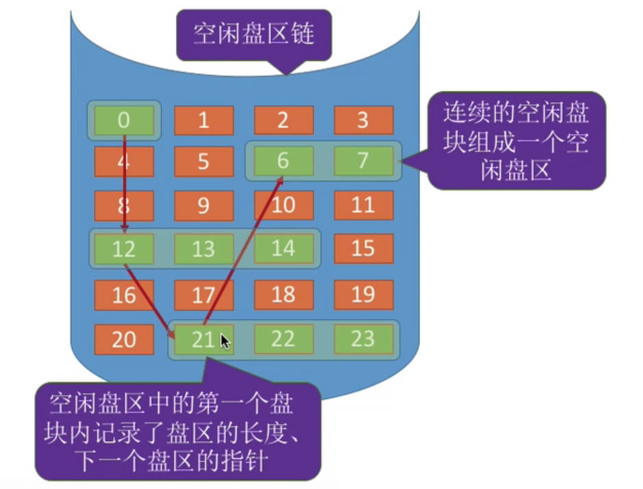
- **分配：** 从「链头」开始划分出对应长度的「物理块」
- **回收：** 没有相邻，则放到「链尾」；有相邻，则与「空闲盘区」合并

## 位示图


## 成组链接法

- **超级块：** 在「目录区」和「内存」中维护一个「超级块」，用来存放空闲的「物理块」
  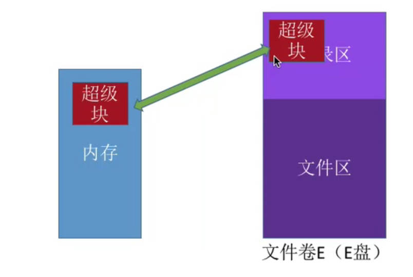


- **思路：**
  1. 「超级块」存放第一组空闲区域
  2. 每一组空闲区域的组成为：a） 当前组中存放的空闲块个数；b）下一组空闲区域存放的「物理块号」；c）一系列空闲的「物理块号」
- **分配：**
  1. 检查「超级块」空闲块个数；
  2. 将「超级块」所指向的「物理块」分配出去；
  3. 若「超级块」全部都被分配了，就将「超级块」指向的下一组空闲区域的值复制到「超级块」中。
- **回收：**
  1. 检查「超级块」空闲块个数；
  2. 若「超级块」没有满，就往「超级块」里放
  3. 若「超级块」满了，就把「超级块」作为一组新的空闲区域放到后面取去

# 文件的操作

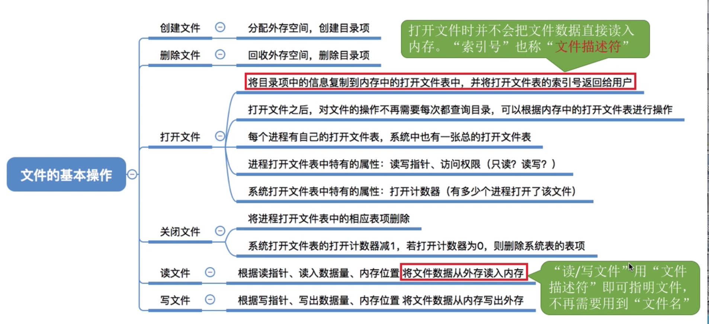

## 创建

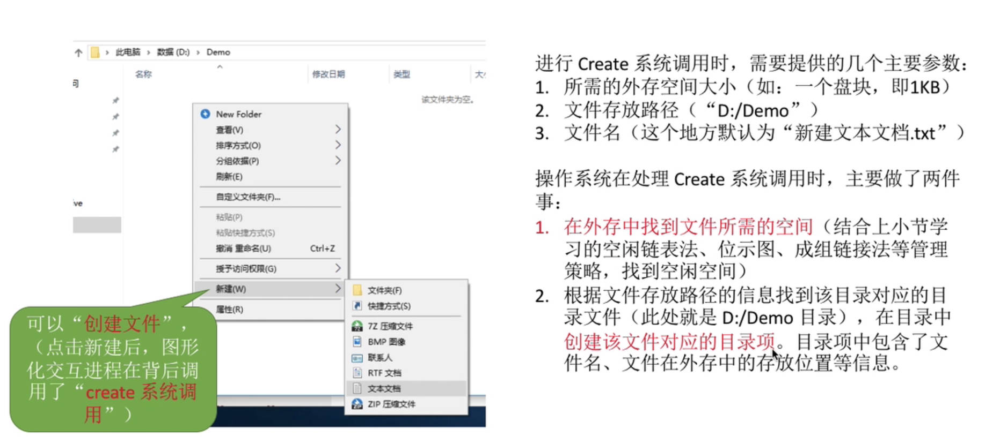

## 删除

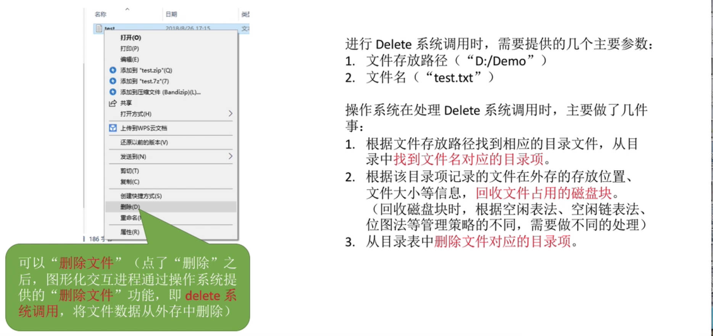

## 打开


> [!note|style:flat]
> 
> - 「进程」所打开的「文件」会在「进程」的`PCB`中的`files`进行记录。其中`stdin、stdout、stderr`就放在前三个位置，「系统表索引号」就是「文件描述符」。
> - 「进程」的「打开文件表」只有关于打开文件的`FCB`的索引号，真正的`FCB`则由「操作系统」的「打开文件表」进行同一管理


## 关闭

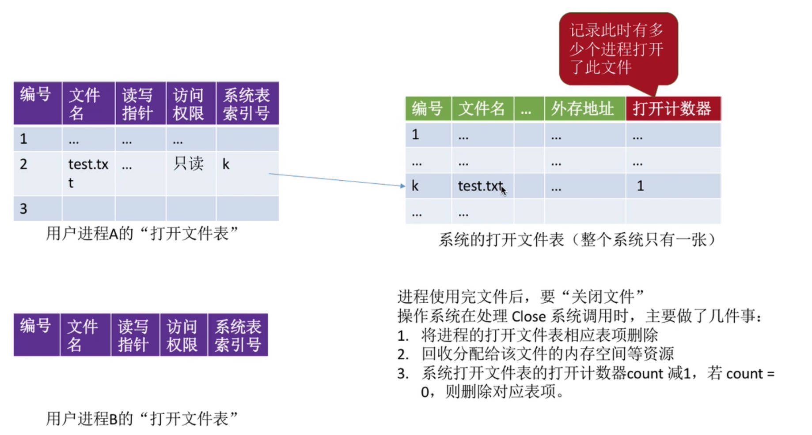


# 文件共享

## 硬链接


**概念：** 多个「文件目录项」中的「索引结点指针」指向同一个「索引结点」。在「索引结点」中存在一个文件计数器`count`，当`count == 0`时，才会删除该文件的数据。

```term
triangle@DESKTOP-5A676MS:~$ ln -d ~/test.txt ~/test1.txt
```
## 软链接


**概念：** 会创建一个`link`类型的「文件」，其中记录了原文件的「路径」。

```term
triangle@DESKTOP-5A676MS:~$ ln -s ~/test.txt ~/test1.txt
triangle@DESKTOP-5A676MS:~$ ll
-rw-r--r-- 1 triangle triangle    6 Jan 23 10:21 test.txt
lrwxrwxrwx 1 triangle triangle    8 Jan 23 10:22 test1.txt -> test.txt
```

# 文件保护

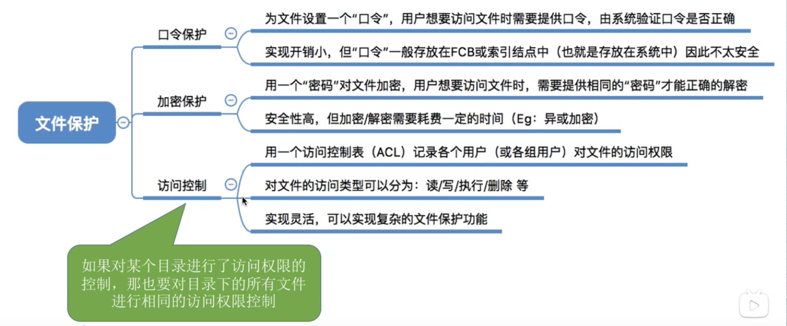


> [!tip]
> 「访问控制」中的文件的读、写、执行权限可以在`FCB`中增加相应字段

# 文件系统的结构层次

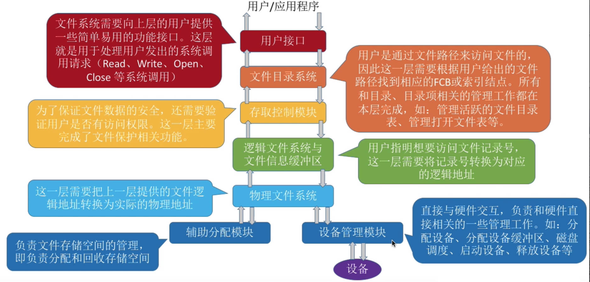


