# 互斥与同步


# 概念

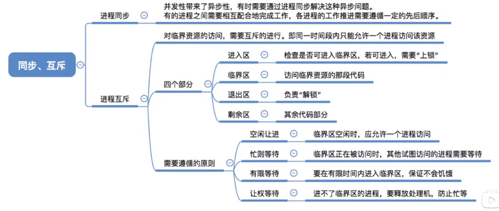

## 术语

- **临界资源**：一段时间内，只能允许一个进程使用的资源。
- **临界区**：使用临界资源的那一段代。
- **互斥**：当一个线程在访问临界资源时，其他进程必须等待。
- **同步**： 要求多个进程能按照一定顺序运行。

## 进程互斥

对于临界资源的互斥访问问题，逻辑上分为四个部分：
1. **进入区**：检查其他进程是否可以进入，对应「上锁」
2. **临界区**：访问临界资源的代码
3. **退出区**：解除对临界资源的占有，对于「解锁」
4. **剩余区**：其他操作

实现进程互斥遵循的原则：
1. **空闲让进**。临界区空闲时，可以允许一个请求进入临界区的进程立即进入临界区；
1. **忙则等待**。当已有进程进入临界区时，其他试图进入临界区的进程必须等待；
1. **有限等待**。对请求访问的进程，应保证能在有限时间内进入临界区（保证不会饥饿）；
1. **让权等待**。当进程不能进入临界区时，应立即释放处理机，防止进程忙等待。

# 进程互斥的实现

## 进程互斥软件实现

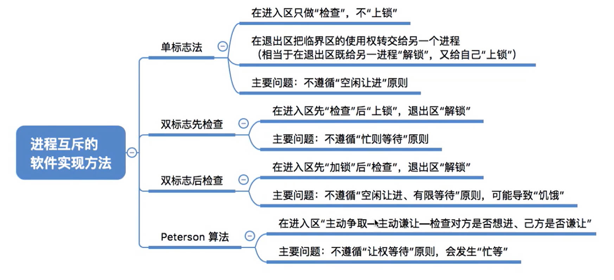

<span style="font-size:24px;font-weight:bold" class="section2">1. 单标算法</span>

- **规则：** 通过一个单一标志来控制对临界区的访问权限。
- **缺陷：** 违背「空闲让进」。当`P0`不想进入时，`P1`就没机会

```cpp
// 标志
int turn = 0;

// ===================进程 P0====================
while (turn != 0) ; // 进入区
// 临界区
turn = 1; // 退出区
// 剩余区

// ===================进程 P1====================
while (turn != 1) ; // 进入区
// 临界区
turn = 0; // 退出区
// 剩余区
```

<span style="font-size:24px;font-weight:bold" class="section2">2. 双标志先检验算法</span>

- **规则：** 通过一个数组来记录每个进程是否想要进入临界区。
- **缺陷：** 主要会导致「忙则等待」。进入区并非原子操作，两个进程会同时进入临界区。

```cpp
// 标记想要进入临界区的意愿
bool flags[2] = {0};
// 进程编号
int P0 = 0;
int P1 = 1;

// ===================进程 P0====================
 // 进入区
while (flag[P1] == true); //P1想进入，就等他用。
flag[P0] = true; // P0 要进入了
// 临界区
flag[P0] = false; // 退出区
// 剩余区

// ===================进程 P1====================
// 进入区
while (flag[P0] == true) ; 
flag[P1] = true; // P1 要进入了
// 临界区
flag[P1] = false; // 退出区
// 剩余区
```


<span style="font-size:24px;font-weight:bold" class="section2">3. 双标志后检验算法</span>

- **规则：** 通过一个数组来记录每个进程是否想要进入临界区。
- **缺陷：** 解决了「忙则等待」。进入区并非原子操作，又导致「空闲让进」与「有限等待」

```cpp
// 标记想要进入临界区的意愿
bool flags[2] = {0};
// 进程编号
int P0 = 0;
int P1 = 1;

// ===================进程 P0====================
 // 进入区
flag[P0] = true; // P0 要进入了
while (flag[P1] == true); //P1想进入，就等他用。
// 临界区
flag[P0] = false; // 退出区
// 剩余区

// ===================进程 P1====================
// 进入区
flag[P1] = true; // P1 要进入了
while (flag[P0] == true) ; 
// 临界区
flag[P1] = false; // 退出区
// 剩余区
```

<span style="font-size:24px;font-weight:bold" class="section2">4. Peterson算法</span>

- **规则：** 通过一个数组来记录每个进程是否想要进入临界区。
- **缺陷：** 违背「让权等待」

```cpp
// 标记想要进入临界区的意愿
bool flags[2] = {0};
int turn = 0;
// 进程编号
int P0 = 0;
int P1 = 1;

// ===================进程 P0====================
 // 进入区
flag[P0] = true; // P0 要进入了
turn = 1; // 谦让一下P1
while (flag[P1] == true && turn == 1); //P1想进入，就等他用。
// 临界区
flag[P0] = false; // 退出区
// 剩余区

// ===================进程 P1====================
// 进入区
flag[P1] = true; // P1 要进入了
turn = 0; // 谦让一下P0
while (flag[P0] == true && turn == 0) ; 
// 临界区
flag[P1] = false; // 退出区
// 剩余区
```


## 进程互斥硬件实现

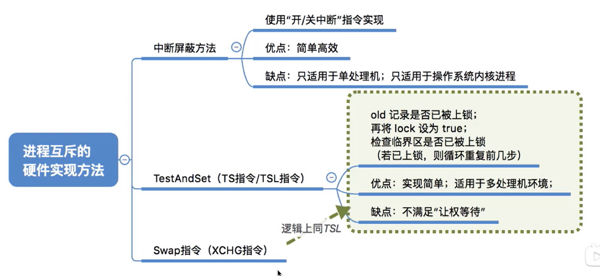

<span style="font-size:24px;font-weight:bold" class="section2">1. 中断屏蔽</span>


- **规则：** 利用「开/关中断」来实现原子性操作。
- **缺陷：** 不适用于多核处理器。且该组指令为特权指令，只能在「内核态」使用。

```cpp
// 屏蔽中断，IF = 0
CLI

// 临界区

// 启动中断，IF = 1
STI
```

<span style="font-size:24px;font-weight:bold" class="section2">2. TestAndSet(TSL/TS指令)</span>

- **规则：** 由于双标志后检验算法，双标志先检验算法出问题都是因为「进入区」的「原子性」通过程序很难保证，所以从硬件来解决。
- **缺陷：** 不能满足「让权等待」

```cpp

// 硬件实现：保证了原子性；lock == true 表示以及加锁了
bool TestAndSet(bool *lock ){
    bool old;
    old = *lock;
    *lock = true;
    return old;
}

//==========进程=============
 // 进入区
while (TestAndSet(&lock)); // 没有加锁，就进入临界区
// 临界区
lock = false; // 退出区，解锁
// 剩余区

```

<span style="font-size:24px;font-weight:bold" class="section2">3. swap指令</span>

- **规则：** 由于双标志后检验算法，双标志先检验算法出问题都是因为「进入区」的「原子性」通过程序很难保证，所以从硬件来解决。<span style="color:red;font-weight:bold"> 实现机制与`TSL`道理一样 </span>
- **缺陷：** 不能满足「让权等待」

```cpp

// 硬件实现：保证了原子性
void Swaps(bool * a , bool * b){
    bool temp  = *a;
    *a = *b;
    *b = temp;
}


//==========进程=============
 // 进入区
bool old = true; // true 表示已经加锁了
do{
    Swap(&lock,&old);
}
while (old == true) // 没有加锁，就进入临界区
// 临界区
lock = false; // 退出区，解锁
// 剩余区

```


# 信号量

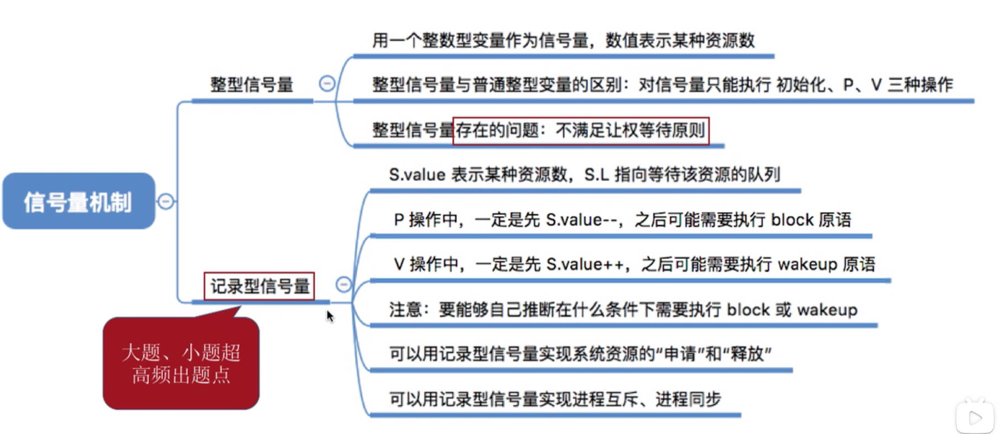

## 基本概念

- **信号量机制：** 由操作系统提供一对「原语」对「信号量」进行操作，以实现进程互斥与进程同步。
- **信号量：** 用来标记系统中某种资源的数量。
- **原语：**
  - **P操作：** 「进入区」的原子操作，拿取信号量
  - **V操作：** 「退出区」的原子操作，返还信号量

## 整型信号量

- **原理：** 利用普通的 <span style="color:red;font-weight:bold"> 整型变量 </span> 作为信号量。
- **缺陷：** 违背「让权等待」


```cpp

// ==============信号量================
/*
 * s > 0 : 有剩余资源
 * s <= 0: 没有资源了
 */
int s = 0;

// ==============P操作================
void P(int &s){
    while(s <= 0);
    s--;
}

// ==============V操作================
void V(int &s){
    s++;
}

// ==============进程================
P(s);
//临界区
V(s);

```

## 记录型信号量

> [!note]
> **可以完美的实现进程互斥、进程同步。**

- **信号量**：

    ```cpp
    struct semaphore{
        int value; // 信号量标记
        process *L; // 等待队列
    };
    ```

    - `value`：当`value > 0`时，剩余资源数量；当`value == 0`时，资源刚好用完，等待队列为空；当`value < 0`时，在等待队列中有`abs(value)`个进程。
    - `L`：当没有资源可用时，用来记录等待队列。

- **P操作：**

    ```cpp
    void P (semaphore &s){
        s.value --;
        // 当 value 为负时，表示已经没有资源可拿，要将进程放入等待队列
        if(s.value < 0){
            // 将当前进程放入等待队列，并将其阻塞。
            block(s.L);
        }
    }    
    ```

- **V操作：**

    ```cpp
    void V (semaphore &s){
        s.value ++;
         // 等待队列中还有等待进程需要资源
        if(s.value <= 0 ){
            // 唤醒一个等待进程，并出队
            wakeUp(s.L);
        }
    }
    ```

## 实现互斥与同步

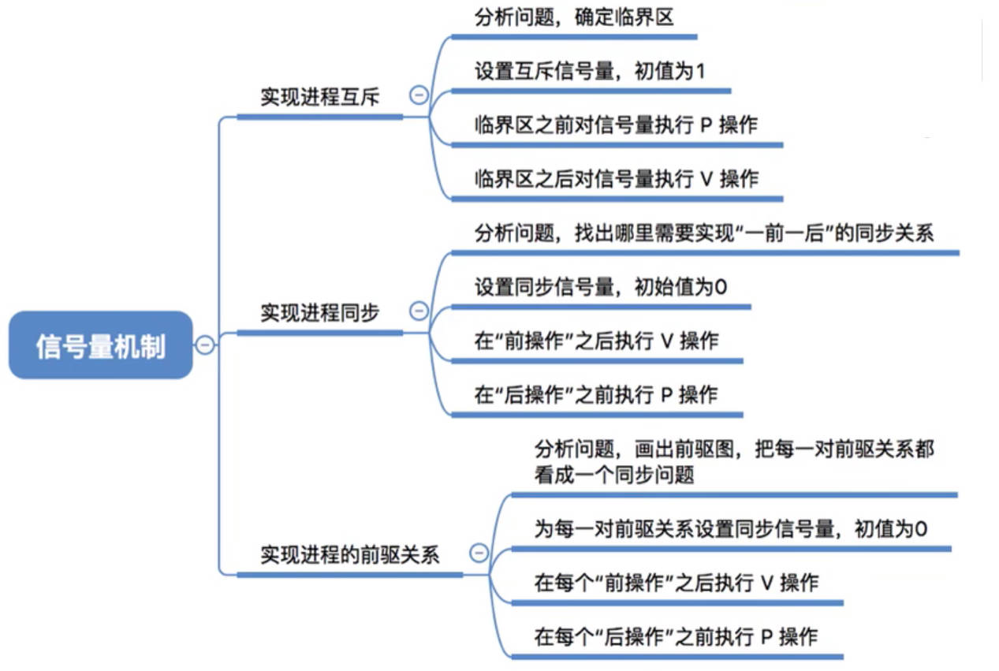

### 记录型信号量实现互斥

> [!tip|style:flat]
> **实现思路**：
> 1. 互斥信号量的初始值：`mutex.value = 1`，<span style="color:red;font-weight:bold"> 初始为解锁状态 </span>；
> 2. 临界区加锁：`P(mutex)`；
> 3. 临界区解锁：`V(mutex)`。

<center>

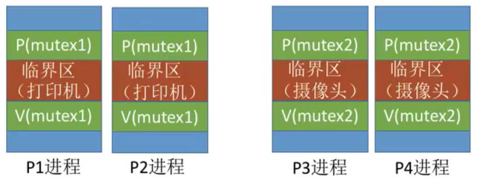

</center>

### 记录型信号量实现同步

> [!tip|style:flat]
> **实现思路：同步的目的是实现「一前一后事件（而非具体的进程 ）」的执行顺序。**
> 1. 同步信号量的初始值：`s.value = 0`，<span style="color:red;font-weight:bold"> 初始为加锁状态 </span>；
> 2. 前者执行后：`V(s)`；
> 3. 后者执行前：`P(s)`。

```cpp
// =============信号量================
semaphore s = {0,nullptr};

// =============前者进程===============
P1(){
    // 前者事件
    V(s);
}

// =============后者进程===============
P2(){
    // 一直处于加锁状态，等待前者时间执行完毕
    P(s);
    // 后者事件
}

```

### 记录型信号量实现前驱关系

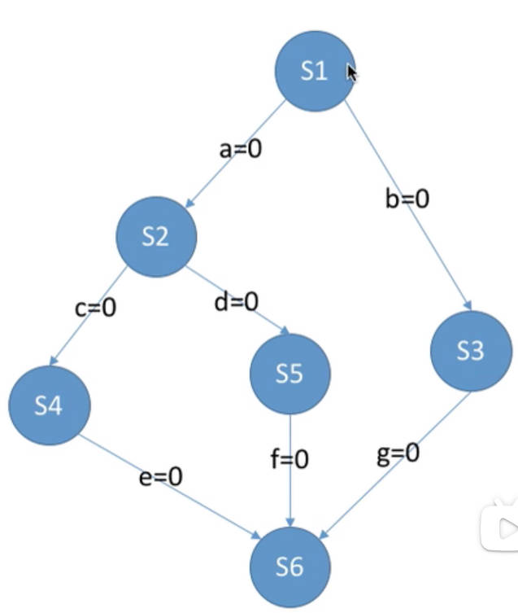


**前驱关系：** 每个进程执行的事件都具有前后执行顺序，就需要对这些事件进行同步。
1. 每一对「前后」顺序的事件都具有一个「同步变量」
2. 前者执行后：`V(s)`；
3. 后者执行前：`P(s)`。

# 互斥与同步问题模型

## 生成者-消费者问题（一对一）

**问题：** 系统由一组生成者进程与一组消费者进程组成，生产者每次生产一个产品放入缓冲区，消费者从缓冲区中拿去商品。
1. 缓冲区为临界资源，缓冲区访问为互斥
2. 生产者必须等待缓冲区有空闲位置，才能放入产品
3. 消费者必须等待缓冲区有产品存在，才能取走产品

```cpp
// ===============信号量================
semaphore mutex = 1;
semaphore empty = n;
semaphore full = 0;

// ================生产=================
producer(){
    while(1){
        生产商品
        // 占用一个缓冲区
        P(empty);
        // 放入缓冲区
        P(mutex);
        放入
        V(mutex); 
        // 放入了一个
        V(full);
    }
}

// ================消费=================
consumer(){
    while{1}{
        // 拿产品
        P(full);
        // 放入缓冲区
        P(mutex);
        取出
        V(mutex); 
        // 取出了一个
        V(empty);
        消费
    }
}

```

## 多类生成者-多类消费者问题（多对多）

**问题：** 有多组「生产者-消费者」共用一个缓冲区。
1. 缓冲区为临界资源，缓冲区访问为互斥
2. 生产者必须等待缓冲区有空闲位置，才能放入产品
3. 不同的消费者必须等待缓冲区有需要的产品存在，才能取走产品


**案例**：桌子上有一只盘子，每次只能向其中放入一个水果。爸爸专向盘子中放苹果，妈妈专向盘子中放橘子，儿子专等着吃盘子中的橘子，女儿专等着吃盘子中的苹果。只有盘子空时，爸爸或妈妈才可向盘子中放一个水果。仅当盘子中有自己需要的水果时，儿子或女儿可以从盘子中取出水果。

```cpp
// ===============信号量================
semaphore mutex = 1;
// 同步盘子
semaphore plate = 1;
// 同步苹果
semaphore apple = 0;
// 同步橘子
semaphore orange = 0;

// ================生产=================
father(){
    while(1){
        削苹果；
        // 占用盘子
        P(plate);
        // 放入盘子
        P(mutex);
        放入苹果；
        V(mutex); 
        // 通知放入苹果
        V(apple);
    }
}

mother(){
    while(1){
        剥橘子；
        // 占用盘子
        P(plate);
        // 放入盘子
        P(mutex);
        放入橘子；
        V(mutex); 
        // 通知放入橘子
        V(orange);
    }
}


// ================消费=================
son(){
    while{1}{
        P(orange);
        P(mutex);
        取出橘子；
        V(mutex); 
        // 通知盘子空了
        V(plate);
        吃；
    }
}

daughter(){
    while{1}{
        P(apple);
        P(mutex);
        取出苹果；
        V(mutex); 
        // 通知盘子空了
        V(plate);
        吃；
    }
}

```

## 吸烟者问题（一对多）

**问题：** 一个生成者，对应不同的消费者，共用一个缓冲区。
1. 缓冲区为临界资源，缓冲区访问为互斥
2. 生产者必须等待缓冲区有空闲位置，才能放入产品
3. 消费者必须等待缓冲区有需要的产品存在，才能取走产品


**案例：** 假设一个系统有三个抽烟者进程和一个供应者进程。每个抽烟者不停地卷烟并抽掉它，但是要卷起并抽掉一支烟，抽烟者需要有三种材料：烟草、纸和胶水。三个抽烟者中，第一个拥有烟草、第二个拥有纸、第三个拥有胶水。供应者进程无限地提供三种材料，供应者每次将两种材料放桌子上，拥有剩下那种材料的抽烟者卷一根烟并抽掉它，并给供应者进程一个信号告诉完成了，供应者就会放另外两种材料再桌上，这个过程一直重复（让三个抽烟者轮流地抽烟）

<center>

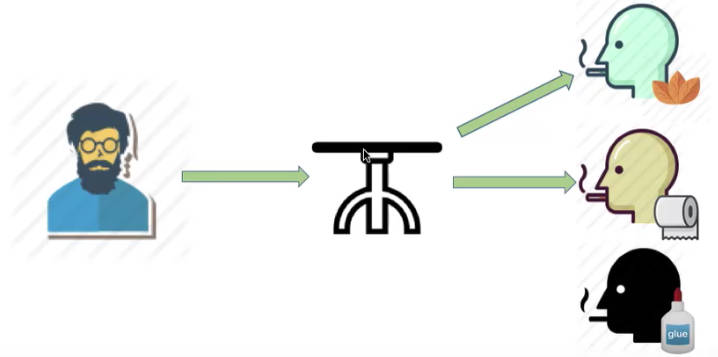

</center>


```cpp
// ===============信号量================
semaphore mutex = 1;
// 同步提供产品
semaphore offer = 1;
// 同步smoker1
semaphore s1 = 0;
// 同步smoker2
semaphore s2 = 0;
// 同步smoker3
semaphore s3 = 0;

// ================生产=================
productor(){
    while(1){
        p(offer);
        switch(i){
            case 0:{
                P(mutex);
                服务smoker1；
                V(mutex);
                V(s1);
                break;
            }
            case 1:{
                P(mutex);
                服务smoker2；
                V(mutex);
                V(s2);
                break;
            }
            case 2:{
                P(mutex);
                服务smoker3；
                V(mutex);
                V(s3);
                break;
            }
        }
        i = (i+1) % 3;
    }
}

// ================消费=================
smoker1(){
    while{1}{
        P(s1);
        P(mutex);
        抽烟；
        V(mutex); 
        // 通知结束了
        V(offer);
    }
}

smoker2(){
    while{1}{
        P(s2);
        P(mutex);
        抽烟；
        V(mutex); 
        // 通知结束了
        V(offer);
    }
}

smoker3(){
    while{1}{
        P(s3);
        P(mutex);
        抽烟；
        V(mutex); 
        // 通知结束了
        V(offer);
    }
}


```

## 读-写问题

**问题：** 存在一组写进程与一组读进程，均对同一文件进行操作。
1. 写进程与读进程互斥
2. 写进程之间互斥
3. 读进程之间可以同时进行

<span style="font-size:24px;font-weight:bold" class="section2">1. 读优先算法</span>

```cpp
// ===============信号量================
semaphore mutex_rw = 1;
int amountR = 0; // 记录读的个数
semaphore mutex = 1; // amountR 对于所有的读进程而言为临界资源，需要加锁保护

// =================读==================
void read(){

    P(mutex);
    if(amountR == 0){
        P(mutex_rw);
    }
    amountR ++;
    V(mutex);

    读；

    P(mutex);
    amountR--;
    if(amountR == 0){
        V(mutex_rw);
    }
    V(mutex);
}

// =================写==================
void write(){
    P(mutex_rw);
    写；
    V(mutex_rw);
}

```

> [!note]
> **会导致「写」饿死。**

<span style="font-size:24px;font-weight:bold" class="section2">2. 读写公平算法</span>

```cpp
// ===============信号量================
semaphore mutex_rw = 1;

int amountR = 0; // 记录读的个数
semaphore mutex = 1; // amountR 对于所有的读进程而言为临界资源，需要加锁保护

semaphore mutex_w = 1; // 读优先锁。读写操作就会根据进入顺序，抢mutex_rw

// =================读==================
void read(){

    P(mutex_w);
    P(mutex);
    if(amountR == 0){
        P(mutex_rw);
    }
    amountR ++;
    V(mutex);
    P(mutex_w);

    读；

    P(mutex);
    amountR--;
    if(amountR == 0){
        V(mutex_rw);
    }
    V(mutex);
}

// =================写==================
void write(){
    P(mutex_w);
    P(mutex_rw);
    写；
    V(mutex_rw);
    V(mutex_w);
}

```

## 哲学家进餐问题

**问题：** 每个人只有拿起自己左右两边的筷子在能吃饭。

<center>


</center>


> [!note]
> **该问题的主要目标是防止「死锁」。**

# 管程

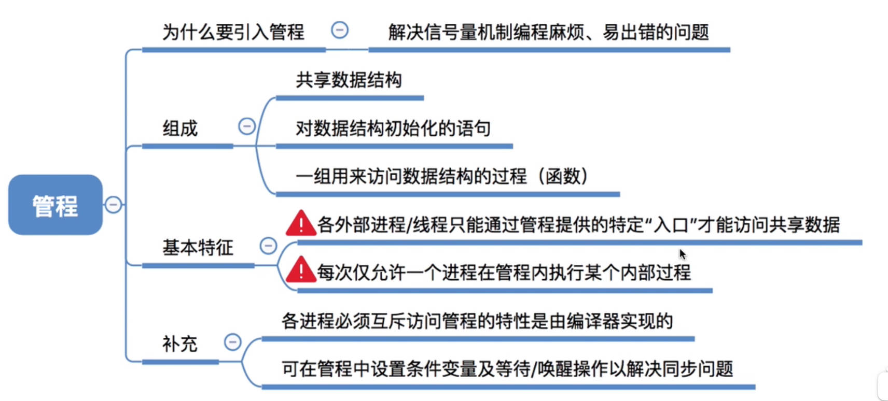

- **思路**：由于「信号量」实现进程的同步与互斥的设计较为复杂，容易出错，「管程」进对互斥与同步的过程进行了封装简化。
- **原理：**
    - 可将管程视为一个「类」，可由用户定义，该机制的互斥与同步由编译器实现。
    - 共享数据（临界资源，信号量等）为 <span style="color:red;font-weight:bold"> 私有变量 </span>，调用进程无法访问。
    - 对共享数据的管理以方法的形式对外开放，且这些方法具有 <span style="color:red;font-weight:bold"> 原子性 </span> 
    - <span style="color:red;font-weight:bold"> 同一时间，有且仅有一个进程能能调用管程里的方法 </span> 

<details>
<summary><span style="border:2px solid;border-radius: 2px;font-weight: bold;">生产者-消费者案例</span></summary>
<div style="border-radius:5px;background-color:#c7edcc">

```cpp
monitor ProducterConsumer{
private:
    // 等待进程队列
    condition productor,consumer;
    // 计数缓冲区中的产品
    int count;

public:
    // 原语
    void push(Item &item){
        // 缓冲区满了
        if(count == N){
            wait(productor);
        }

        count ++;
        放入缓冲区；

        // 通知消费
        if(count == 1){
            signal(consumer);
        }
    }

    // 原语
    void pull(){
        // 缓冲区空了
        if(count == 0){
            wait(consumer); 
        }

        count --;
        取走产品；

        // 通知生产 
        if(count == N - 1){
            signal(productor);
        }
    } 
}
```
</div>
</details>

# 死锁

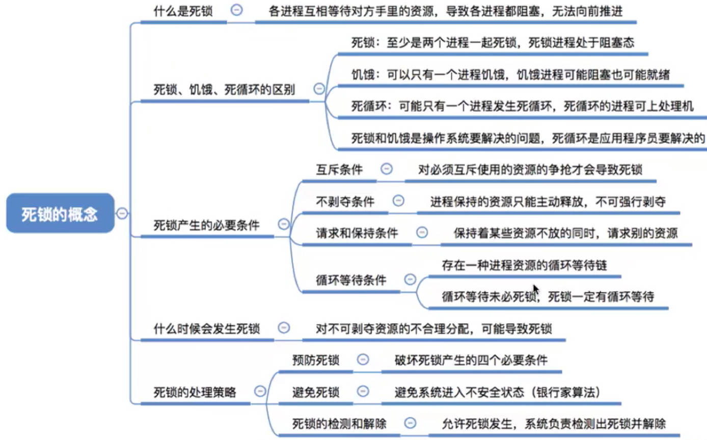

## 预防死锁

> [!tip]
> **只要打破死锁条件中的一个，就能预防死锁。**

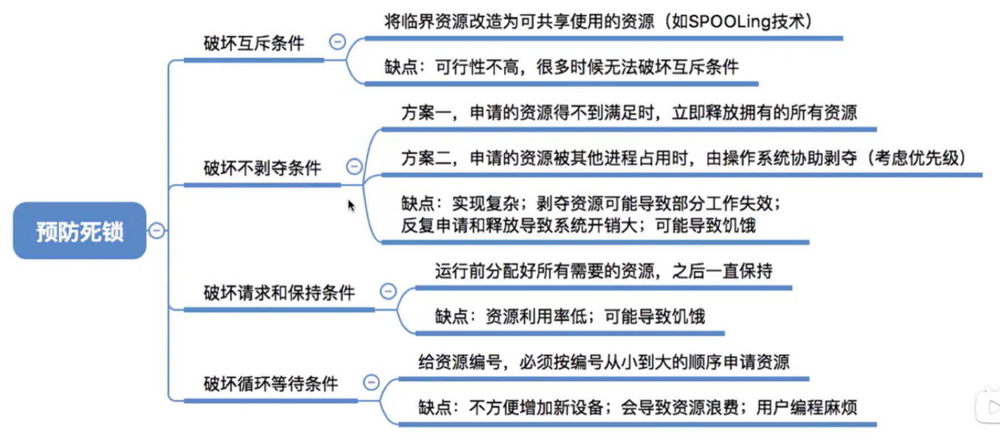

## 避免死锁

### 基本概念

- **安全序列**：如果系统按照某种种序列分配公共资源（如临界资源），存在互斥或者同步关系的进程能够顺利的运行下去。这种进程的执行顺序就为「安全序列」。
- **安全状态**：只要存在一种「安全序列」，系统就处于安全状态。<span style="color:red;font-weight:bold"> 一定不会死锁 </span>
- **不安全状态**：一种「安全序列」都不存在，系统就处于不安全状态。<span style="color:red;font-weight:bold"> 有可能会死锁 </span>

### 银行家算法

> [!note]
> **思路：** 在分配资源之前，首先预测一下进程的请求是否会导致系统进入不安全状态。


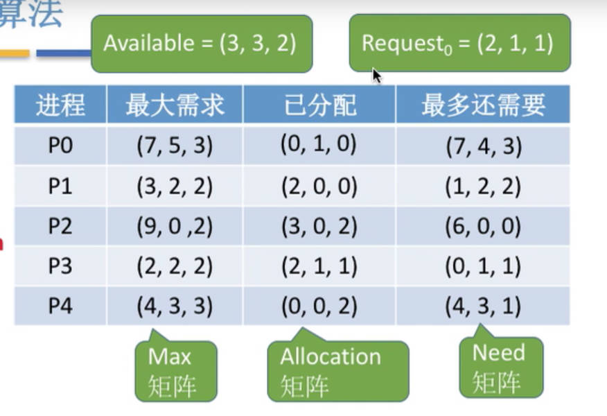

**前提：**
- 用一个向量来储存所有的资源个数，同一类资源为向量种的一个元素；
- 记录下每个进程已经得到的资源和还需要的资源；

**银行家算法：**
1. 检查进程的「request」是否大于了「need」的数量，若是，则拒绝请求；
2. 检查进程的「request」是否大于了「available」，若是，则拒绝请求，等待资源充足；
3. 试探性的满足请求，将资源分给该进程，并更新上图数据表。
4. 对更新后的数据表进行「系统安全性」验证。若安全，则正式分配资源。

**安全性验证算法：就是找到一个「安全序列」。对上图的系统状态进行安全性检查。**

1. 假设将所剩余的资源`(3,3,2)`全部分配出去，找出可以正常执行完毕的进程。
    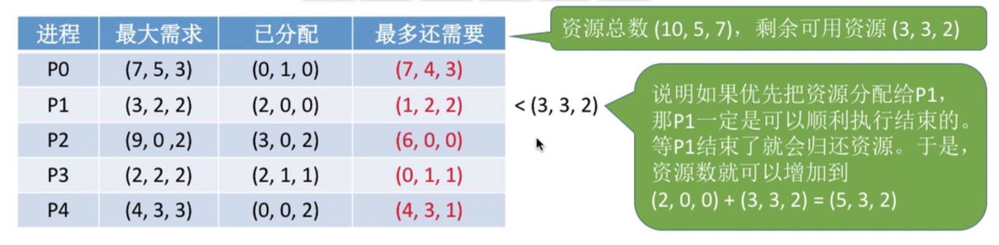
2. 找到能执行完毕的进程后，可以假设其已经运行完毕，并回收资源，然后将`P1`加入「安全序列」。
    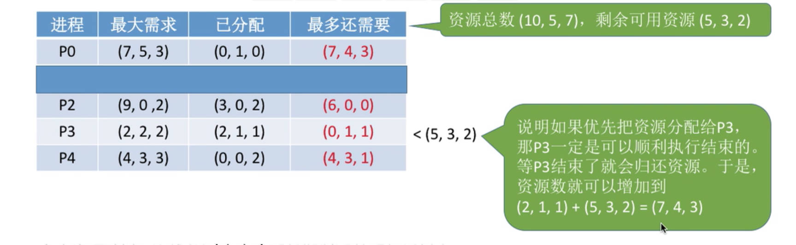
3. 重复上述步骤，直到所有的进程都能进入「安全序列」，就说明系统是「安全」的，否则系统是「不安全」的。

## 检测和解除

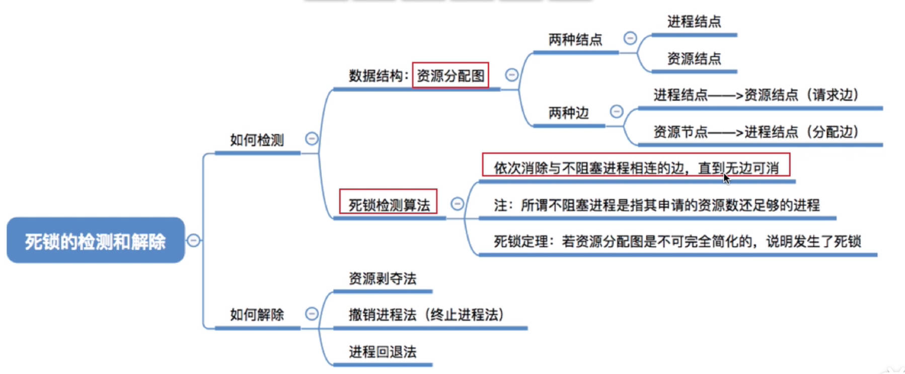

### 死锁检测

1. 将资源与进程的状态系统绘制成「资源分配图」
    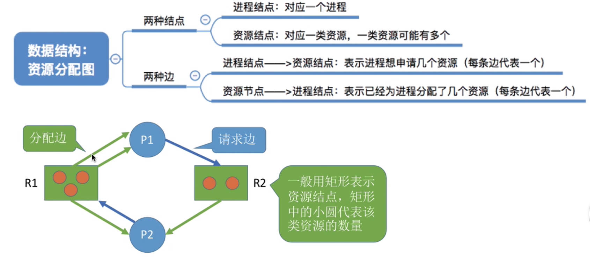

2. 检测每个「进程结点」，若进程资源都能被满足，就将该「进程结点」的所有边都去除；
    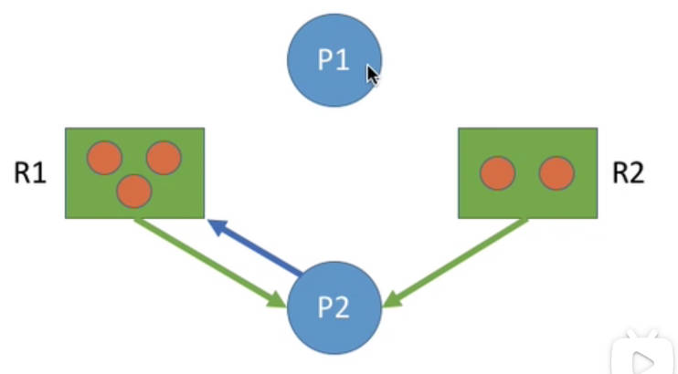
3. 重复步骤2，若最终所有结点都被孤立，则该图「可完全简化」，也就是说该系统是安全的。
    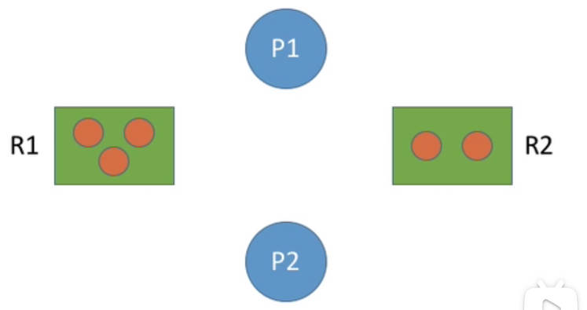
若不能消除这些边，使得结点孤立，则系统就会发生死锁。
    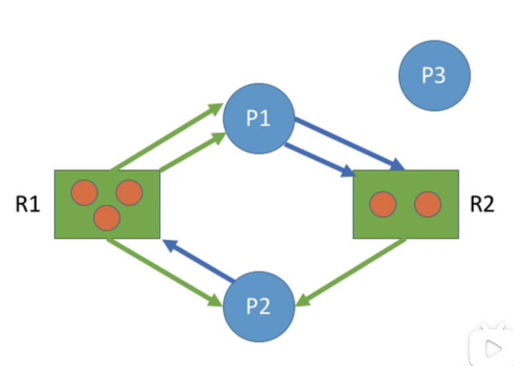

### 死锁解除

**从上图可以看出，在经过资源图化简后，还连着边的进程才是死锁进程。解除死锁，就能从这些进程入手**
- **资源剥夺法**：挂起某些死锁进程，将他们的资源分配给其他进程。
- **撤销进程法**：将某些死锁进程直接杀死掉，将资源空出来。

